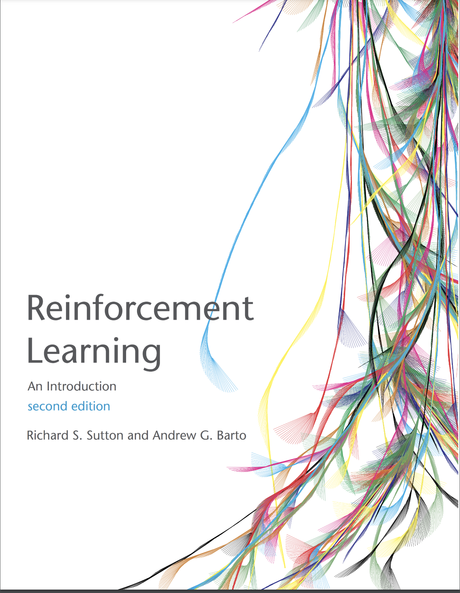

[Sutton & Barto RL Book]: http://incompleteideas.net/book/RLbook2020.pdf
[Sutton & Barto, 2nd Edition, 2020]: http://incompleteideas.net/book/RLbook2020.pdf
[Gymnasium]: https://gymnasium.farama.org/

# Intro 2 RL: Implemented Algorithms from "Reinforcement Learning - An Introduction" [Sutton & Barto, 2nd Edition, 2020]



## Table of Contents
- [Introduction](#introduction)
- [Features](#features)
- [Implemented Chapters](#implemented-chapters)
- [Code Organization](#code-organization)
- [Dependencies](#dependencies)

## Introduction
Sutton & Barto's introductory book to RL is a fundamental reference for anyone starting off in RL or any RL practictioner. In this project I implement several of the "boxed algorithms" - the algorithms shown in the grey boxes in the book.

## Features
* Algorithms are implemented in Python/Numpy. 
* They are encapsulated under "agent" objects. 
* Environments come primarily from [Gymnasium], unless noted

## Implemented Chapters:
- [ ] Chapter 2: Bandits (_TBD: merge from "Bandit" project_)
- [x] Chapter 5: [Monte Carlo (MC)](tabular_methods/monte_carlo/README.md) methods
- [x] Chapter 6: [Temporal Difference (TD)](tabular_methods/td/README.md) methods
- [x] Chapter 7: [n-Step Bootstrapping](tabular_methods/td/README.md)
- [x] Chapter 8: [Planning](tabular_methods/planning/README.md)


## Code Organization
```
intro_2_rl/
│
├── README.md          # Project documentation
│
├── LICENSE.md         # Project license (MIT)
│
├── tabular_methods/       # Tabular Methods directory
│   ├── monte_carlo/       # Source code for Monte Carlo (MC) methods
│   │   ├── agents.py      # Algorithms from: Ch.5
│   │   ├── main.py        # Main execution script
│   │   └── README.md      # Detailed information
│   │
│   ├── td/                # Source code for Temporal Difference (TD) & nStep bootstrapping methods
│   │   ├── agents.py      # Algorithms from: Ch.6,7
│   │   ├── main.py        # Main execution script
│   │   └── README.md      # Detailed information
│   │
│   ├── planning/          # Source code for Planning and Learning methods
│   │   ├── agents.py      # Algorithms from: Ch.8
│   │   ├── main.py        # Main execution script
│   │   ├── envMaze.py     # DynaMaze environment
│   │   ├── rl_glue.py     # Imported library for DynaMaze environment
│   │   └── README.md      # Detailed information
│   │
│   └── utils.py           # Base agents, utilities
│
└── requirements.txt   # Python dependencies

```

## Dependencies

* Scikit-Learn
* [Gymnasium]
* Pandas
