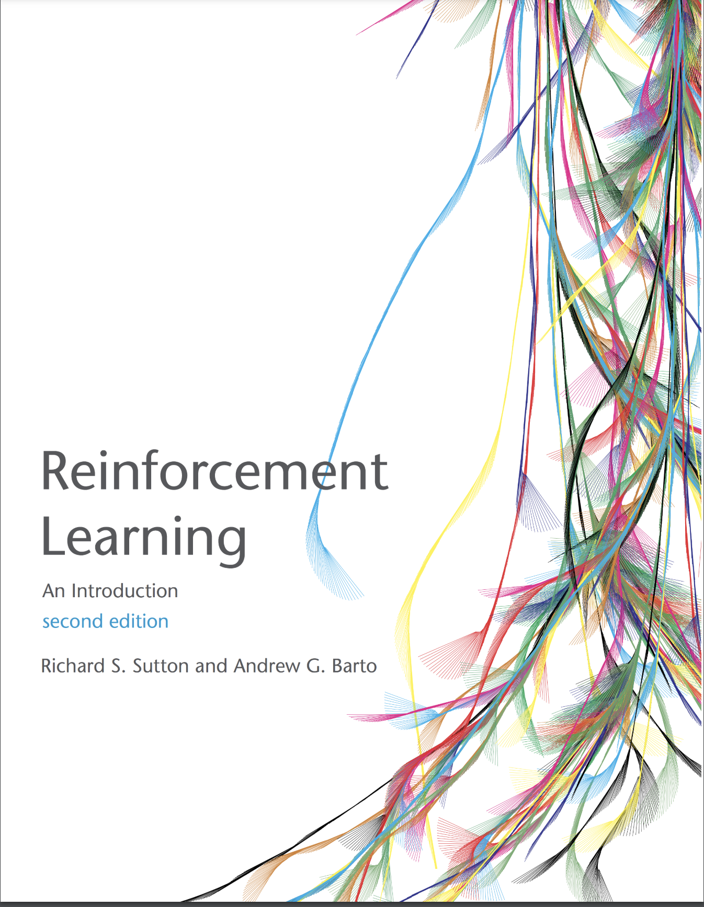

[Sutton & Barto RL Book]: http://incompleteideas.net/book/RLbook2020.pdf
[Sutton & Barto, 2nd Edition, 2020]: http://incompleteideas.net/book/RLbook2020.pdf
[Gymnasium]: https://gymnasium.farama.org/

# Intro 2 RL: Implemented Algorithms from "Reinforcement Learning - An Introduction" [Sutton & Barto, 2nd Edition, 2020]



## Table of Contents
- [Introduction](#introduction)
- [Features](#features)
- [Implemented Chapters](#implemented-chapters)
- [Code Organization](#code-organization)
- [Dependencies](#dependencies)

## Introduction
Sutton & Barto's introductory book to RL is a fundamental reference for anyone starting off in RL or any RL practictioner. 
In this project I implement several (a selection) of the "boxed algorithms" - 
the algorithms shown in the grey boxes in the book, and additional algos whether they come 
from the exercises, or just natural extensions (e.g. Sarsa & Expected Sarsa).
The environments used for the simulations are not necessarily those used in the book. 
I try to leverage existing environments (e.g. [Gymnasium]), and wrap the algorithms into
agents which adhere to its interface. The idea here is these agents should work 
across environments.

## Features
* Algorithms are implemented in Python/Numpy. 
* They are encapsulated under "agent" objects. 
* Environments come primarily from [Gymnasium], unless noted

## Implemented Chapters:
- [x] Chapter 2:  [Bandits](bandits/README.md)
- [x] Chapter 5:  [Monte Carlo Methods](tabular_methods/monte_carlo/README.md) 
- [x] Chapter 6:  [Temporal Difference Methods](tabular_methods/td/README.md) 
- [x] Chapter 7:  [n-Step Bootstrapping](tabular_methods/td/README.md)
- [x] Chapter 8:  [Planning](tabular_methods/planning/README.md)
- [x] Chapter 10: [On-Policy Approximation](approximate_methods/on_policy/README.md)
- [x] Chapter 11: [Off-Policy Approximation](approximate_methods/off_policy/README.md)
- [x] Chapter 12: [Eligibility Traces](approximate_methods/eligibility_traces/README.md)
- [x] Chapter 13: [Policy Gradient Methods](policy_gradient/README.md)


## Code Organization


```
intro_2_rl/
│
├── README.md                                       # Project documentation
│
├── LICENSE.md                                      # Project license (MIT)
│
├── bandits/                                        # The multi-armed bandit setting
│   ├── eps_greedy_main.py                          # Epsilon greedy methods experiments
│   ├── gradient_main.py                            # Gradient methods experiments
│   ├── ucb_main.py                                 # UCB1 methods experiments
│   ├── addt'l_alg'os_main.py                       # S-max exploration, Bernoully-Greedy, Thompson Sampling
│   ├── utils.py                                    # Utilities
│   ├── non-assoc'_val'_funct's.py                  # Non-associative setting action value functions
│   ├── non-assoc'_policies.py                      # Policies for the non-associative setting
│   ├── summary.ipynb                               # Theoretical development (better equation rendering).
│   │
│   ├── tools/
│   │   ├── random_walks.py                         # Random walks
│   │   └── moving_averages.py                      # Average estimators
│   │
│   └── environments/
│       ├── binary_reward_testbed.py                # k-armed bandits generating success/failure rewards
│       └── cont'_reward_testbed.py                 # k-armed bandits generating continuous value rewards
│
│
├── tabular_methods/                                # Tabular methods directory
│   ├── monte_carlo/                                # Source code for Monte Carlo (MC) methods
│   │   ├── agents.py                               # Algorithms from: Ch.5
│   │   ├── main.py                                 # Main script for running experiments.
│   │   ├── summary.ipynb                           # Theoretical development (better rendering).
│   │   └── README.md                               # Detailed information
│   │
│   ├── td/                                         # Source code for Temporal Difference (TD) & nStep bootstrapping methods
│   │   ├── agents.py                               # Algorithms from: Ch.6,7
│   │   ├── main.py                                 # Main script for running experiments.
│   │   ├── summary.ipynb                           # Theoretical development (better rendering).
│   │   └── README.md                               # Detailed information
│   │
│   ├── planning/                                   # Source code for Planning and Learning methods
│   │   ├── agents.py                               # Algorithms from: Ch.8
│   │   ├── main.py                                 # Main execution script
│   │   ├── envMaze.py                              # DynaMaze environment
│   │   ├── rl_glue.py                              # Imported library for DynaMaze environment
│   │   └── README.md                               # Main landing page. Overview
│   │
│   ├── train.py                                    # Train and evaluation loops for tabular learning methods
│   ├── plot.py                                     # Plotting results of tabular learning
│   └── utils.py                                    # Base agents, utilities
│
│
├── approximate_methods/                            # Approximate methods directory
│   ├── off_policy/                                 # Source code for off_policy methods (initial implementation. Needs debugging)
│   │   ├── bairds.py                               # Bairds counterexample, implemented examples. 
│   │   └── summary.ipynb                           # Theoretical development.
│   │
│   ├── on_policy/                                  # Source code for on_policy methods
│   │   ├── agents.py                               # Algorithms from: Ch. 10
│   │   ├── main.py                                 # Main execution script.
│   │   ├── summary.ipynb                           # Theoretical development (better rendering).
│   │   └── README.md                               # Main landing page. Overview
│   │
│   ├── eligibility_traces/                         # Source code for on_policy methods
│   │   ├── algorithms.py                           # Algorithms shown in the random walk examples
│   │   ├── random_walk_mrp.py                      # Random walk environment.
│   │   ├── examples.py                             # Random walk examples runner.
│   │   ├── agents.py                               # Implementation of agents (eg. Sarsa).
│   │   ├── main.py                                 # Main running script of agents.
│   │   ├── summary.ipynb                           # Theoretical development (better rendering).
│   │   └── README.md                               # Main landing page. Overview
│   │
│   ├── tiles3.py                                   # Source code for tile-coding
│   └── utils.py                                    # Utilities
│
│
├── policy_gradient/                                # Policy gradient theory, methods, algo implementations
│   ├── agents                                      # Implementation of algorithms in agentic form
│   ├── nets.py                                     # Function approximators (PyTorch)
│   ├── train.py                                    # Train and evaluation loops for PG learning
│   ├── plot.py                                     # Result plotting
│   ├── utils.py                                    # Utilities
│   ├── main_continuous_action_continuing.py        # Main script for continuous action, continuing task experiments
│   ├── main_continuous_action_episodic.py          # Main script for continuous action, episodic experiments
│   ├── main_discrete_action_continuing.py          # Main script for discrete action, continuing task experiments
│   ├── main_discrete_action_episodic.py            # Main script for discrete action, episodic experiments
│   ├── summary.ipynb                               # Theoretical development
│   └── README.md                                   # Main landing page. Overview
│
│
├── shared/                                         # Shared code directory
│   └── utils.py                                    # Schedules, samplers, experience 
│
└── requirements.txt                                # Python dependencies

```

## Dependencies

* Scikit-Learn
* [Gymnasium]
* Pandas
* PyTorch
