[Sutton & Barto RL Book]: http://incompleteideas.net/book/RLbook2020.pdf
[Seijen 2016]: https://arxiv.org/pdf/1512.04087 

# Eligibility Traces

A cleaner rendering of the formulas is located [here](summary.ipynb)

Eligibility traces (ET)s unify and generalize TD and Monte Carlo methods. When TD
methods are augmented with ETs, they produce a family of methods spanning
a spectrum that has Monte Carlo methods at one end ($ \lambda = 1$) and one-step TD methods
at the other ($\lambda = 0$). In between are intermediate methods that are often better than
either extreme method. ETs also provide a way of implementing Monte Carlo
methods online and on continuing problems without episodes. 
What ETs offer is a short-term memory vector mechanism, 
a memory vector, the _eligibility trace_ $\mathbf{z}_t \in \mathbb{R}^d$, 
that parallels the $n$-step TD method's long-term weight vector 
$\mathbf{w}_t \in \mathbb{R}^d$.

Some of the advantages of ETs are:
* Only a single trace vector is required rather than a store of the last $n$ feature vectors
* Learning also occurs continually and uniformly in time rather than being delayed and
then catching up at the end of the episode.
* Learning can occur and affect behavior immediately after a state is 
encountered rather than being delayed $n$ steps.

Monte-Carlo and TD methods evaluate a state's value on events that occur
following the state over multiple stepts. This is the _forward view_. With 
ETs it is possible to leverage the TD error and looking backward
to evaluate a state's value. This approach is called the _backward view_.

---

## The $\lambda$-return
The $n$-step __return__ is defined as:
$$
\begin{align*}
G_{t:t+n} &\overset{\cdot}{=} \sum_{i=t + 1}^{t+n}\gamma^{i-t - 1}R_{i} + \gamma^{n}\hat{v}(S_{t+n}, \mathbf{w}_{t+n-1}), \quad 0 \le t \le T - n 
\end{align*}
$$

where for $t \gt T$ the $n$-step return is just the sum of discounted rewards up
to the end of the episode at $t = T$. Here $\hat{v}(s, \mathbf{w})$ is the
approximate value of $s$ evaluated by function (approximator) $\hat{v}$ 
parametrized by $\mathbf{w}$.

Another valid target return for the update can be the average over 
returns from different $n$s. For example a target update can be
defined as the sum $\frac{1}{2} G_{t:t+2} + \frac{1}{2}G_{t:t+4}$. 
Any set of $n$-step returns - even infinite - can be averaged this way as 
long as their weights (coefficients) sum to $1$.

An update that averages simpler component updates is called 
a _compound update_. A compound update can only be done
when the longest of its component updates is complete. The TD($\lambda$) is
one particular way of combining all $n$-step updates, where each 
component is weighted proportionally to 
$\lambda^{n - 1}, \space \lambda \in [0, 1)$ and normalized 
by $1 - \lambda$ to ensure the sum of the weights add up to $1$.

The resulting target return $G^{\lambda}$ is called the _$\lambda$-return_:

$$
\begin{align*}
G^{\lambda}_{t} \overset{\cdot}{=} (1 - \lambda)\sum_{n=1}^{\infty}\lambda^{n-1}G_{t:t+n}
\end{align*}
$$

In this formulation, the $1$-step is given the largest weight $1 - \lambda$, 
next the $2$-step with weight $(1 - \lambda)\lambda$, and so forth - the weight
decays with $\lambda$. 

For any $n$ s.t. $ t + n \ge T$, all $n$-step return is the conventional $G_t = \sum_{i=t+1}^{T} \gamma^{i - t - 1} R_{i}$. 
So for the remaining traces of same return, their cummulative weight 
is $\lambda^{T - t - 1}$. An alternative view of weight distribution 
is given below:

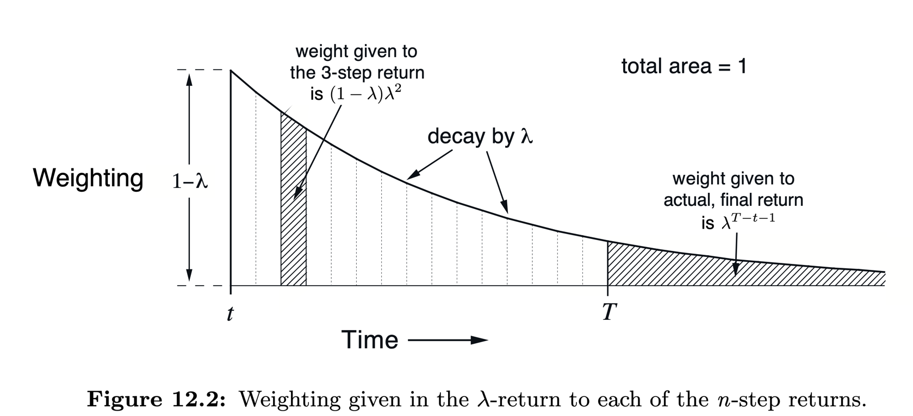

So we can separate the terms after terminal state from the main summation 
of the $\lambda$-return as follows:

$$
\begin{align*}
G^{\lambda}_{t} = (1 - \lambda)\sum_{n=1}^{T - t - 1}\lambda^{n-1}G_{t:t+n} + \lambda^{T - t - 1} G_t
\end{align*}
$$

Here we note that when $\lambda = 1$, we get the conventional MC return 
$G_t^{\lambda=1} = G_t$, while for $\lambda = 0$ we get 
$G_t^{\lambda=0} = G_{t:t+1}$, the one-step TD($0$) return. The $\lambda$ 
parameter affects how far into the future the $\lambda$-return is determined by. 
The $\lambda$-return gives us an alternative way of moving smoothly between MC
and one-step TD methods, comparable with the $n$-step bootstrapping methods, 
where we vary the steps.

###### Exercise 12.1
Note the recursive relationship of the $n$-step return:
$$
\begin{align*}
G_{t:t+n} &\overset{\cdot}{=} \sum_{i=t+1}^{t+n}\gamma^{i-t - 1}R_{i} + \gamma^{n}\hat{v}(S_{t+n}, \mathbf{w}_{t+n-1}) = R_{t+1} + \gamma G_{t+1:t+n},  \quad 0 \le t \le T - n
\end{align*}
$$

Replacing it into the $\lambda$-return we also get the recursive relationship as follows:

$$
\begin{align*}
G^{\lambda}_{t} &\overset{\cdot}{=} (1 - \lambda)\sum_{n=1}^{\infty}\lambda^{n-1}G_{t:t+n} \\
&= (1 - \lambda)\sum_{n=1}^{\infty}\lambda^{n-1}\bigl(R_{t+1} + \gamma G_{t+1:t+n}\bigr) \\
&= (1 - \lambda)\sum_{n=1}^{\infty}\bigl[\lambda^{n-1} R_{t+1} + \lambda^{n-1}\gamma G_{t+1:t+n}\bigr] \\
&=(1 - \lambda)\Bigl[\sum_{n=1}^{\infty}\lambda^{n-1} R_{t+1} + \gamma \sum_{n=1}^{\infty}\lambda^{n-1}  G_{t+1:t+n} \Bigr] \\
&=(1 - \lambda)\sum_{n=1}^{\infty}\lambda^{n-1} R_{t+1} + \gamma \Bigl[(1 - \lambda) \sum_{n=1}^{\infty}\lambda^{n-1}  G_{t+1:t+n} \Bigr] \\
&= R_{t+1} + \gamma\Bigl[(1 - \lambda)\sum_{n=1}^{\infty}\lambda^{n-1}  G_{t+1:t+n} \Bigr] \tag*{(sum of infinite geometric series cancels out coefficient)} \\
&= R_{t+1} + \gamma G^{\lambda}_{t+1}
\end{align*}
$$

### Offline $\lambda$-return Algorithm

The _offline_ algorithms makes no changes to the weight vector during the 
episode. At the end of the episode, a sequence of offline updates are applied
according to the semi-gradient update rule, using the $\lambda$-return as 
the target

$$
\begin{align*}
\mathbf{w}_{t+1} = \mathbf{w}_{t} + \alpha\bigl[G^{\lambda}_t - \hat{v}(S_t, \mathbf{w}_t) \bigr]\nabla_{\mathbf{w}}\hat{v}(S_t, \mathbf{w}_t), \;\; t = 0, ..., T-1 
\end{align*}
$$

In this approach, for each state visited, we look forward in time to
all the future rewards and decide how best to combine them. This is the 
(theoretical) _forward_ view of the learning algorithm. 
After looking forward from and updating one particular state, 
we move on to the next state and do not
bother with the already "updated" states. Future states however, are 
repeatedly affected from the point of view of the previous states 
(recall that for approximate methods, an update to a state affects others, 
unlike the independence we get in the tabular methods where the update
of a state does not affect the values others).

---

## TD($\lambda$)
Ties the theoretical forward view with the backward view using ETs. 
It improves over the offline (forward) view in the following ways:

* updates the weight vector $\mathbf{w}$ in every step, rather at the end of the episode
* computations are distributed equally in time, as opposed to at the end
* can be applied to continuing rather than just episodic problems

#### Semigradient TD($\lambda$) with function approximation
In this setting, ET is a vector $\mathbf{z} \in \mathbb{R}^{d}$
with the same number of components as the weight vector $\mathbf{w}$. 
The weight vector is a long-term memory accumulating accross the episode,
whereas ETs are short-term memory lasting less than the episode, and assist
in the learning process. They affect the weight vector, which in turn affects
the state value.

In TD($\lambda$) ETs are initialized to zero at the beggining of the episode,
it is incremented by the gradient at each step, and it is decayed by
a $\gamma \lambda$ factor over time.

$$
\begin{align*}
\mathbf{z}_{-1} &\overset{\cdot}{=} \mathbf{0} \\
\mathbf{z}_{t} &= \gamma \lambda \mathbf{z}_{t-1} + \nabla_{\mathbf{w}} \hat{v}(S_t, \mathbf{w}_t), \;\; \; 0 \le t \le T \\
\mathbf{z}_{t} &= \sum_{k=0}^{t}(\gamma \lambda)^{t - k} \nabla_{\mathbf{w}}\hat{v}(S_k, \mathbf{w}) \tag{if we don't update the weight}
\end{align*}
$$

$\lambda$ is the same parameters as in the $\lambda$-return and is also referred
to as _trace-decay_ parameter. The ET keeps track of which components of 
$\mathbf{w}$ have contributed positively or negatively to _recent_ state 
valuations. Recency in this context is defined in terms of $\gamma \lambda$.
In linear function approximation, the gradient of the value 
function $\hat{v}(S_t, \mathbf{w}_t)$ is simply the feature vector 
$\mathbf{x}_t$ - so the ET is the accumulation of past (decaying) features.

_Eligibility of the trace $\mathbf{z}$ denotes the eligibility of each component of $\mathbf{w}$
for undergoing (learning) changes if a reinforcing event happens._ The reinforcing
event under consideration are the momentary 1-step TD errors 
$\delta_t \overset{\cdot}{=} R_{t + 1} + \gamma \hat{v}(S_{t+1}, \mathbf{w}_t) - \hat{v}(S_t, \mathbf{w}_t)$.
The update rule is defined as: 
$$
\begin{align*}
\mathbf{w}_{t+1} \overset{\cdot}{=} \mathbf{w}_{t} + \alpha \delta_{t} \mathbf{z}_t
\end{align*}
$$

So here we have the update depending on the value of the current TD error and
the accumulation of features of past events, i.e. _backward_ view. The 
prediction algorithm is given as:

###### Intuition behind the backward view of TD($\lambda$)
At each moment we look at the current TD error $\delta_t$ and assign it backward to 
each prior state $[..., S_{t - i}, ..., S_t+1]$ according to how much that 
state contributed to the current eligibility trace $\mathbf{z}_t$ at $t$.

At the update of the weights $\mathbf{w}_{t+1}$ the values of those states
are changed, for when they're encountered again in the future.Consider what 
happens under TD($\lambda$) for different $\lambda$ values.

* $\lambda = 0$: $\;\; \mathbf{z}_t = \nabla\hat{v}(S_t, \mathbf{w}_t)$. The update
reduces to the one-step semi-gradient TD update, which is why the algorithm
is called TD($0$). Only the one state preceding the current one is updated 
by the TD error. Other states may have their value estimates changed by 
generalization due to function approximation.
* $0 \lt \lambda \lt 1$: More of the preceding states are  updated, but each 
more temporally distant state is updated less because the corresponding  
eligibility trace is smaller (due to the decay $\gamma \lambda$). Earlier 
states are given less credit for the TD error.
* $\lambda = 1$: Credit given to earlier states falls by $\gamma$. We achieve
MC behavior. Note that the reward is passed back by the trace discounted by 
$\gamma^k$, which is what we get under MC (but what about the term due to $\hat{v}$'s ?) 
This is also called as TD($1$). One benefit of using TD($1$) is that
it allows us to use MC for continuing tasks; and which can be implemented 
incrementally and online (unlike the vanilla MC which waits for the end of 
episode). Unlike in MC, if something unusually good or bad happens
during an episode, control methods based on TD(1) can learn immediately 
and alter their behavior on that same episode.

###### Exercise 12.3
From Exercise 12.1 we know:
$$
\begin{align*}
G^{\lambda}_{t} &= R_{t+1} + \gamma G^{\lambda}_{t+1}
\end{align*}
$$

The error term in the offline algorithm can be expanded as:

$$
\begin{align*}
G^{\lambda}_t - \hat{v}(S_t, \mathbf{w}_t) &= R_{t+1} + \gamma G^{\lambda}_{t+1} - \hat{v}(S_t, \mathbf{w}_t) + \gamma \hat{v}(S_{t + 1}, \mathbf{w}_t) - \gamma \hat{v}(S_{t + 1}, \mathbf{w}_t) \\
&= \delta_t + \gamma(G^{\lambda}_{t+1} - \hat{v}(S_{t + 1}, \mathbf{w}_t)) \\
&= \delta_t + \gamma(R_{t+2} + \gamma G^{\lambda}_{t+2} - \hat{v}(S_{t + 1}, \mathbf{w}_t) + \gamma\hat{v}(S_{t+2}, \mathbf{w}_t) - \gamma\hat{v}(S_{t+2}, \mathbf{w}_t)) \\
&= \delta_{t} + \gamma\delta_{t+1} + \gamma^{2}(G^{\lambda}_{t+2} - \hat{v}(S_{t+2}, \mathbf{w}_t)) \\
&= \delta_{t} + \gamma\delta_{t+1} + \gamma^{2}\delta_{t+2} + ...  \\
&= \sum_{i=t}^{\infty}\gamma^{i - t}\delta_i \tag*{continuing case}\\
&= \sum_{i=t}^{T-1}\gamma^{i - t}\delta_i \tag*{where $\delta_t = 0$ for $t \ge T$, episodic case}
\end{align*}
$$

Note that TD error here is conditioned on fixed $\mathbf{w}_t$

###### Exercise 12.4: equivalence of TD($\lambda$) and offline $\lambda$-return 
We're showing here how we go from forward to backward view and the 
*approximate* equivalence between TD($\lambda$) and offline $\lambda$-return. 
algorithm. If the weight updates over an episode were computed on 
each step but not actually used to change the weights 
($\mathbf{w}$ remained fixed), then the sum of TD($\lambda$)’s weight updates 
would be the same as the sum of the offline $\lambda$-return algorithm’s 
updates.

We know:

* $\mathbf{z}_{t} = \sum_{k=0}^{t}(\gamma \lambda)^{t - k} \nabla_{\mathbf{w}}\hat{v}(S_k, \mathbf{w}) \tag{if we don't update the weight}$
* Sum of updates: $\sum_{t=0}^{T - 1}\delta_t(\sum_{k=0}^{t}(\gamma \lambda)^{t - k} \nabla_{\mathbf{w}}\hat{v}(S_k, \mathbf{w}) \tag{if we don't update the weight})$
* $G^{\lambda}_t - \hat{v}(S_t, \mathbf{w}_t) = \sum_{i=t}^{T-1}\gamma^{i - t}\delta_i$
* $\bigl[G^{\lambda}_t - \hat{v}(S_t, \mathbf{w}_t) \bigr]\nabla_{\mathbf{w}}\hat{v}(S_t, \mathbf{w}_t)$
* Sum of updates: $\sum_{t = 0} ^ {T - 1}\bigl[G^{\lambda}_t - \hat{v}(S_t, \mathbf{w}) \bigr]\nabla_{\mathbf{w}}\hat{v}(S_t, \mathbf{w})$

We want to show:$\sum_{t = 0} ^ {T - 1}\bigl[G^{\lambda}_t - \hat{v}(S_t, \mathbf{w}) \bigr]\nabla_{\mathbf{w}}\hat{v}(S_t, \mathbf{w}) = \sum_{t=0}^{T - 1}\delta_t(\sum_{k=0}^{t}(\gamma \lambda)^{t - k} \nabla_{\mathbf{w}}\hat{v}(S_k, \mathbf{w}) \tag{if we don't update the weight})$

Since we're not updating the weight for this exercise, I'm omitting it 
from the notation for simplicity. $\nabla\hat{v}(s) = \nabla_{\mathbf{w}}\hat{v}(s, \mathbf{w})$

$$
\begin{align*}
\sum_{k = 0}^{T-1}[G^{\lambda}_{k} - \hat{v}(S_k)]\nabla \hat{v}(S_k) &= \sum_{k=0}^{T-1}\nabla \hat{v}(S_k)\Bigl(\sum_{i = k} ^ {T-1}\gamma^{i-k}\delta_{i} \Bigr) \\
&= \sum_{k = 0} ^ {T-1}\sum_{i = k}^{T-1}\gamma^{i - k}\delta_{i} \nabla\hat{v}(S_k) \\
&= \sum_{i = 0}^{T-1}\sum_{k = 0}^{i} \gamma^{i - k}\delta_{i} \nabla\hat{v}(S_k) \tag{index switch} \\
&= \sum_{i = 0} ^{T-1}\delta_{i}\Bigl(\sum_{k = 0} ^ {i} \gamma^{i-k} \nabla\hat{v}(S_k) \Bigr)
\end{align*}
$$

However, since we are indeed updating the weights online (i.e. at every step)
with TD($\lambda$), this is not an exact equivalence between the two methods.

##### Fig 12.6: Compare TD($\lambda$) vs Offline $\lambda$-return Algorithm

###### Note
Here the "environment" is the 19-state random walk from example 7.1.
In the description of this example, the authors note that the reward
from the first state (A) to the terminal state on the left is -1. However,
while they expand on the 5-state example, it is not clear whether the terminal
state on the right of the last example has a reward of 0 or +1. Since this 
is not clear, I am using the 5-state random walk setup where
on transition from the last state onto the right, a reward of +1 is emitted.

Moreover, the true value of each state is defined as the undiscounted expected
sum of rewards starting from each respective state. I compute this numerically
over 300 runs for each initial state for all states. The results are shown 
in the table below:

| TD($\lambda$)                                                               | Offline $\lambda$-return Algorithm                                                      |
|-----------------------------------------------------------------------------|-----------------------------------------------------------------------------------------|
| 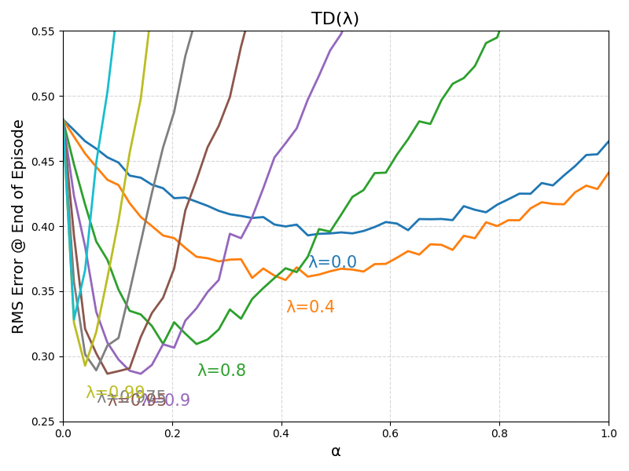 | 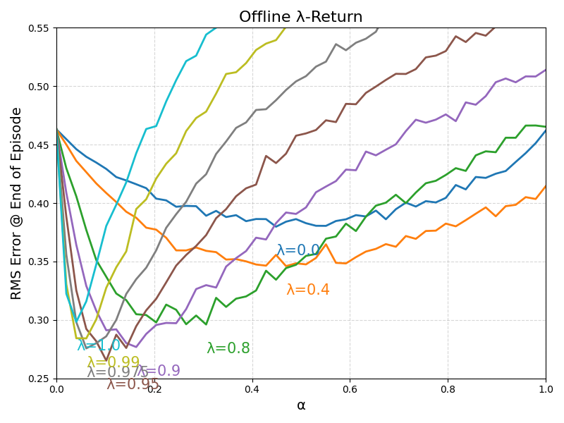 |

One discrepancy between the graph above and the book is that in the case of
TD($\lambda$) at $\alpha$ = 0, the error is approximately 0.47 while 
the authors are at 0.55. As of this writing, it is unclear to me why this is 
the case. At $\alpha$ = 0, the weights are not updated (i.e. there is no 
learning). Moreover, per Example 7.1., value function is initialized as 
$V(s) = 0$. The only other difference are the true values used. This could 
stem from a disrepancy between the random walk transition probabilities or 
the insufficient samples used for the state value estimation. I invite
the curious reader to further investigate this discrepancy. For the moment, I 
am proceeding with the findings as I generate them.

###### Results
For each $\lambda$ value, if $\alpha$ is selected optimally for it (or
smaller), then the two algorithms perform virtually identically. If $\alpha$ 
is chosen larger than is optimal, however, then the $\lambda$-return 
algorithm is only a little worse whereas TD($\lambda$) is much worse 
and may even be unstable.

### Online $\lambda$-return Algorithm

#### $n$-step Truncated $\lambda$-return
Lambda return up to a certain horizon is defined as:

$$
\begin{align*}
G^{\lambda}_{t:h} &\overset{\cdot}{=} (1 - \lambda)\sum_{n=1}^{h - t - 1}\lambda^{n-1}G_{t:t+n} + \lambda^{h - t - 1}G_{t:h} \tag*{$0 \le t \le h \le T$}
\end{align*}
$$

The $n$-step truncated $\lambda$-return is defined as $G^{\lambda}_{t:n}$. 
The updates are delayed by $n$ steps and only take  into account the first 
$n$ rewards. Note that for the $n$-step return $G_{t:n}$ we only use the 
$n$-step return, whereas for $G^{\lambda}_{t:n}$ we use the - geometrically 
weighted $(1 - \lambda)\lambda^{k}$ - sum of 
$G^{\lambda}_{t:k}$ for $1 \le k \le n$. The longest component update is 
$n$-steps long, unlike the $\lambda$-return which goes all the way to the 
end of the episode. Just like with $n$-step bootstrapping, this formulation 
gives rise to $n$-step truncation of TD($\lambda$), or TTD($\lambda$), 
which is defined as:

$$
\begin{align*}
\mathbf{w}_{t+n} &\overset{\cdot}{=} \mathbf{w}_{t+n-1} + \alpha \bigl(G^{\lambda}_{t:t+n} - \hat{v}(S_{t}, \mathbf{w}_{t+n-1}) \bigr)\nabla_{\mathbf{w}}\hat{v}(S_{t}, \mathbf{w}_{t+n-1}) \tag{$0 \le t \le T$}
\end{align*}
$$

Just like the n-step TD methods, the updates are delayed by n-1 steps for each 
episode, and upon termination n-1 updates are performed. Instead of 
scaling with $n$, efficient implementations exploit the following 
recursive formulation:

$$
\begin{align*}
G^{\lambda}_{t:t+n} = \hat{v}(S_t, \mathbf{w}_{t-1}) + \sum_{i = t}^{t + k - 1}(\gamma \lambda)^{i - t}\delta^{'}_{i}
\end{align*}
$$

_Note_: $\hat{v}(S_t, \cdot)$ is the value at the _beginning_ of the horizon. 

where: $\delta^{'}_{i} \overset\cdot{=} R_{t+1} + \gamma \hat{v}(S_{t+1}, \mathbf{w}_t) - \hat{v}(S_t, \mathbf{w}_{t-1})$

Implementation of TTD($\lambda$) is in `algorithms/TTDLambda`. Below
I am generating the same graphs (i.e. experiments) as those generated
for TD($\lambda$) above using the 19-state random walk environment.

| 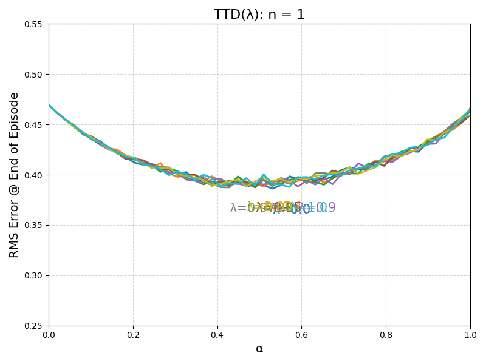  | 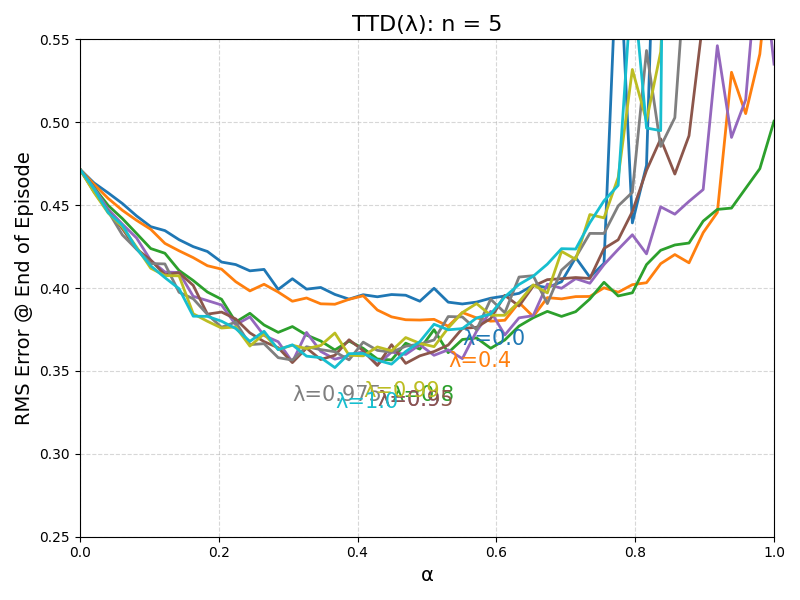  | 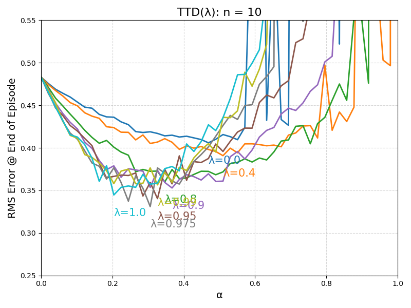 |
|----------------------------------------------------------------|----------------------------------------------------------------|----------------------------------------------------------------|
| 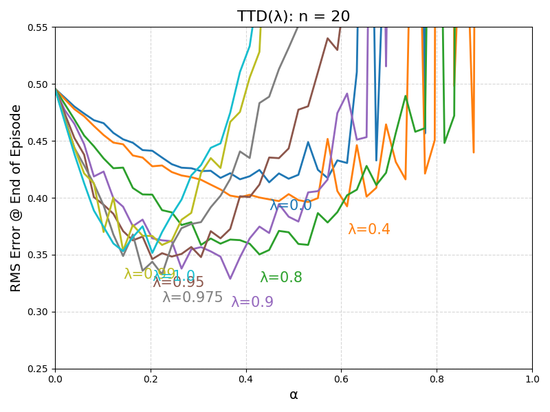 | 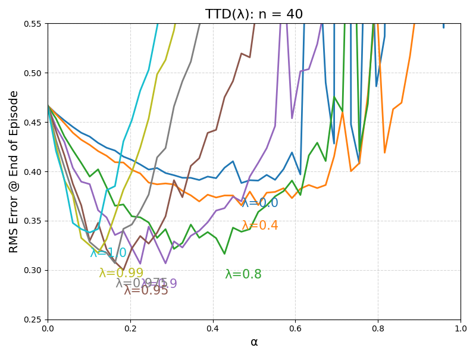 |

As we can see, for longer step sizes the estimate becomes more accurate, but 
it also becomes more sensitive to the learning rate / step size $\alpha$.

#### The online form of $\lambda$-return
"The concept of an online forward view contains a paradox. On the one hand, 
multi-step update targets require data from time steps far beyond the 
time a state is visited; on the other hand, the online aspect requires that 
the value of a visited state is updated immediately. The solution to this 
paradox is to assign a sequence of update targets to each visited state. 
The first update target in this sequence contains data from only the next 
time step, the second contains data from the next two time steps, the third 
from the next three time steps, and so on." [Seijen 2016] - c.f.: 3.1

The online (multi-step) $\lambda$-return algorithm involves multiple passes over the 
episode, one at each horizon length (i.e. the number of available steps so far), 
each generating a different sequence of weight vectors. 
Using the truncated form above, the update rule at each step 
in the episode is as follows:

$$
\begin{align*}
\mathbf{w}^h_{t+1} &\overset{\cdot}{=} \mathbf{w}^h_{t} + \alpha \bigl[G^{\lambda}_{t:h} - \hat{v}(S_t, \mathbf{w}^h_{t}) \bigr] \nabla\hat{v}(S_t, \mathbf{w}^h_{t})  \tag*{$0 \le t \le h \le T$}
\end{align*}
$$

where $\mathbf{w}_t \overset{\cdot}{=} \mathbf{w}^t_t$

Here, at each step $h$ during the episode, we generate an $h$ sequence of weights,
${\mathbf{w}^h_{1}, \mathbf{w}^h_{2}, ..., \mathbf{w}^h_{h}}$. Note that
$\mathbf{w}_{0}^{h}$ is the weight _inherited from the previous episode_. The 
last weight $\mathbf{w}^{h}_{h}$ is the final weight determined by the algorithm. 
The advantage here is that we can perform better during the episode, whereas the offline 
algorithm performs none, as it waits till the episode finishes. Moreover, the
value of the bootstrap term $\hat{v}$ is better, as it is continuously updated,
thus generating a better estimate at the end of the episode. The shortcoming
of this approach is its increased complexity.

The following snapshot from the book depicts how the online form looks
through a run.

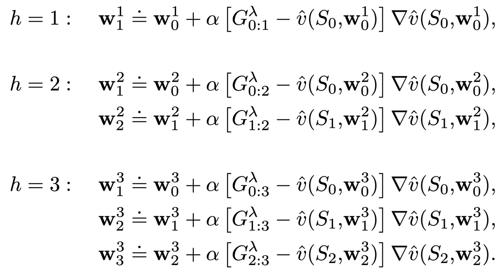

### True Online TD($\lambda$)

The online $\lambda$-return algorithm is the ideal which the online TD($\lambda$)
approximates (also as we showed on Exercise 12.4). 
The "truer" form of TD($\lambda$), approximates the online
$\lambda$-return algorithm better. Just like the less-true variant, it is a 
backward-view algorithm using eligibility traces. 
The sequence of weight vectors produced by the online $\lambda$-return algorithm can
be arranged in a triangle:

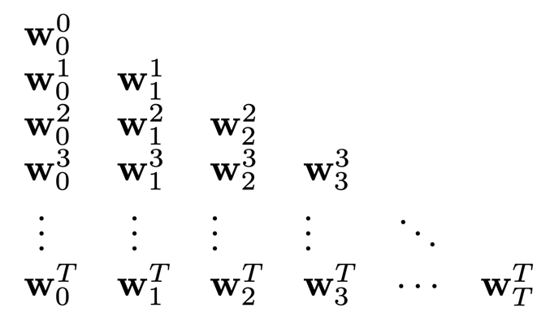

One row of this triangle is produced on each time step. The weight vectors
on the diagonal, the $\mathbf{w}^{t}_{t}$, are the only ones really needed.
For the online algorithm, the diagonal weights are used without super-script as
$\mathbf{w}_{t} \overset{\cdot}{=} \mathbf{w}^{t}_{t}$; where for the linear model
 $\hat{v}(s, \mathbf{w}) = \mathbf{w}^{\top}\mathbf{x}(s)$. The update
rule is defined as:

$$
\begin{align*}
\mathbf{w}_{t+1} \overset{\cdot}{=} \mathbf{w}_{t} + \alpha \delta_{t} \mathbf{z}_t + \alpha(\mathbf{w}^{\top}_{t}\mathbf{x}(s_t) - \mathbf{w}^{\top}_{t-1}\mathbf{x}(s_t))(\mathbf{z}_t - \mathbf{x}(s_t)) 
\end{align*}
$$

where $\delta_t \overset{\cdot}{=} R_{t + 1} + \gamma \hat{v}(S_{t+1}, \mathbf{w}_t) - \hat{v}(S_t, \mathbf{w}_t)$
just like in the TD($\delta$) algorithm, and:

$$
\begin{align*}
\mathbf{z}_{t} \overset{\cdot}{=} \gamma \lambda \mathbf{z}_{t-1} + (1 - \alpha \gamma \lambda \mathbf{z}^{\top}_{t-1}\mathbf{x}(s_t))\mathbf{x}_t
\end{align*}
$$

The trace used in this algorithm is called the _Dutch trace_, whereas the original
trace in TD($\lambda$) is referred to as the _accumulating trace_. This 
algorithm generates the same $\mathbf{w}_t$ as the online algorithm, 
for $0 \le t \le T$.

The memory requirement of the online TD($\lambda$) are the same as TD($\lambda$).
Same holds for the compute requirements $O(d)$.

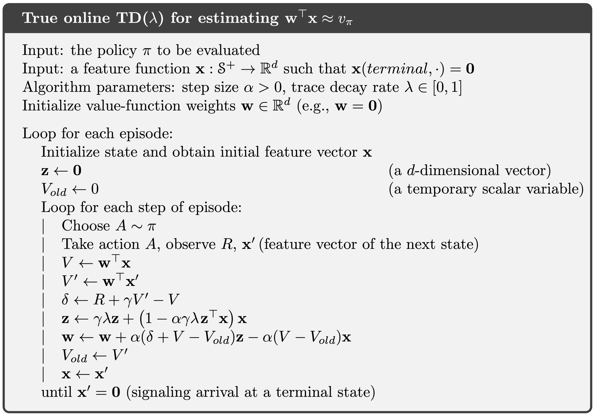

The following shows the run of Online TD($\lambda$):

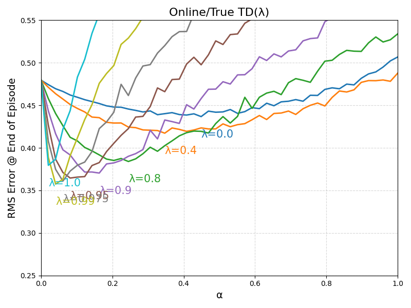

### Implementation
The algorithms presented so far - for the random walk are located in the
`algorithms.py` module.

### Sarsa($\lambda$)
The traces methods can also be used for state-action values 
$\hat{q}(s, a, \mathbf{w})$. 

Starting from the n-step return definition:

$$
\begin{align*}
G_{t:t+n} = R_{t+1} + \gamma R_{t+2} + \gamma^2 R_{t+3} + ... + \gamma^{n-1}R_{t+n} + \gamma^{n}\hat{q}(S_{t+n}, A_{t+n}, \mathbf{w}_{t + n - 1})
\end{align*}
$$
where $G_{t:t+n} = G_t$ for $t+n \ge T$.

The state-action value for the $\lambda$-return can be used for the $\lambda$-return
algorithm, just like for the state-value approach. The update in this case is:
$$
\begin{align*}
\mathbf{w}_{t + 1} = \mathbf{w}_{t} + \alpha \bigl[G^{\lambda}_{t} - \hat{q}(S_t, A_t, \mathbf{w}_{t}) \bigr] \nabla \hat{q}(S_t, A_t, \mathbf{w}_{t})  
\end{align*}
$$
for $t = 0, 1, ..., T-1$, where, $G^{\lambda}_t \overset{\cdot}{=}G^{\lambda}_{t:\infty}$.

The temporal-difference method for action values Sarsa($\lambda$), approximates
this forward view. Its update rule is the same as the state-value TD($\lambda$)'s: 
$\mathbf{w}_{t+1} = \mathbf{w}_{t} + \alpha \delta_{t}\mathbf{z}_t$, where
the temporal difference error is defined in terms of the state-action values:

$$
\begin{align*}
\delta_t = R_{t+1} + \gamma \hat{q}(S_{t+1}, A_{t+1}, \mathbf{w}_t) - \hat{q}(S_{t}, A_{t}, \mathbf{w}_t)   
\end{align*}
$$

and the state-action value eligibility trace is defined as:

$$
\begin{align*}
\mathbf{z}_{-1} &\overset{\cdot}{=} \mathbf{0} \\
\mathbf{z}_{t} &= \gamma \lambda \mathbf{z}_{t-1} + \nabla \hat{q}(S_t, A_t, \mathbf{w}_t), \space \space 0 \le t \le T
\end{align*}
$$

The pesudocode for Sarsa($\lambda$) is shown below:

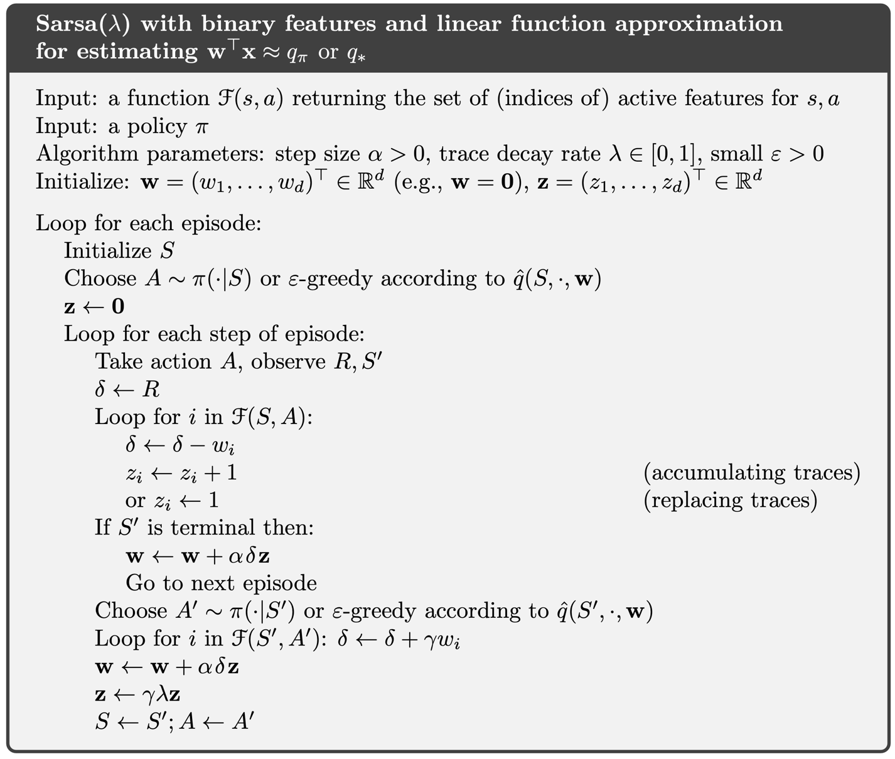

Note that here the authors are highlighting the use-case with binary features.
This allows for each (active) component of the weights, to either accumulate or replace 
the trace on reinforcing events. Accumulating traces has longer time span, 
however it may cause instability in learning. The implementation
in `agents/SarsaLambda` supports both settings `{accumulate | replace}`.
Additionally, `{replace_clear}` clears out the trace for other components 
(cf Figure 12.11). 

Moreover, just like with the true online TD($\lambda$),
there is a true online Sarsa($\lambda$) variant, with the following pseudocode:

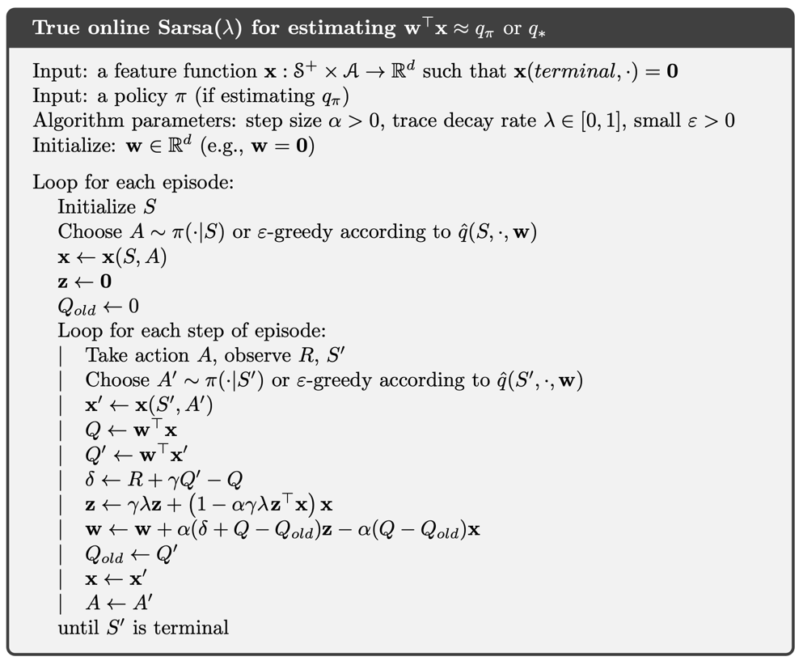

###### Results
In running the MountainCar environment, the accumulating traces were not 
stable for certain settings - for Sarsa($\lambda$). 
On deeper inspection I noticed that larger ET values
generated larger weight values. As such I used a clipping to avoid `inf` 
and resulting `NaN` values. The trace replacing method showed to be more stable 
for both Sarsa($\lambda$).
Of course, the choice of whether to replace or accumulate traces
is a hyper-parameter to play around with depending on the 
environment. For true online Sarsa($\lambda$), this is not a parameter.

As in the book, I am showing the averaged number of steps
to completion (max horizon 1000 steps) for 50 epochs over 100 trials, where
$\varepsilon = 0$.

| Traces       | Sarsa($\lambda$)                                                                          | True Online Sarsa($\lambda$)                                                                        |
|--------------|-------------------------------------------------------------------------------------------|-----------------------------------------------------------------------------------------------------|
| Replacing    | 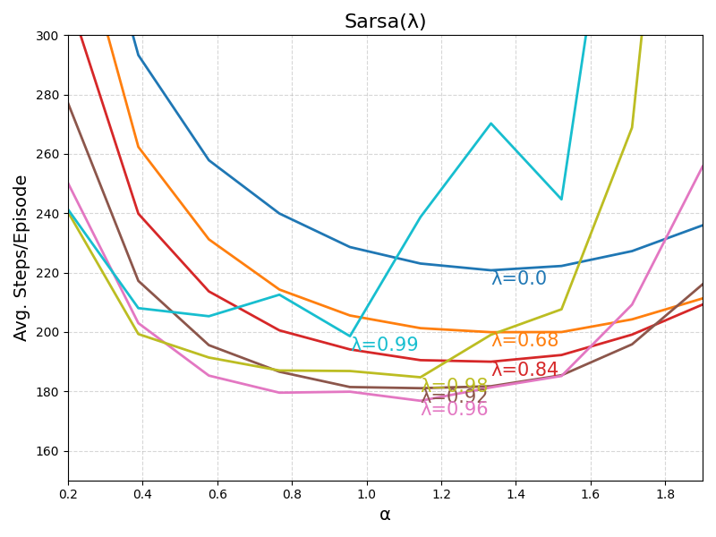    | --                                                                                                  |
| Accumulating | 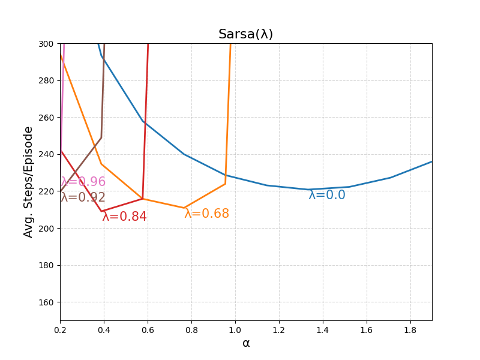 | 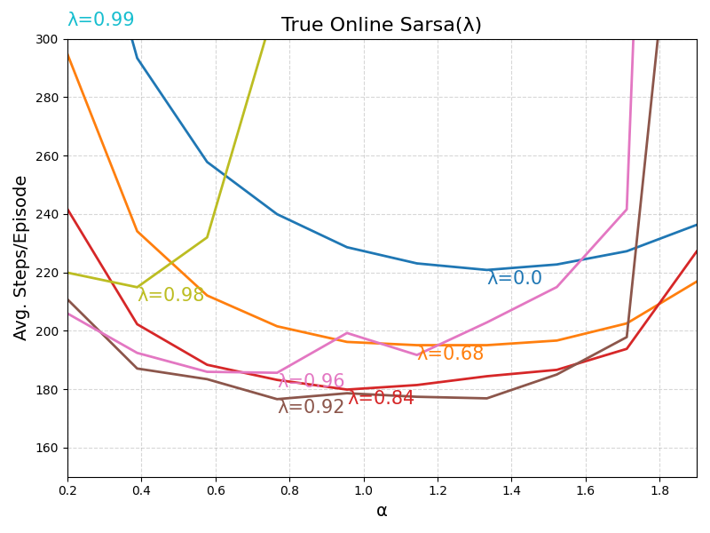 |

### Variable $\lambda$ and $\gamma$: generalize the degree of bootstrapping and discounting
In generalizing the TD algorithms, the discounting and bootstrapping parameters
can be variable {$\lambda_t$, $\gamma_t$} - i.e. at each time step we can 
have a different value. The bootstrapping parameter can vary its values as
function of states and actions. The notation becomes: 
$\lambda \colon \space \mathcal{S} \times \mathcal{A} \to [0,1]$. The
time variant state-action dependent parameter is thus defined as: 
$\lambda_t \overset\cdot{=} \lambda(S_t, A_t)$. For the discounting parameter,
we can vary it as a function of state $\gamma \colon \space \mathcal{S} \to [0, 1]$
where the time variable parameter is defined as 
$\gamma_t \overset\cdot{=} \gamma(S_t)$. The _function_ $\gamma$, called the 
_termination function_, is important as it affects the return 
(sum of discounted rewards), the random variable we are trying to estimate.

###### Variable Discounting
With these notations the (variable) discounted return is (re)defined as:

$$
\begin{align*}
G_t & \overset \cdot{=} R_{t+1} + \gamma_{t+1}G_{t+1} \\
& = R_{t+1} + \gamma_{t+1} R_{t+2} +  \gamma_{t+1} \gamma_{t+2} R_{t+3} + \gamma_{t+1} \gamma_{t+2} \gamma_{t+3} R_{t+4} + \dots \\
& = \sum_{k = t} ^{\infty}\bigr(\prod_{i=t+1} ^{k} \gamma_{i} \bigl)R_{k+1}
\end{align*}
$$

where it is required that $\prod_{k=t}^{\infty}\gamma_{k} = 0$, 
with probability 1, so that the sums above are finite. 
This definition enables the episodic setting and its algorithms to 
be presented in terms of a single stream of experience, without special 
terminal states, start distributions, or termination times. A terminal state
becomes a state at which $\gamma(s) = 0$ and which transitions to the start 
distribution. 

Using a constant $\gamma(\cdot) = c$ the classical episodic setting
is recovered, thus making it a special case. _State dependent termination_ (SDT)
includes other prediction cases such as _pseudo termination_, in which we 
seek to predict a quantity without altering the flow of the Markov process. 
SDTs unify episodic with discounted-continuing cases.

###### Variable Bootstrapping
The generalization to variable bootstrapping is a change in the solution 
strategy. The generalization affects the $\lambda$-returns for states 
and actions. The two forms (state values & action values) are recursively 
defined as follows:

$$
\begin{align*}
G_t^{\lambda s} & \overset \cdot{=} R_{t+1} + \gamma_{t+1}\bigl((1 - \lambda_{t+1}) \hat{v}(S_{t+1}, \mathbf{w}_t) + \lambda_{t+1}G_{t+1}^{\lambda s} \bigr) \\
G_t^{\lambda a} & \overset \cdot{=} R_{t+1} + \gamma_{t+1}\bigl((1 - \lambda_{t+1}) \hat{q}(S_{t+1}, A_{t+1}, \mathbf{w}_t) + \lambda_{t+1}G_{t+1}^{\lambda a} \bigr) \tag{Sarsa} \\
G_t^{\lambda a} & \overset \cdot{=} R_{t+1} + \gamma_{t+1}\bigl((1 - \lambda_{t+1}) \bar{V}_{t}(S_{t+1}) + \lambda_{t+1}G_{t+1}^{\lambda a} \bigr) \tag{Expected Sarsa}
\end{align*}
$$

where for the Expected Sarsa we have: $\hat{V}_{t}(s) \overset \cdot{=} \sum_{a} \pi(a|s)\hat{q}(s, a, \mathbf{w}_t)$

### Off-Policy Traces with Control Variates
As of the writing of the 2nd edition, 2020 edition of the book, 
there is no way to incorporate (naiive) importance sampling 
$\rho_{t:T} = \prod_{k=t}^{T-1}\frac{\pi(A_k | S_k)}{b(A_k | S_k)}$ to the un-truncated target returns $G_{t}^{\lambda}$.
Instead, per-decision importance sampling (IS) with control variate is used.

$$
\begin{align*}
G_{t}^{\lambda s} \overset\cdot{=} \rho_t \bigl[R_{t+1} + \gamma_{t+1} \bigl( (1-\lambda_{t+1})\hat{v}(S_{t+1}, \mathbf{w}_t)) + \lambda_{t+1} G_{t+1}^{\lambda s} \bigr) \bigr] + (1 - \rho_t)\hat{v}(S_t, \mathbf{w}_t)
\end{align*}
$$

where: $\rho_t = \frac{\pi(A_t | S_t)}{b(A_t | S_t)}$ is the single-step IS 
ratio. The (untruncated) $\lambda$-return can be approximated in terms of the
sum of TD-errors:

$\delta_t^{s} \overset \cdot{=} R_{t+1} + \gamma_{t+1}\hat{v}(S_{t+1}, \mathbf{w}_t) - \hat{v}(S_t, \mathbf{w}_t)$

as:

$G_{t}^{\lambda s} \approx \hat{v}(S_t, \mathbf{w}_t) + \rho_t \sum_{k = t}^{\infty}\delta_{k}^{s}\prod_{i=t+1}^{k}\gamma_{i}\lambda_{i}\rho_{i}$

The semi-gradient update rule is:
$$
\begin{align*}
\mathbf{w}_{t+1} &= \mathbf{w}_t + \alpha(G^{\lambda s}_{t} - \hat{v}(S_t, \mathbf{w}_t))\nabla_{\mathbf{w}_t}\hat{v}(S_t, \mathbf{w}_t) \\
&\approx  \mathbf{w}_t + \alpha \Bigl(\rho_t  \sum_{k = t}^{\infty}\delta_{k}^{s}\prod_{i=t+1}^{k}\gamma_{i}\lambda_{i}\rho_{i} \Bigr)\nabla_{\mathbf{w}_t}\hat{v}(S_t, \mathbf{w}_t)
\end{align*}
$$

The authors leverage the sum of updates $\sum_{t=0}^\infty \mathbf{w}_{t+1} - \mathbf{w}_t$
to derive the general accumulating trace $\mathbf{z}_t$. The summation (LHS)
is an approximation to the RHS because the updates to the value 
function $\hat{v}$ are being ignored.

$$
\begin{align*}
\sum_{t=0}^\infty \mathbf{w}_{t+1} - \mathbf{w}_t & \approx \sum_{t=0}^\infty  \sum_{k = t}^{\infty} \alpha \rho_t \nabla\hat{v}(S_t, \mathbf{w}_t) \delta_{k}^{s} \prod_{i=t+1}^{k}\gamma_{i}\lambda_{i}\rho_{i} \tag{forward view} \\
&= \sum_{k = 0} ^ {\infty} \alpha \delta_{k}^{s} \sum_{t = 0}^{k} \rho_t  \nabla\hat{v}(S_t, \mathbf{w}_t) \prod_{i=t+1}^{k}\gamma_{i}\lambda_{i}\rho_{i} \tag{backward view}\\
&= \sum_{k = 0} ^ {\infty} \alpha \delta_{k}^{s} \mathbf{z}_k \\
&= \sum_{k = 0} ^ {\infty} \alpha \delta_{k}^{s} \Bigl(\gamma_k \lambda_k \rho_k \sum_{t = 0}^{k - 1}\rho_t \nabla \hat{v}(S_t, \mathbf{w}_t) \prod_{i=t+1}^{k-1}\gamma_{i}\lambda_{i}\rho_{i} + \rho_k \nabla\hat{v}(S_k, \mathbf{w}_k) \Bigr) \\
&= \sum_{k = 0} ^ {\infty} \alpha \delta_{k}^{s} \bigl(\rho_k (\gamma_k \lambda_k \mathbf{z}_{k-1} - \nabla\hat{v}(S_k, \mathbf{w}_k)) \bigr) \tag{recursive relationship of the backward view} \\
&= \sum_{t = 0} ^ {\infty} \alpha \delta_{t}^{s} \bigl(\rho_t (\gamma_t \lambda_t \mathbf{z}_{t-1} - \nabla\hat{v}(S_t, \mathbf{w}_t)) \bigr) \tag{equivalent index notation change} \\
\end{align*}
$$

This eligibility trace,
along with the original update rule of TD($\lambda$) forms the on/off policy 
_generalized_ form of TD($\lambda$):

* General accumulating trace: $\mathbf{z}_{t} \overset \cdot{=} \rho_t(\gamma_t \lambda_t \mathbf{z}_{t-1} +\nabla_{\mathbf{w}_t}\hat{v}(S_t, \mathbf{w}_t))$
* Semi-gradient parameter update rule (ref: $(12.7)$): $\mathbf{w}_{t+1} = \mathbf{w}_t + \alpha \delta_t^{s} \mathbf{z}_t$

Where for:
* On-policy: $\rho_t = 1$, and we get the original TD($\lambda$) with variable $\gamma_t$ and $\lambda_t$
* Off-policy: the algorithm often works well, but it's not guaranteed to be stable.

###### Off-Policy Expected Sarsa($\lambda$)
We can use the same steps to derive the off-policy traces for the 
state-action values, which would be used in the generalized off-policy 
Sarsa($\lambda$) algorithms.

$$
\begin{align*}
G_{t}^{\lambda a} &\overset \cdot{=} R_{t+1} + \gamma_{t+1} \Bigl( \bigl( 1 - \lambda_{t+1} \bigr) \bar{V}_t(S_{t+1}) + \lambda_{t+1} \bigl(\rho_{t+1} G_{t+1}^{\lambda a} + \bar{V}_t(S_{t+1}) - \rho_{t+1} \hat{q}(S_{t+1}, A_{t+1}, \mathbf{w}_t)  \bigr) \Bigr) \\
&= R_{t+1} + \gamma_{t+1} \Bigl(\bar{V}_t(S_{t+1}) + \lambda_{t+1} \rho_{t+1} \bigl(G_{t+1}^{\lambda a} - \hat{q}(S_{t+1}, A_{t+1}, \mathbf{w}_t) \bigr) \Bigr)
\end{align*}
$$

where: $\bar{V}_t(S_t) = \sum_{a}\pi(a | S_t) \hat{q}(S_t, a, \mathbf{w}_t)$

For the off-policy Expected Sarsa we have the following:
* $\delta_t ^{a} = R_{t+1} + \gamma_{t+1}\bar{V}_t(S_{t+1}) - \hat{q}(S_t, A_t, \mathbf{w}_t)$ $\; \; \; \; ref \; (12.28)$
* $\mathbf{z}_{t} = \rho_t \gamma_t \lambda_t \mathbf{z}_{t - 1} + \nabla_{\mathbf{w}_t}\hat{q}(S_t, A_t, \mathbf{w}_t)$ $\; \; \; \; ref \; (12.29)$
* $\mathbf{w}_{t+1} = \mathbf{w}_t + \alpha \delta_{t}^{a}\mathbf{z}_t$ $\; \; \; \; ref \; (12.7)$

##### Tree-Backup($\lambda$)
In the off-policy learning (Ch. 7), Tree-Backups were introduced as an off-policy
alternative which does not require imporance sampling.

###### Background: n-Step Tree-Backup
In the $n$-step Tree-Backup algorithm the unsampled actions
are bootstrapped using the estimated value. While the sampled actions 
are weighted according to the probability of the target policy $\pi$ 
having taken that action. More concretely, if we have two steps (i.e. 2-step
Tree-Backup), the target is:

$$
\begin{align*}
G_{t:t+2} &\overset \cdot{=} R_{t+1} + \gamma \sum_{a \ne A_{t+1}} \pi(a | S_{t + 1}) \hat{q}(S_{t + 1}, a, \mathbf{w}_{t + 1}) + \gamma \pi(A_{t+1}| S_{t+1}) \Bigl(R_{t+2} + \gamma \sum_{a}\pi(a | S_{t+2}) \hat{q}(S_{t+2}, a, \mathbf{w}_{t + 1}) \Bigr) \tag{unrolled form} \\
&=  R_{t+1} + \gamma \sum_{a \ne A_{t+1}} \pi(a | S_{t + 1}) \hat{q}(S_{t + 1}, a, \mathbf{w}_{t + 1}) + \gamma \pi(A_{t+1}| S_{t+1})G_{t+1:t+2} \tag{recursive relationship}
\end{align*}
$$

In Ch.7, the n-step TB was first presented for the tabular case. The linear 
approximation is the same, where the action value is estimated 
by the linear approximator $\hat{q}(s, a, \mathbf{w})$.

The general form of the n-step target is:
$G_{t:t+n} = R_{t+1} + \gamma \sum_{a \ne A_{t+1}} \pi(a | S_{t + 1}) \hat{q}(S_{t + 1}, a, \mathbf{w}_{t + n - 1}) + \gamma \pi(A_{t+1}| S_{t+1})G_{t+1:t+n}$.

which can also be expressed in terms of the TD errors as:
$G_{t:t+n} \overset \cdot{=} \hat{q}(S_{t}, A_{t}, \mathbf{w}_{t+n - 1}) + \sum_{k = t}^{t + n - 1} \delta_k \prod_{i = t + 1} ^ k \gamma \pi(A_i | S_i)$

With semi-gradient update rule as follows 
(_note_ there is no importance sampling involved):
$\mathbf{w}_{t + n} = \mathbf{w}_{t + n - 1} + \alpha \Bigl(G_{t:t+n} - \hat{q}(S_t, A_t, \mathbf{w}_{t+n - 1}) \Bigr) \nabla \hat{q}(S_t, A_t, \mathbf{w}_{t + n - 1})$

###### TB($\lambda$) eligibility traces
The ET version of Tree Backup is called TB($\lambda$). Similar to 
Q-learning, it has the property that it doesn't use importance sampling 
for off-policy data. In order to define $\lambda$ return for action-values 
we start from the recursive form used for online Expected Sarsa:

$$
\begin{align*}
G_t^{\lambda a} & \overset \cdot{=} R_{t+1} + \gamma_{t+1}\bigl((1 - \lambda_{t+1}) \bar{V}_{t}(S_{t+1}) + \lambda_{t+1}G_{t+1}^{\lambda a} \bigr) \\
&= R_{t+1} + \gamma_{t+1}\Bigl[(1 - \lambda_{t+1}) \bar{V}_{t}(S_{t+1}) + \lambda_{t+1}\Bigl(\sum_{a \ne A_{t + 1}} \pi(a | S_{t+1}) \hat{q}(S_{t+1}, a, \mathbf{w}_t) + \pi(A_{t+1} | S_{t+1}) G_{t+1}^{\lambda a} \Bigr)  \Bigr]
\end{align*}
$$

with the sum of TD errors form - ignoring the changes in the value function:

$G_{t}^{\lambda a} \approx \hat{q}(S_t, A_t, \mathbf{w}_t) + \sum_{k = t}^{\infty}\delta_{k}^{a} \prod_{i = t + 1} ^ {k} \gamma_i \lambda_i \pi(A_i | S_i) $

where following the usual steps for moving from forward view to the backward
view, the following eligibility trace is obtained:

$\mathbf{z}_{t} = \gamma_t \lambda_t \pi(A_t | S_t) \mathbf{z}_{t-1} + \nabla \hat{q}(S_t, A_t, \mathbf{w}_t)$

where the probability of taking $A_t$ is used instead of the IS ratio. Finally,
the update rule is again:

$\mathbf{w}_{t+1}  = \mathbf{w}_t + \alpha\delta_t^{a}\mathbf{z}_t$

TB($\lambda$) is implemented in `agents/TBLambda`

### Stable Off-policy Methods with Traces
Two additional agents (algorithms) have been implemented.

##### GQ($\lambda$)

###### GTD($\lambda$)
GTD($\lambda$) is the eligibility-trace algorithm analogous to TDC, the better of the two
state-value Gradient-TD predictions. Its goal is to learn the $\mathbf{w}_t$ 
such that $\hat{v}(s, \mathbf{w}_t) = \mathbf{w}_t^{T}\mathbf{x}_t(s) \approx v_{\pi}(s)$
even from data from a different behavior policy. Its update rule is:

$$
\mathbf{w}_{t+1} = \mathbf{w}_t + \alpha \delta_{t}^{s} \mathbf{z}_t - \alpha \gamma_{t+1}(1 - \lambda_{t+1})(\mathbf{z}_t^{T}\mathbf{v}_t)\mathbf{x}_{t+1}
$$
with:
$$
\mathbf{z}_{t} = \rho_t(\lambda_t \gamma_t \mathbf{z}_{t-1} + \nabla \hat{v}(S_t)) 
$$
where:

$$
\delta_t^{s} = R_{t+1} + \gamma_{t+1} \hat{v}(S_{t+1}, \mathbf{w}_t) - \hat{v}(S_t, \mathbf{w}_t)
$$

and:

$$
\mathbf{v}_{t+1} = \mathbf{v}_{t} + \beta \delta_{t}^{s}\mathbf{z}_t - \beta(\mathbf{v}_t^{T} \mathbf{x}_t)\mathbf{x}_t
$$

$\mathbf{v}_0 = \mathbf{0}$ and $\beta > 0$ is the second step parameter.

###### GQ($\lambda$)
The action value variant is called GQ($\lambda$), where its goal is learning 
the $\mathbf{w}_t$ such that 
$\hat{q}(s, a, \mathbf{w}_t) = \mathbf{w}_t^{T}\mathbf{x}_t(s, a) \approx q_{\pi}(s, a)$.
If the target policy $\pi$ is biased towards greedy $\hat{q}$ (e.g. $\varepsilon$-greedy, 
or any other method), GQ($\lambda$) can be used for control.

The update rule is:

$$
\mathbf{w}_{t+1} = \mathbf{w}_{t} + \alpha \delta_{t}^{a}\mathbf{z}_t - \alpha \gamma_{t + 1}(1 - \lambda_{t+1})(\mathbf{z}_{t}^{T} \mathbf{v}_t)\bar{\mathbf{x}}_{t + 1}  
$$

where:

$$
\bar{\mathbf{x}}_t = \sum_{a}\pi(a | S_t)\mathbf{x}_t(S_t, a)
$$

and the action TD error is defined as (the expected Sarsa formulation):

$$
\delta_{t}^{a} = R_{t+1} + \gamma_{t+1} \mathbf{w}_t^{T}\bar{\mathbf{x}}_{t+1} -  \mathbf{w}_t^{T}\mathbf{x}_t
$$

The eligibility trace is defined as:

$$
\mathbf{z}_t = \gamma_t \lambda_t \rho_t \mathbf{z}_{t-1} + \nabla \hat{q}(S_t, A_t, \mathbf{w}_t) =  \gamma_t \lambda_t \rho_t \mathbf{z}_{t-1} + \mathbf{x}_t 
$$

This is implemented in `agents/GQLambda`

##### HTD($\lambda$) and HQ($\lambda$)

###### HTD($\lambda$)
HTD($\lambda$) is a a hybrid state-value algorithm combining aspects of GTD($\lambda$) 
and TD($\lambda$). Its most appealing feature is that it is a strict 
generalization of TD($\lambda$) to off-policy learning, i.e. if $b = \pi$ 
HTD($\lambda$) becomes the same as TD($\lambda$), which is not true for 
GTD($\lambda$). This is appealing because TD($\lambda$) is faster than 
GTD($\lambda$). 

HTD($\lambda$)'s weight update rule is defined as:

$$
\begin{align*}
\delta_t^{s} &= R_{t+1} + \gamma_{t+1} \hat{v}(S_{t+1}, \mathbf{w}_t) - \hat{v}(S_t, \mathbf{w}_t) \\
\mathbf{w}_{t+1} & = \mathbf{w}_t + \alpha \delta_t^{s} \mathbf{z}_t + \alpha \bigl((\mathbf{z}_t - \mathbf{z}_t^b)^{T} \mathbf{v}_t \bigr) \bigl(\mathbf{x}_t - \gamma_{t+1} \mathbf{x}_{t+1} \bigr) \\
\mathbf{v}_{t+1} &= \mathbf{v}_{t} + \beta \delta_t^{s} \mathbf{z}_t - \beta \bigl(\mathbf{z}_{t}^{{b}^T} \mathbf{v}_t \bigr)(\mathbf{x}_t - \gamma_{t+1}\mathbf{x}_{t+1}) \tag{$\mathbf{v}_0 = \mathbf{0}$} \\
\mathbf{z}_t &= \rho_t \bigl(\gamma_t \lambda_t \mathbf{z}_{t-1} + \mathbf{x}_t \bigr) \tag{$\mathbf{z}_{-1} = \mathbf{0}$} \\
\mathbf{z}_t^{b} &= \gamma_t \lambda_t \mathbf{z}_{t - 1}^{b} + \mathbf{x}_t \tag{$\mathbf{z}_{-1}^{b} = \mathbf{0}$}
\end{align*}
$$

$\mathbf{z}_t^b$ are conventional accumulating eligibility traces for the 
behavior policy and become equal to $\mathbf{z}_t$ if all $\rho_t$ equal to $1$.
Note that for state value case $\mathbf{x}_t \overset \cdot{=} \mathbf{x}(S_t)$

###### HQ($\lambda$) (Experimental)
Following the pattern as for GQ($\lambda$), under the same greedy
assumptions of the policy for action value function $\hat{q}$, I created
the control variant HTD($\lambda$), called it HQ($\lambda$), with the 
following formulas:

$$
\begin{align*}
\delta_t^{s} &= R_{t+1} + \gamma_{t+1} \hat{v}(S_{t+1}, \mathbf{w}_t) - \hat{v}(S_t, \mathbf{w}_t)  \\
\delta_{t}^{a} &= R_{t+1} + \gamma_{t+1} \mathbf{w}_t^{T}\bar{\mathbf{x}}_{t+1} -  \mathbf{w}_t^{T}\mathbf{x}_t \\
\mathbf{w}_{t+1} & = \mathbf{w}_t + \alpha \delta_t^{a} \mathbf{z}_t + \alpha \bigl((\mathbf{z}_t - \mathbf{z}_t^b)^{T} \mathbf{v}_t \bigr) \bigl(\bar{\mathbf{x}}_t - \gamma_{t+1} \bar{\mathbf{x}}_{t+1} \bigr) \\
\mathbf{v}_{t+1} &= \mathbf{v}_{t} + \beta \delta_t^{s} \mathbf{z}_t - \beta \bigl(\mathbf{z}_{t}^{{b}^T} \mathbf{v}_t \bigr)(\mathbf{x}_t - \gamma_{t+1}\mathbf{x}_{t+1}) \tag{$\mathbf{v}_0 = \mathbf{0}$} \\
\mathbf{z}_t &= \rho_t \gamma_t \lambda_t \mathbf{z}_{t-1} + \mathbf{x}_t \tag{$\mathbf{z}_{-1} = \mathbf{0}$} \\
\mathbf{z}_t^{b} &= \gamma_t \lambda_t \mathbf{z}_{t - 1}^{b} + \mathbf{x}_t \tag{$\mathbf{z}_{-1}^{b} = \mathbf{0}$}
\end{align*}
$$

where for action values (i.e. the control case) we have 
$\mathbf{x}_t \overset \cdot{=} \mathbf{x}(S_t, A_t)$ and the 
usual definition for linear approximators:

$$
\hat{v}(S_t, \mathbf{w}_t) = \sum_{a}\pi(a | S_t)\hat{q}(S_t, a, \mathbf{w}_t) = \sum_{a} \pi(a | S_t)\mathbf{w}_t^{T} \mathbf{x}(S_t, a)
$$

This agent is implemented in `agents/HQLambda`

##### Off Policy Experiments
Here I am showing the results for the off-policy algorithms presented
above. In this setup, I set up the following hyper-paramters for each
agent, as follows:

* Behavioral policy:`on_policy/agents/SemiGradientSarsa`,  $\varepsilon = 0.1, \gamma = 0.99$
* Expected Sarsa($\lambda$): $\alpha = \frac{\alpha'}{Num. tiles = 8}, \varepsilon = 0.0, \gamma = 0.99$
* TB($\lambda$): $\alpha = \frac{\alpha'}{Num. tiles = 8}, \varepsilon = 0.0, \gamma = 0.99$
* GQ($\lambda$): $\alpha = \frac{0.3 \alpha'}{Num. tiles = 8}, \beta = \frac{\alpha'}{Num. tiles = 8}, \varepsilon = 0.0, \gamma = 0.99$
* HQ($\lambda$): $\alpha = \frac{0.3 \alpha'}{Num. tiles = 8}, \beta = \frac{\alpha'}{Num. tiles = 8}, \varepsilon = 0.0, \gamma = 0.99$

The results presented are only for MountainCar, which was run for maximum
episode length of 999 steps. 100 episodes and 50 experiments  - 
each with a different seed - were run. Note that 1 experiment = 100 episodes
in which only the traces and $\mathbf{v}_t$ were cleared after each episode.
For each experiment, the agent started unlearned. Also note that the $\lambda$ 
values are a bit different from the on-policy experiments, in that
I am exploring more intermediary values, whereas in the on-policy case
lambdas explored (also in the book) were concentrated near 1 (also refer to 
figure 12.14 in the book).

| 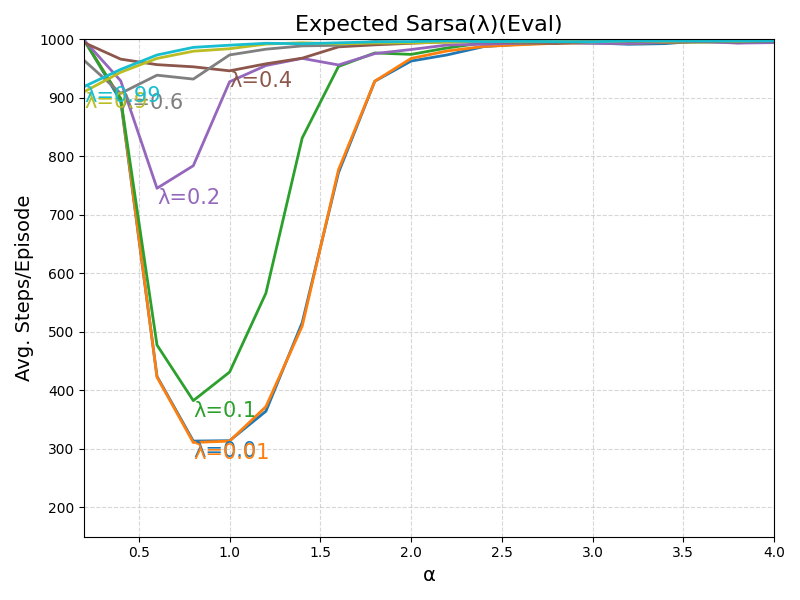 | 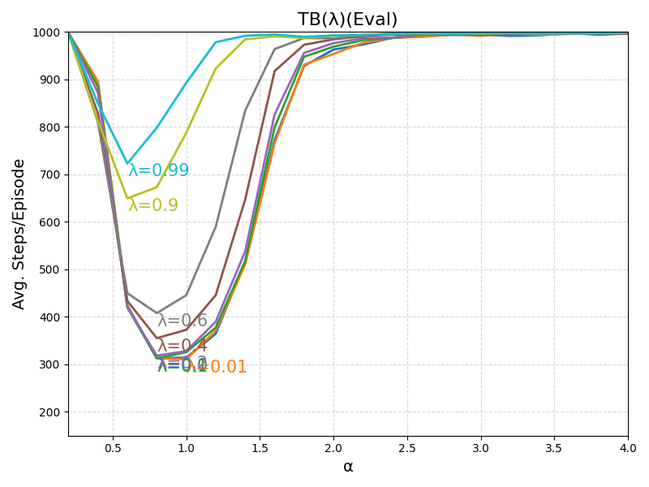 |
|--------------------------------------------------------------------------------|--------------------------------------------------------------------|
| 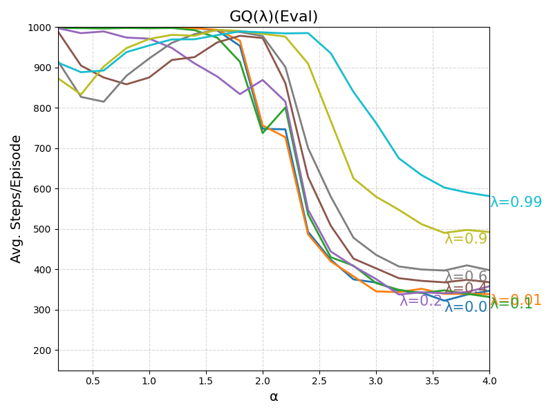              | 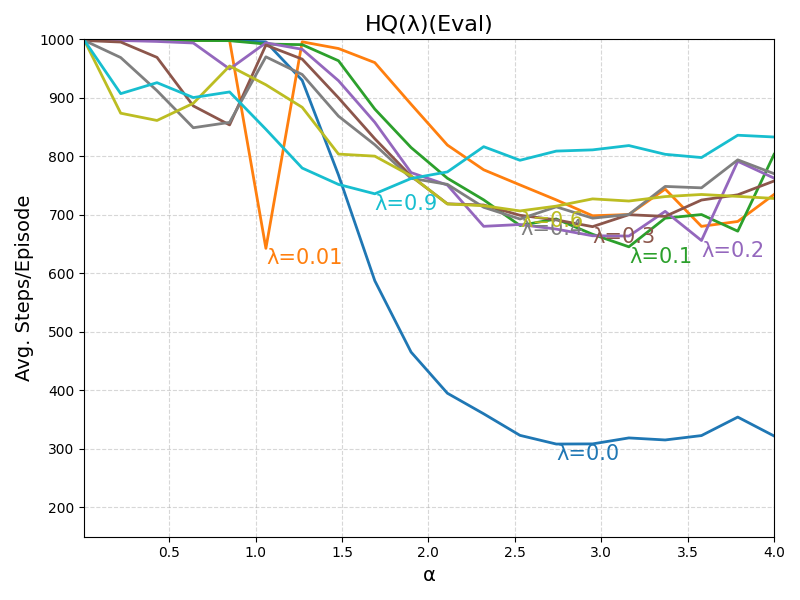  |

In these experiments, HQ($\lambda$) did not perform well. 
Besides the low scores, several of the experiments failed, as 
training was unstable for particular seeds. The results shown here are only those
that succeeded (however the results are questionable). More work is needed here.

