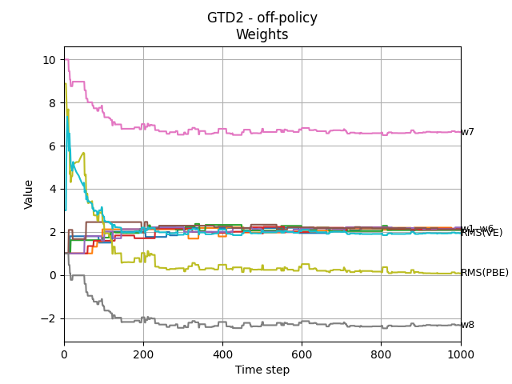
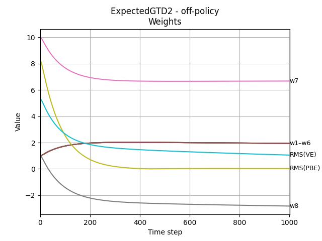
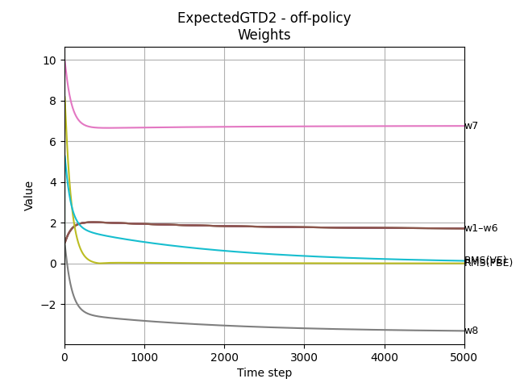
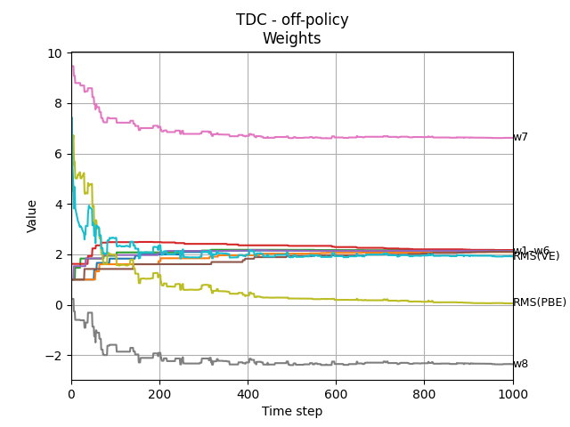
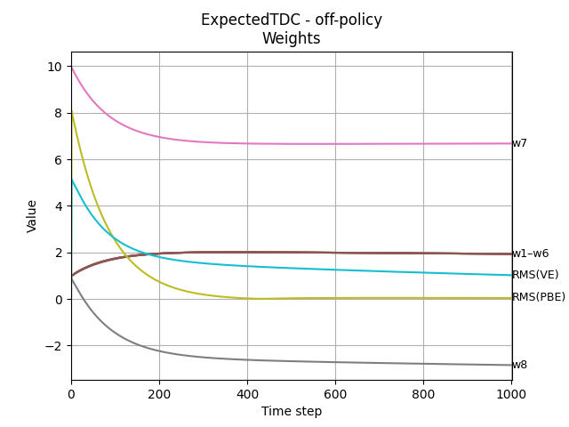

[Sutton & Barto RL Book]: http://incompleteideas.net/book/RLbook2020.pdf

# Off-policy Methods with Approximation

## Table of Contents
- [Introduction](#introduction)
- [Implemented Algorithms](#implemented-algorithms)
- [Development, Explanations, and Experimental Details](#development-explanations-and-experimental-details)
- [TD(0) - Sarsa](#td0---sarsa)
- [Dynamic Programming](#dynamic-programming)
- [TD(0) - Q-Learning](#td0---q-learning)
- [The Deadly Triad](#the-deadly-triad)
- [GTD2 and Expected GTD2](#gtd2-and-expected-gtd2)
- [TDC](#tdc)

## Introduction
The extension to function approximation is significantly different and 
harder for off-policy learning than it is for  on-policy learning. 
The tabular off-policy methods readily extend to semi-gradient algorithms, 
but these algorithms do not converge as robustly as  they do under on-policy 
training. In off-policy learning we try to learn a value function for a target policy
$\pi$, given data due to a different behavior policy $b$.

For the _prediction_ case, both policies are static and given, and we try
to learn/approximate the value functions $\hat{q} \approx q_{\pi}$ 
or $\hat{v} \approx v_{\pi}$. For the _control_ case we learn action values 
$\hat{q}$ and both policies change, where the target policy $\pi$ being 
greedy wrt to $\hat{q}$ and behavioral $b$ is $\varepsilon$-soft wrt $\hat{q}$.

#### Challenges with Off-Policy
Two challenges present themselves in the off-policy with approximation
* _Target_ (value) of the update $\rightarrow$ dealt with importance sampling (IS)
* _Distribution_ of the updates $\rightarrow$ IS for semi-gradient methods, true gradients without IS

## Implemented Algorithms
- [x] GTD2: `bairds/GTD2`
- [x] Expected GTD2: `bairds/ExpectedGTD2`
- [x] TDC: `bairds/TDC`
- [x] ExpectedTDC: `bairds/ExpectedTDC`
- [x] n-step Off-Policy Sarsa: `agents/SemiGradient_nStepsSarsaOffPolicy`

## Development, Explanations, and Experimental Details
The theoretical details, detours, and expansions are in [this](summary.ipynb) notebook.

## TD(0) - Sarsa
Here I am using the behavioral policy $b$ to generate the experiences.
On-Policy for the Sarsa case means that we force $\rho = 1$

* $\mathbf{w}_{t+1} = \mathbf{w}_{t} + \alpha \rho_{t}(R_{t+1} + \gamma\hat{v}(S_{t+1}, \mathbf{w}_{t}) - \hat{v}(S_{t}, \mathbf{w}_{t}))\nabla_{\mathbf{w}}\hat{v}(S_{t}, \mathbf{w}_{t}) $
* Implemented in: `` bairds_main.py\Pi_Sarsa``

| Off-Policy                                                                    | On-Policy                                                                    |
|-------------------------------------------------------------------------------|------------------------------------------------------------------------------|
|  |  |

## Dynamic Programming
For the DP case, we have access to the environment dynamics $P$. 
On-Policy for the DP case means that we use $\pi = b$ probabilities.
Also note that $P(r \ne 0, \cdot | \cdot) = 0$.

* $\mathbf{w}_{k + 1} = \mathbf{w}_{k} + \frac{\alpha}{|\mathcal{S}|}\sum_{s}([\mathbb{E}_{S_{t+1} \sim P(\cdot | S_t = s, a \sim \pi(\cdot|S_t = s))}[R_{t} + \gamma \hat{v}(S_{t+1}, \mathbf{w}_k) | S_t = s] - \hat{v}(S_t = s, \mathbf{w}_k)]\nabla_{\mathbf{w}}\hat{v}(S_t = s, \mathbf{w}_k))$
* Implemented in: `` bairds_main.py\Pi_DP``

Went a little verbose here for clarity.

| Off-Policy                                                                 | On-Policy                                                                 |
|----------------------------------------------------------------------------|---------------------------------------------------------------------------|
|  |  |

As we can see above, for the off policy cases, weights diverge, whereas 
the on-policy there is a solution found.

## TD(0) - Q-Learning
For Q-Learning I'm keeping a separate set of weight vectors for each actions
as $\mathbf w^{T}_{a}$. The (explicit) update rule is then as follows:

* $\mathbf{w}_{A_t, t+1} = \mathbf{w}_{A_t, t} + \alpha (R_{t+1} + \gamma \max_a \hat{q}(S_{t+1}, a, \mathbf{w}_{a, t}) - \hat{q}(S_{t}, A_t, \mathbf{w}_{A_t, t}))\nabla_{\mathbf{w}_{A_t}}\hat{q}(S_{t}, A_t, \mathbf{w}_{A_t, t}) $
* Implemented in: `` bairds_main.py\Pi_QLearning``

We also note here that the weights diverge, for both actions

|  |  |
|--------------------------------------------------------------------------------------------|-------------------------------------------------------------------------------------------|

## The Deadly Triad
Likelihood of divergence rises under these three conditions

* Function approximation: generalizing from a state space
* Bootstrapping: updates based on estimates, as opposed to fully relying on samples (eg MC)
* Off-Policy Training: Training on a distribution of transitions other than that produced
by the target policy.Sweeping through the state space and updating all states
uniformly, as in dynamic programming, does not respect the target policy and is
an example of on-policy training.

## GTD2 and Expected GTD2
In pursuing the off-line stability, "true" SGD methods for minimizing 
_mean squared Projected Bellman Error_ (PBE), namely $\overline{PBE}$ 
are considered.

Implemented in: `` bairds_main.py\ExpectedGTD2``

| GTD2                                                               | Expected GTD2                                                              |
|--------------------------------------------------------------------|----------------------------------------------------------------------------|
|  |  |

For the expected  GTD2, $\sqrt{\overline{VE}}$ does tend towards 
the optimal solution,  however it takes too long, since the projected
error $\sqrt{\overline{PBE}} \approx 0$.

## TDC
An improved alternative, called _GTD(0)_ incorportates a gradient 
correction.  An alternative name for this algorithm is 
_TD(0) with gradient correction_ (TDC) Implemented in:
`` bairds_main.py\TDC``. The expected version follows the same 
pattern as the ExpectedGTD2, 
and it is implemented in `` bairds_main.py\ExpectedTDC``

| TDC                                                               | Expected TDC                                                              |
|-------------------------------------------------------------------|---------------------------------------------------------------------------|
|  |  |
