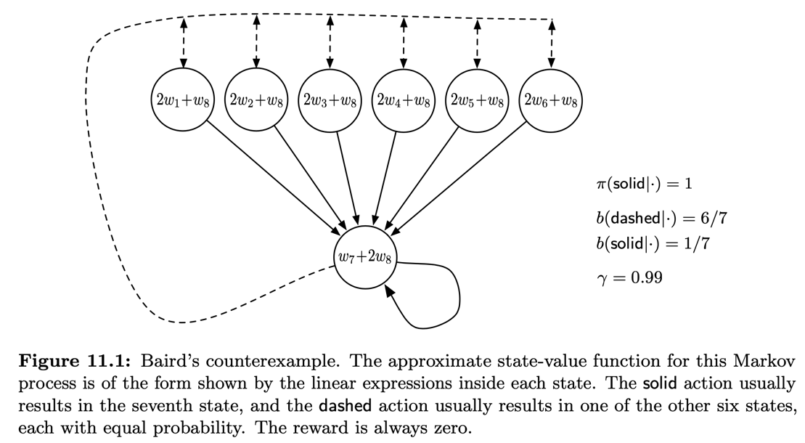
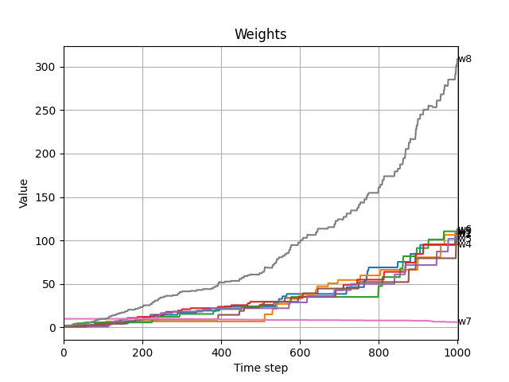
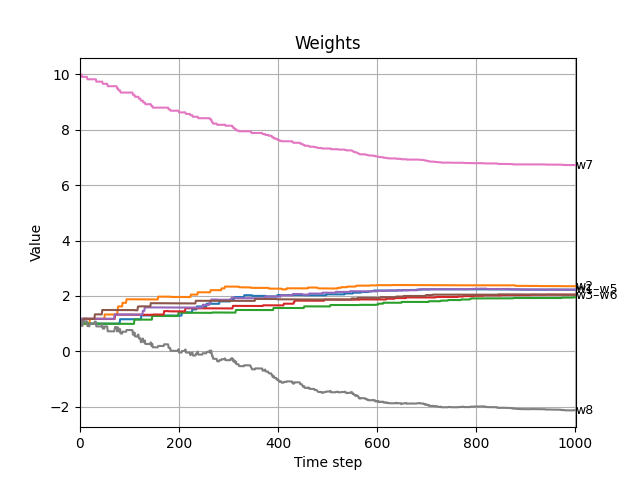
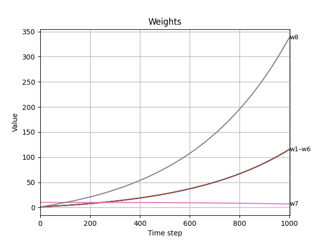
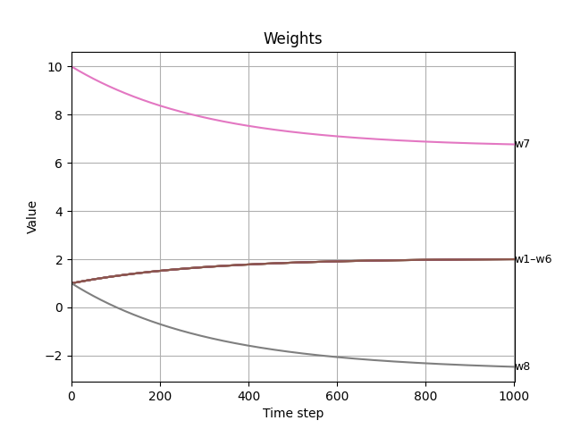
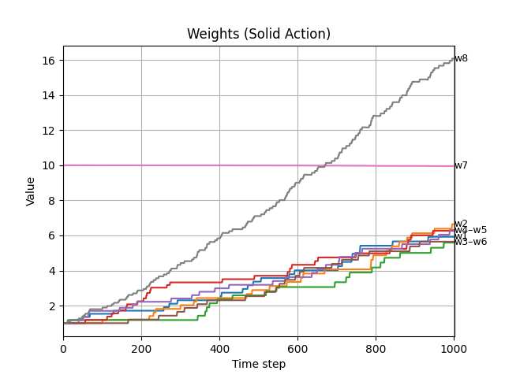
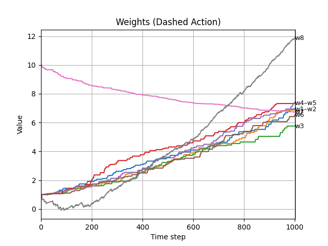
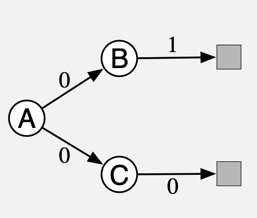

[Sutton & Barto RL Book]: http://incompleteideas.net/book/RLbook2020.pdf

# *WIP* Off-policy Methods with Approximation

_Notes on this README.md are, __for the moment__, being developed. The ongoing 
work is also copied onto [summary.ipynb](summary.ipynb) - which 
will be their final destination. Please
refer to this document for the complete rendering of the formulas._

## Introduction
The extension to function approximation is significantly different and 
harder for off-policy learning than it is for  on-policy learning. 
The tabular off-policy methods readily extend to semi-gradient algorithms, 
but these algorithms do not converge as robustly as  they do under on-policy 
training. In off-policy learning we try to learn a value function for a target policy
$\pi$, given data due to a different behavior policy $b$.

For the _prediction_ case, both policies are static and given, and we try
to learn/approximate the value functions $\hat{q} \approx q_{pi}$ 
or $\hat{v} \approx v_{\pi}$. For the _control_ case we learn action values 
$\hat{q}$ and both policies change, where the target policy $\pi$ being 
greedy wrt to $\hat{q}$ and behavioral $b$ is $\varepsilon$-soft wrt $\hat{q}$.

#### Challenges with Off-Policy
Two challenges present themselves in the off-policy with approximation
* _Target_ (value) of the update $\rightarrow$ dealt with importance sampling (IS)
* _Distribution_ of the updates $\rightarrow$ IS for semi-gradient methods, true gradients without IS

### Semi-Gradient Methods
The tabular IS methods can be extended for the off-policy semi-gradient case, 
in dealing with the learning target. These methods, however, do not address
the update distribution.

IS used in the tabular form, are adopted here by replacing the tabular 
update of $Q$ or $V$ to approximated method parametrized by $\mathbf{w}$.

The per-step IS ratio is defined as:

$$
    \rho_{t} \overset{\cdot}{=} \rho_{t:t} =\frac{\pi(A_t | S_t)}{b(A_t | S_t)}
$$

#### One-Step

The following is the development for the one-step case, both for prediction
($\hat{v}$) and control ($\hat{q}$)

###### Prediction 
TD-errors are:

* Episodic

$\delta_{t} \overset{\cdot}{=} R_{t+1} + \gamma\hat{v}(S_{t+1}, \mathbf{w}_{t}) - \hat{v}(S_{t}, \mathbf{w}_{t})$

* Continuing 

$\delta_{t} \overset{\cdot}{=} R_{t+1} - \bar{R}_t + \gamma\hat{v}(S_{t+1}, \mathbf{w}_{t}) - \hat{v}(S_{t}, \mathbf{w}_{t})$

###### Control
TD-errors are as follows for each control aglorithm:
* __Sarsa__
  * Episodic: 
$\delta_{t} \overset{\cdot}{=} R_{t+1} + \gamma\hat{q}(S_{t+1}, A_{t+1}, \mathbf{w}_{t}) - \hat{q}(S_{t}, A_{t}, \mathbf{w}_{t})$
  * Continuing: 
$\delta_{t} \overset{\cdot}{=} R_{t+1} - \bar{R}_t + \hat{q}(S_{t+1}, A_{t+1}, \mathbf{w}_{t}) - \hat{q}(S_{t}, A_{t}, \mathbf{w}_{t})$

* __Expected Sarsa__
  * Episodic: 
  $\delta_{t} \overset{\cdot}{=} R_{t+1} + \gamma \sum_a \pi(a | S_{t+1}) \hat{q}(S_{t+1}, a, \mathbf{w}_{t}) - \hat{q}(S_{t}, A_{t}, \mathbf{w}_{t})$
  * Continuing: 
  $\delta_{t} \overset{\cdot}{=} R_{t+1} - \bar{R}_t + \sum_a \pi(a | S_{t+1}) \hat{q}(S_{t+1}, a, \mathbf{w}_{t}) - \hat{q}(S_{t}, A_{t}, \mathbf{w}_{t})$

* __Q-Learning__
  * Episodic:
  $\delta_{t} \overset{\cdot}{=} R_{t+1} + \gamma \max_a \hat{q}(S_{t+1}, a, \mathbf{w}_{t}) - \hat{q}(S_{t}, A_{t}, \mathbf{w}_{t})$
  * Continuing: 
  $\delta_{t} \overset{\cdot}{=} R_{t+1} - \bar{R}_t + \max_a \hat{q}(S_{t+1}, a, \mathbf{w}_{t}) - \hat{q}(S_{t}, A_{t}, \mathbf{w}_{t})$

###### Update
The update procedure is as follows:

* $\mathbf{w}_{t+1} = \mathbf{w}_{t} + \alpha \rho_{t}\delta_{t}\nabla_{\mathbf{w}}\hat{v}(S_{t}, \mathbf{w}_{t}) $ (prediction)
* $\mathbf{w}_{t+1} = \mathbf{w}_{t} + \alpha \delta_{t}\nabla_{\mathbf{w}}\hat{q}(S_{t}, A_{t}, \mathbf{w}_{t}) $ (control)

Note that for the _control_ case ($\hat{q}$) we __do not use__
IS ratio. This is because we're estimating the value for $(S_t, A_t)$ following 
$\pi$. This means, we're at $A_t$ already, and we care how the ratios of the subsequent
actions, i.e. $A_{t+1:t+n}$ are taken not how we got to $A_t$. So, for the 
one-step case, the control algorithm is the same as the on-policy.

Another way to look at it is when we consider the following identity 
$v(s) = \mathbb{E}_{\pi(\cdot|s)}[\mathbb{E}_{P(\cdot|s, a)}[r + \gamma v_{\pi}(s')]] = \sum_{a}\pi(a|s) \mathbb{E}_{P(\cdot|s, a)}[r + \gamma v_{\pi}(s')]$, 
therefore the appropriate IS adjustment is  needed for the sampled actions $a \sim b(\cdot|s)$, 
in order to obtain the sample-estimate of  the expectation $\mathbb{E}_{\pi(\cdot|s)}$. 

For the $q(s, a) = \mathbb{E}_{P(\cdot|s, a)}[r + \gamma v_{\pi}(s')]
= \mathbb{E}_{P(\cdot|s, a)}[r + \gamma  \mathbb{E}_{\pi(\cdot|s'), P}[q_{\pi}(s', a')]]$ we're 
already starting our analysis at $a$,  i.e. there is no $\mathbb{E}_{\pi(\cdot|s)}$ 
expectation that depends on the $a$ under consideration; and we're 
bootsrapping  $q(s', a')$, i.e. not estimating it.

#### Multi-Step
In the multi-step case the one-step algorithms are extended as follows:

###### Target

__Prediction__
* $G_{t:t+n} = R_{t+1} + \gamma R_{t+2} + ... + \gamma^{n-1}R_{t+n} + \gamma^{n}\hat{v}(S_{t+n}, \mathbf{w}_{t+n - 1})$ (episodic)
* $G_{t:t+n} = R_{t+1} - \bar{R}_{t} + - \bar{R}_{t+1} + ... + R_{t+n} - \bar{R}_{t+n-1} + \hat{v}(S_{t+n}, \mathbf{w}_{t+n - 1})$ (continuing)

__Control__

_Sarsa_
* $G_{t:t+n} = R_{t+1} + \gamma R_{t+2} + ... + \gamma^{n-1}R_{t+n} + \gamma^{n}\hat{q}(S_{t+n}, A_{t+n}, \mathbf{w}_{t+n - 1})$ (episodic)
* $G_{t:t+n} = R_{t+1} - \bar{R}_{t} + R_{t+2} - \bar{R}_{t+1} + ... + R_{t+n} - \bar{R}_{t+n-1} + \hat{q}(S_{t+n}, A_{t+n}, \mathbf{w}_{t+n - 1})$ (continuing)

_Expected Sarsa_
* $G_{t:t+n} = R_{t+1} + \gamma R_{t+2} + ... + \gamma^{n-1}R_{t+n} + \gamma^{n}\sum_{a}\pi(a | S_{t+n})\hat{q}(S_{t+n}, a, \mathbf{w}_{t+n - 1})$ (episodic)
* $G_{t:t+n} = R_{t+1} - \bar{R}_{t} + R_{t+2} - \bar{R}_{t+1} + ... + R_{t+n} - \bar{R}_{t+n-1} + \sum_{a}\pi(a | S_{t+n}) \hat{q}(S_{t+n}, a, \mathbf{w}_{t+n - 1})$ (continuing)

_Q-Learning_
* $G_{t:t+n} = R_{t+1} + \gamma R_{t+2} + ... + \gamma^{n-1}R_{t+n} + \gamma^{n}\max_{a}\hat{q}(S_{t+n}, a, \mathbf{w}_{t+n - 1})$ (episodic)
* $G_{t:t+n} = R_{t+1} - \bar{R}_{t} + R_{t+2} - \bar{R}_{t+1} + ... + R_{t+n} - \bar{R}_{t+n-1} + \max_{a}\hat{q}(S_{t+n}, a, \mathbf{w}_{t+n - 1})$ (continuing)

__Update__ 
The update rule for the $n$-Step are as follows:

* $\mathbf{w}_{t+1} = \mathbf{w}_{t} + \alpha (\prod_{k=\textbf{t}}^{t+n-1} \rho_{k})[G_{t:t+n} - \hat{v}(S_{t}, \mathbf{w}_{t+n-1})] \nabla_{\mathbf{w}}\hat{v}(S_{t}, \mathbf{w}_{t+n-1})$ (prediction)
* $\mathbf{w}_{t+1} = \mathbf{w}_{t} + \alpha (\prod_{k=\textbf{t+1}}^{t+n} \rho_{k}) [G_{t:t+n} - \hat{q}(S_{t}, A_{t}, \mathbf{w}_{t+n-1})] \nabla_{\mathbf{w}}\hat{q}(S_{t}, A_{t}, \mathbf{w}_{t+n-1})$ (control)

Here also, just like in the one-step setting, for action-value
we do not IS weigh the $R_t$, since we're estimating $q(s, a)$, but we do weigh
the subsequent rewards as their choice depends on the appropriate (IS adjusted)
probability $\pi$. This makes sense for the tabular case, where each $(S_t, A_t)$
update is independent of others. But for the function approximation approach
this assumption does not hold. So for $\hat{v}$ the IS weights are 
synchronized with the actions which generated sampled rewards, whereas 
for $\hat{q}$ they are shifted one step forward, i.e. synchronized 
the next rewards, i.e. $R_{t+1:t+n}$ and the last $\hat{q}(S_{t+n}, A_{t+n})$

Note that $\rho_k = 1$ for $k \ge T$ and $G_{t:t+n} = G_t$ for $t+n \ge T$

### Off-Policy Divergence
One issue with off-policy with function approximation is the update 
distribution divergence. An example of such divergence is Baird's example 
(refer to `bairds_main.py` for the implementation).

In this example, the _dashed_ line (actions) take the system to one of the upper 
states which land into any of the with equal probability. The _solid_ line
(the other action) takes the system to the seventh state. In this example
the behavioral policy $b$ takes _dashed_ action with $\frac{6}{7}$ probability
and _solid_ action with $\frac{1}{7}$ so that the next state distribution
under $b$ is uniform, i.e. $b(\cdot|S_{t+1}) \sim U$. 

The target $\pi$ policy takes only the _solid_ line action with probability 1. 
The reward is 0 on all transitions.

Using the semi-gradient update for offline learning as follows:

##### TD(0) - Sarsa
Here I am using the behavioral policy $b$ to generate the experiences.
On-Policy for the Sarsa case means that we force $\rho = 1$

* $\mathbf{w}_{t+1} = \mathbf{w}_{t} + \alpha \rho_{t}(R_{t+1} + \gamma\hat{v}(S_{t+1}, \mathbf{w}_{t}) - \hat{v}(S_{t}, \mathbf{w}_{t}))\nabla_{\mathbf{w}}\hat{v}(S_{t}, \mathbf{w}_{t}) $

| Off-Policy                                                                    | On-Policy                                                                    |
|-------------------------------------------------------------------------------|------------------------------------------------------------------------------|
|  |  |

##### DP
For the DP case, we have access to the environment dynamics $P$. 
On-Policy for the DP case means that we use $\pi = b$ probabilities.
Also note that $P(r \ne 0, \cdot | \cdot) = 0$. 

* $\mathbf{w}_{k + 1} = \mathbf{w}_{k} + \frac{\alpha}{|\mathcal{S}|}\sum_{s}([\mathbb{E}_{S_{t+1} \sim P(\cdot | S_t = s, a \sim \pi(\cdot|S_t = s))}[R_{t} + \gamma \hat{v}(S_{t+1}, \mathbf{w}_k) | S_t = s] - \hat{v}(S_t = s, \mathbf{w}_k)]\nabla_{\mathbf{w}}\hat{v}(S_t = s, \mathbf{w}_k))$

Went a little verbose here for clarity.

| Off-Policy                                                                 | On-Policy                                                                 |
|----------------------------------------------------------------------------|---------------------------------------------------------------------------|
|  |  |

As we can see above, for the off policy cases, weights diverge, whereas 
the on-policy there is a solution found.

##### TD(0) - Q-Learning
For Q-Learning I'm keeping a separate set of weight vectors for each actions
as $\mathbf w^{T}_{a}$. The (explicit) update rule is then as follows:

* $\mathbf{w}_{A_t, t+1} = \mathbf{w}_{A_t, t} + \alpha (R_{t+1} + \gamma \max_a \hat{q}(S_{t+1}, a, \mathbf{w}_{a, t}) - \hat{q}(S_{t}, A_t, \mathbf{w}_{A_t, t}))\nabla_{\mathbf{w}_{A_t}}\hat{q}(S_{t}, A_t, \mathbf{w}_{A_t, t}) $

We also note here that the weights diverge, for both actions

|  |  |
|--------------------------------------------------------------------------------------------|-------------------------------------------------------------------------------------------|

### The Deadly Triad
Likelihood of divergence rises under these three conditions

* Function approximation: generalizing from a state space
* Bootstrapping: updates based on estimates, as opposed to fully relying on samples (eg MC)
* Off-Policy Training: Training on a distribution of transitions other than that produced
by the target policy.Sweeping through the state space and updating all states
uniformly, as in dynamic programming, does not respect the target policy and is
an example of on-policy training.

### Bellman Error
The Bellman Equation value function is defined as follows 
$v_{\pi}(s) = \sum_{a}\pi(a | s)\sum_{s', r}P(s', r | s, a)[r - \gamma v_{\pi}(s')]$, for all $s \in \mathcal{S}$.

The only solution to the Bellman Equation is the true value function $v_{\pi}$.
Any approximation of it $\hat{v}_{\pi} = v_{\mathbf{w}, \pi}$ will yield an error, which is called
_Bellman Error_ (BE) at state $s$ and is defined as:

$$
\begin{align*}
\bar{\delta}_{\mathbf{w}}(s) &\overset{\cdot}{=}(\sum_{a}\pi(a | s)\sum_{s', r}P(s', r | s, a)[r - \gamma v_{\mathbf{w}, \pi}(s')]) - v_{\mathbf{w}, \pi}(s) \\
&= \mathbb{E}_{\pi}[R_{t+1} + \gamma v_{\mathbf{w}, \pi}(S_{t+1}) - v_{\mathbf{w}, \pi}(S_{t}) | S_{t} = s, A_t \sim \pi]
\end{align*}
$$

where we see the relationship between BE and TD error. The vector of 
BE's at _all states_ is the vector: $\bar{\delta}_{\mathbf{w}} \in \mathbb{R}^{|\mathcal{S}|}$
called the Bellman error vector. The norm of this vector, is the mean square BE

$$
  \overline{BE}(\mathbf{w}) = \lVert \bar{\delta}_{\mathbf{w}} \lVert^{2}_{\mu}
$$
where $\mu$ is the _stationary distribution_ of states under $\pi$ (c.f. (9.3)) - 
which denotes the fraction of time spent on a state over an entire episode.

Based on $(11.14)$ in the book:

$$
\begin{align*}
  \overline{BE}(\mathbf{w}) &= \sum_{s}\mu(s)[\bar{\delta}_{\mathbf{w}}(s)]^2 \\
  &= \mathbb{E}_{\mu}[\mathbb{E}_{\pi}[\bar{\delta}_{\mathbf{w}}(s)]^2]
\end{align*}
$$

It is not possible to reduce $\overline{BE}(\mathbf{w}) = 0$ where $v_{\pi} = v_{\mathbf{w}}$
but for linear approximation there is a $\mathbf{w}$ for which $\overline{BE}$
is minimized.

### Gradient Descend on Bellman Error
SGD is appealing for true gradient methods because of its robust convergence 
guarantees. 

##### TD Error
Temporal difference learning uses TD error

$\delta_t = R_{t+1} + \gamma \hat{v}(S_{t+1}, \mathbf{w}_t) - \hat{v}(S_{t}, \mathbf{w}_t)$

A candidate objective function could be $\overline{TDE}(\mathbf{w})$ called
the _mean squared TD error_:

$$
  \begin{align*}
    \overline{TDE}(\mathbf{w}) &= \sum_{s}\mu(s)\mathbb{E}[\delta_{t}^2 | S_t = s, A_t \sim \pi] \\
    &= \sum_{s}\mu(s)\mathbb{E}[\rho_t \delta_{t}^2 | S_t = s, A_t \sim b] \\
    &= \mathbb{E}_{b}[\rho_t \delta_{t}^2]
  \end{align*}
$$

where for $A_t \sim b$, $\mu(s)$ is the on-policy state distribution under $b$ -
which is often defined to be the fraction of time spent on $s$. 
The last equation is of the form needed for SGD; it gives the objective as 
an expectation that can be sampled from experience

$$
\begin{align*}
\mathbf{w}_t &= \mathbf{w}_t - \frac{1}{2}\alpha \nabla_{\mathbf{w}} (\rho_t \delta_{t}^2) \\
             &= \mathbf{w}_t + \alpha \rho_t \delta_t(\nabla_{\mathbf{w}}\hat{v}(S_{t}, \mathbf{w}_t) - \gamma\nabla_{\mathbf{w}}\hat{v}(S_{t+1}, \mathbf{w}_t))
\end{align*}
$$

This is a "complete" gradient and therefore a true SGD - called the _naive 
residual-gradient_. The residual-gradient converges, but it doesn't converge
to a desirable place.

##### A-Split Example
Considering the 3-state episodic Markov Reward Process shown in the image.

Considering $\gamma = 1$, and on-policy ($\rho=1$) the true state 
values of this MRP should be:
* $v(A) = \frac{1}{2}$
* $v(B) = 1$
* $v(C) = 0$

Using the naive residual-gradient approach the system learns 
* $\hat{v}(A) = \frac{1}{2}$ which is correct
* $\hat{v}(B) = \frac{3}{4}$
* $\hat{v}(C) = \frac{1}{4}$

Let's list the errors at each transition to understand the results.
Each entry in the table is a TD-error ($\delta_t$)

| $\hat{v}(A) \rightarrow \hat{v}(B)$             | $\hat{v}(A) \rightarrow \hat{v}(C)$              | $\hat{v}(B) \rightarrow Term$         | $\hat{v}(C) \rightarrow Term$    |
|-------------------------------------------------|--------------------------------------------------|---------------------------------------|----------------------------------|
| $(0 + \frac{3}{4}) - \frac{1}{2} = \frac{1}{4}$ | $(0 + \frac{1}{4}) - \frac{1}{2} = -\frac{1}{4}$ | $(1 + 0) - \frac{3}{4} = \frac{1}{4}$ | $0 - \frac{1}{4} = -\frac{1}{4}$ |

The average (i.e. sample expectation) TD-error $\overline{TDE} = \frac{1}{16}$. 

Let's compare $\overline{TDE}$ wrt the real values

| $v(A) \rightarrow v(B)$               | $v(A) \rightarrow v(C)$                   | $v(B) \rightarrow Term$ | $v(C) \rightarrow Term$ |
|---------------------------------------|-------------------------------------------|-------------------------|-------------------------|
| $(0 + 1) - \frac{1}{2} = \frac{1}{2}$ | $( 0 + 0) - \frac{1}{2} = -\frac{1}{2}$   | $1 - 1 = 0$             | $0 - 0 = 0$             |

The average TD-error $\overline{TDE} = \frac{1}{8}$. 

So the values found with the residual-gradients has a lower $\overline{TDE}$ than
the true values. Therefore, the true solution has higher expected error.

From this example we can conclude that $\overline{TDE}$ is not a desirable objective.

##### Bellman Error
A better solution woule be minimizing mean square of the Bellman Error 
$\overline{BE}$. In the A-split example above $\overline{BE} = 0$. Normally
we wouldn't typically expect $\overline{BE}$ to be exactly zero. 
Let's repeat the definition  of the $\overline{BE}$ from above, 
then develop the gradient descend.

$\overline{BE} = \mathbb{E}_{\mu}[\mathbb{E}_{\pi}[\bar{\delta}_{\mathbf{w}}(s)]^2]$

Let's recall:

$$
\delta_{t, \mathbf{w}} = \mathbb{E}_{\pi}[R_{t+1} + \gamma v(S_{t+1}, \mathbf{w}) - v(S_{t}, \mathbf{w}) | S_t, A_t \sim \pi]
$$

The gradient update of the weights then becomes:

$$
\begin{align*}
\mathbf{w}_{t+1} & = \mathbf{w}_{t} - \frac{1}{2} \alpha \nabla_{\mathbf{w}} (\mathbb{E}_{\pi}[\delta_{t, \mathbf{w}}]^2) \\
  &= \mathbf{w}_{t} - \frac{1}{2} \alpha \nabla_{\mathbf{w}} (\mathbb{E}_{b}[\rho_t \delta_{t, \mathbf{w}}]^2) \\
  &= \mathbf{w}_{t} - \alpha \mathbb{E}_{b}[\rho_t \delta_{t, \mathbf{w}}] \nabla_{\mathbf{w}} (\mathbb{E}_{b}[\rho_t \delta_{t, \mathbf{w}}]) \\
  &= \mathbf{w}_{t} - \alpha \mathbb{E}_{b}[\rho_t (R_{t+1} + \gamma v(S_{t+1}, \mathbf{w}) - v(S_{t}, \mathbf{w}))]\mathbb{E}_{b}[\rho_t  \nabla_{\mathbf{w}}\delta_{t, \mathbf{w}}] \\
  &= \mathbf{w}_{t} + \alpha \mathbb{E}_{b}[\rho_t (R_{t+1} + \gamma v(S_{t+1}, \mathbf{w}_t) - v(S_{t}, \mathbf{w}_t))]\mathbb{E}_{b}[\rho_t  \nabla_{\mathbf{w}}v(S_{t}, \mathbf{w}_t) - \gamma \rho_t\nabla_{\mathbf{w}}v(S_{t+1}, \mathbf{w}_t)] \\
\end{align*}
$$

Recall the off-policy $n$-step error $-$ let's call it $\delta_{t:t+n}$ $-$ for the prediction case is: 
$\delta_{t:t+n} = (\prod_{k=t}^{t+n-1} \rho_{k})[G_{t:t+n} - \hat{v}(S_{t}, \mathbf{w}_{t+n-1})] \nabla_{\mathbf{w}}\hat{v}(S_{t}, \mathbf{w}_{t+n-1})$

$$
\begin{align*}
\delta_{t, \mathbf{w}} &= \mathbb{E}_{\pi}[R_{t+1} + \gamma v(S_{t+1}, \mathbf{w}) - v(S_{t}, \mathbf{w}) | S_t, A_t \sim \pi] \\
    &= \rho_t \mathbb{E}_{b}[R_{t+1} + \gamma v(S_{t+1}, \mathbf{w}) - v(S_{t}, \mathbf{w}) | S_t, A_t \sim b] \\
    &= \rho_t \mathbb{E}_{b}[R_{t+1} + \gamma v(S_{t+1}, \mathbf{w})| S_t, A_t \sim b] - \rho_t \mathbb{E}_{b}[v(S_{t}, \mathbf{w}) | S_t, A_t \sim b] \\
\end{align*}
$$

Here, $v_{\pi}(S_t)$ is treated as an expectation wrt 
to $\pi$, so $\mathbb{E}_{b}[v_{\pi}] = v_{\pi}$ 

###### Discussion
This brings up an issue with the introductory definitions of this chapter,
where the authors are IS-weighing the TD-error, not just the target ($R_{t+1}, S_{t+1} \sim b$).
C.f. to footnote [1] in Ch. 11.5 under the BE development. The problem here
is the determination of whether $S_t$ sample is generated 
from $b$ $-$ which corresponds to the original definition, or not. 
We can make the case similar to the control case where we don't care how we 
got to take $A_t$ for $\hat{q}(S_t, A_t)$. The authors here  are not 
clarifying why this different treatment here.

Let's continue with the procedure as presented in the book:
$$
\begin{align*}
  \mathbf{w}_{t+1} &= \mathbf{w}_{t} + \alpha \mathbb{E}_{b}[\rho_t (R_{t+1} + \gamma v(S_{t+1}, \mathbf{w}_t)) - v(S_{t}, \mathbf{w}_t)][\nabla_{\mathbf{w}}v(S_{t}, \mathbf{w}_t) - \gamma \mathbb{E}_{b}[\rho_t\nabla_{\mathbf{w}}v(S_{t+1}, \mathbf{w}_t)]]
\end{align*}
$$

This is called as _residual-gradient algorithm_. If we were to use only the 
obtained samples, this reduces to the naive residual-gradient above (with some
minor difference wrt the treatment of $\rho_t$). This is naive because
the expectation wrt $S_{t+1}$ is multiplied together. Since we're using 
the same sample $S_{t+1}$ we get a biased estimate of the expectation. To
obtain an un-biased estimate of the expectation, we would need two independently
sampled $S_{t+1}$'s. But we only get one sample in the interaction with the 
environment. There are two ways to de-bias this expectation:

* If the environment is deterministic (i.e. $S_{t+1, k} = S_{t+1, j})$, the
estimate is un-biase
* Simulated environment, where we can sample $S_{t+1}$ twice starting from $S_{t}$

For these conditions, the algorithm is guaranteed to converge to a 
minumm of $\overline{BE}$. This would work for the linear and non-linear
approximations. In the linear approximation case, the solution is unique.
However, this is not feasible in real environments.

Authors outline 3 issues with this algorithm (for the two conditions given above):
* Slow convergence
* Despite strong convergence guarantees of $\overline{BE}$ the predicted values 
found can still be incorrect.
* $\overline{BE}$ is not learnable 
