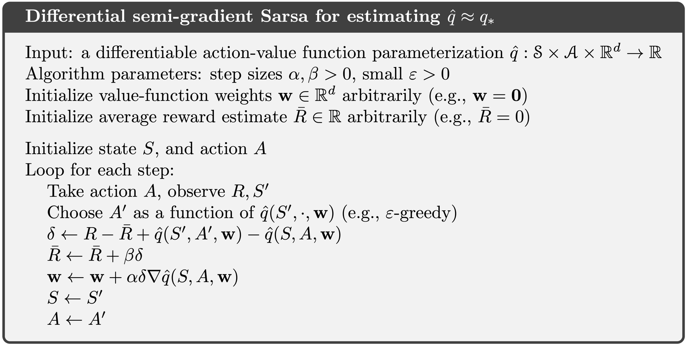
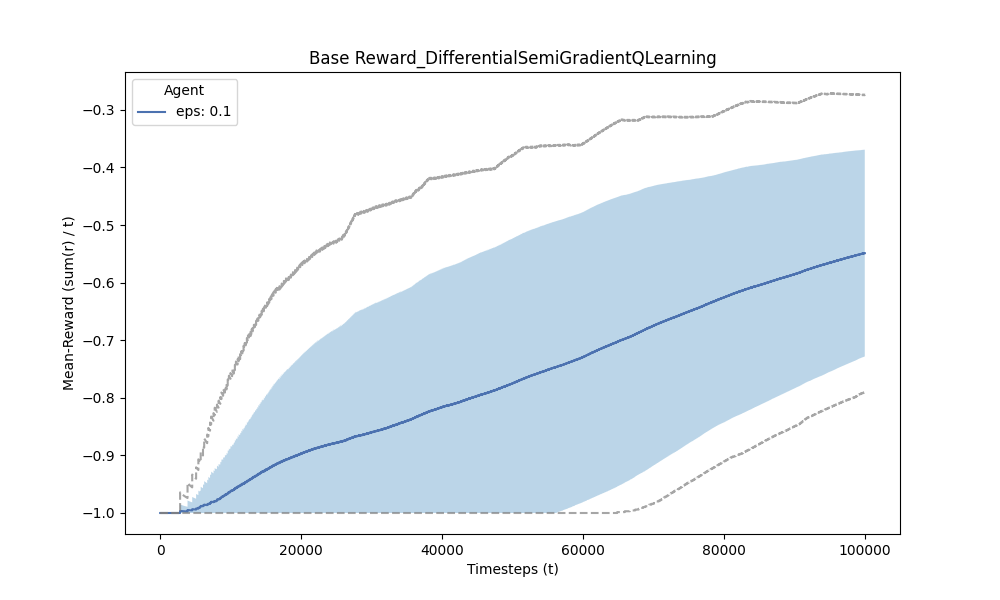
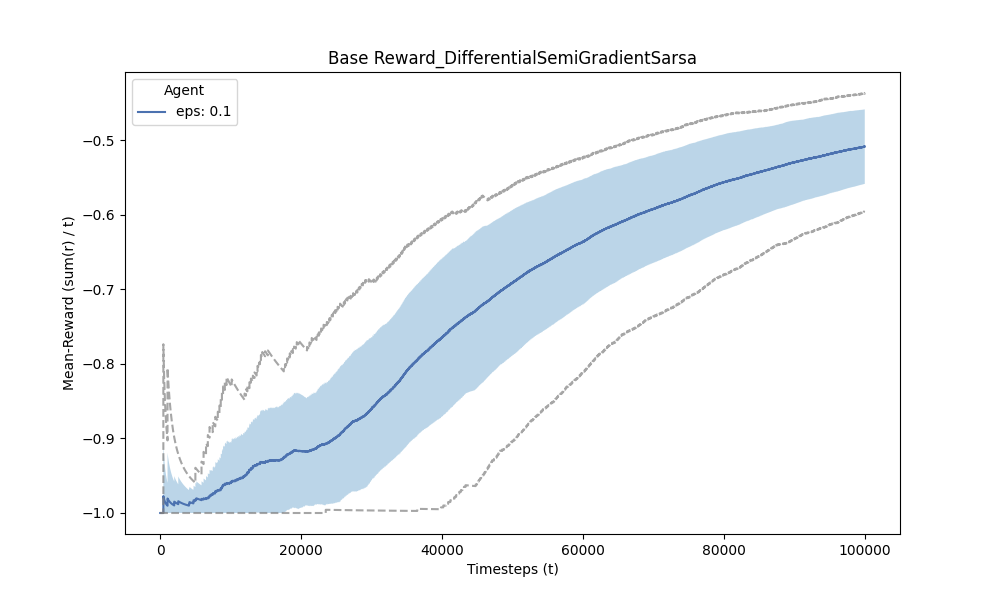

[Sutton & Barto RL Book]: http://incompleteideas.net/book/RLbook2020.pdf


# On-policy Control with Approximation

## Table of Contents
- [Introduction](#introduction)
- [Implemented Algorithms](#implemented-algorithms)

## Introduction
This section contains methods from Chapter 10 in [Sutton & Barto RL Book].

#### Linear Methods
Approximate functions $\hat{v}(\cdot, \mathbf{w})$ or $\hat{q}(\cdot, \mathbf{w})$, 
are a linear function of the weight vector $\mathbf{w}$. 
Linear methods approximate the value functions by the inner product 
between $\mathbf{w}$ and $\mathbf{x}(s)$ - for the state-value 
function $\hat{v}(\cdot, \mathbf{w})$; or 
$\mathbf{x}(s, a)$ for $\hat{q}(\cdot, \mathbf{w})$ for the state-action value function, where $\mathbf{x}(s)$ or $\mathbf{x}(s, a)$ are feature vectors, encoding the state
or state-action pairs into a feature space.

The value functions are defined as:
* $\hat{v}(s, \mathbf{w}) \overset{\cdot}{=} \mathbf{w}^\top \mathbf{x}(s) \overset{\cdot}{=} \sum_{i=1}^{d} w_i x_i(s)$
* $\hat{q}(s, a, \mathbf{w}) \overset{\cdot}{=} \mathbf{w}^\top \mathbf{x}(s, a) \overset{\cdot}{=} \sum_{i=1}^{d} w_i x_i(s, a)$

The gradient of the approximate value functions with respect to $\mathbf{w}$
in this case are:
* $\nabla \hat{v}(s, \mathbf{w}) = \mathbf{x}(s)$
* $\nabla \hat{q}(s, a, \mathbf{w}) = \mathbf{x}(s, a)$


## Implemented Algorithms
- [x]  Semi-gradient Sarsa (Section: 10.1): `agents.py/SemiGradientSarsa`
- [x]  n-Step Semi-gradient Sarsa (Section: 10.2): `agents.py/nStepSemiGradientSarsa`
- [x]  Differential Semi-Gradient Sarsa (Section: 10.3): `agents.py/DifferentialSemiGradientSarsa`
- [x]  Differential Semi-Gradient QLearning (Section: 10.3): `agents.py/DifferentialSemiGradientQLearning`


## Algorithms - Episodic Semi-Gradient Control
### Semi-Gradient Sarsa


#### Experiments
Here the [MountainCar](https://gymnasium.farama.org/environments/classic_control/mountain_car_continuous/) environment from OpenAI's Gymnasium is used.
This is a continuous control environment where the agent is a car that must reach the flag at the top of the hill.

The continuous state-space is discretized into feature vectors using tile-coding from [`tiles3.py`](http://incompleteideas.net/tiles/tiles3.py-remove) - where, as in footnote (1) in the book - it is used as:
- `iht=IHT(4096)` 
- `tiles(iht,8,[8*x/(0.5+1.2),8*xdot/(0.07+0.07)],[A])`

where the number of tiles & tilings are set to 8.

###### Parameters
The following parameters are used:
* Num episodes = 200
* Evaluation frequency = 5
* Max steps = 999
* &epsilon; = 0.01
* learning rate (&alpha;) was decayed from 
  * start  = 1 / (2 * num_tilings) = 1 / (2 * 8)
  * end = 1 / (10 * num_tilings) = 1 / (10 * 8)

  
| Train                                                                                       | Evaluation                                                                                 | 
|---------------------------------------------------------------------------------------------|--------------------------------------------------------------------------------------------|
|  |  | 


### n-Step Semi-Gradient Sarsa
An n-step version of episodic semi-gradient Sarsa by using an n-step return as the update target in the semi-gradient Sarsa update equation.
The n-step return immediately generalizes from its tabular form to a function approximation form.

$G_{t:t+n} \overset{\cdot}{=} R_{t+1} + \gamma R_{t+2} + \cdots + \gamma^{n-1} R_{t+n} + \gamma^n \hat{q}(S_{t+n}, A_{t+n}, \mathbf{w}_{t+n-1}), \ t + n < T$

The integrated algorithm is shown below:


#### Experiments
The same MountainCar environment is used for this experiment, with the same parameters as the Semi-Gradient Sarsa experiment (above)

Paremeters pertaining to nStep-Semi-Gradient Sarsa for the shown results are:
* n = 4
* &epsilon; = 0.05
  
| Train                                                                                            | Evaluation                                                                                      | 
|--------------------------------------------------------------------------------------------------|-------------------------------------------------------------------------------------------------|
|  |  | 

Results for other parameters and reward shaping functions are located under `images/results` folder.


### Reward Shaping
Three reward shaping functions were also tried to encourage the car to reach the flag.
The results for these methods are located under `images/results` folder.

```python
# 1.Encourage the car to reach the flag by giving a reward proportional to the position of the car
def reward_shaper_position(reward: float, state:np.ndarray, done: bool, t: int):
    k = 0.1
    return reward + k * (state[0] - 0.45)

# 2. Encourage the car to reach the flag by giving a reward proportional to the 
# position of the car and discourage small velocities - which would default 
# to the car oscillating at the trough between the two hills
def reward_shaper_position_velocity(reward: float, state:np.ndarray, done: bool, t: int):
    k = 0.1
    return reward + k * (state[0] - 0.45)  * (0.07/(abs(state[1]) + 0.001))

# 3. Focus only on the velocity of the car
def reward_shaper_velocity(
        reward: float, state: np.ndarray, done: bool, t: int):
    k = 0.1
    return reward + k * np.sign((state[0] - 0.45)) * (0.07 / (abs(state[1]) + 0.001))
```


## Algorithms - Continuing Task Semi-Gradient Control

### Average Reward
Like the discounted setting, the average reward setting applies to continuing problems, 
problems for which the interaction between agent and environment goes on and on forever 
without termination or start states. Unlike that setting, however, there is no discounting—the agent 
cares just as much about delayed rewards as it does about immediate reward.

In the average-reward setting, the quality of a policy $\pi$  is defined as the average rate of reward, 
or  simply average reward $r(\pi)$, while following that policy.


$r(\pi) \overset{\cdot}{=} \lim_{{h \to \infty}} \frac{1}{h} \sum_{{t=1}}^{h} \mathbb{E} \left[ R_t \mid S_0, A_{0:t-1} \sim \pi \right]$

$\hspace{1cm} = \lim_{{t \to \infty}} \mathbb{E} \left[ R_t \mid S_0, A_{0:t-1} \sim \pi \right]$

$\hspace{1cm} = \sum_{s} \mu_{\pi}(s) \sum_{a} \pi(a \mid s) \sum_{s',r} p(s', r \mid s, a)r$

The second and third equations hold if the steady-state distribution 
$\mu_{\pi}(s) \overset{\cdot}{=} \lim_{{t \to \infty}} \Pr \{ S_t = s \mid A_{0:t-1} \sim \pi \}$ exists,
exists and is independent of $S_0$, in other words, if the MDP is _ergodic_. 
In an ergodic MDP, the starting state and any early decision made by the agent 
can have only a temporary effect, in the long run the expectation of being in 
a state depends only on the policy and the MDP transition probabilities.

For most practical purposes it may be adequate simply to order policies 
according to their average reward per time step $r(\pi)$. All 
policies that attain the maximal value of $r(\pi)$ are considered to be optimal.

In the average-reward setting, returns are defined in terms of 
differences between rewards and the average reward:

$G_t \overset{\cdot}{=} R_{t+1} - r(\pi) + R_{t+2} - r(\pi) + R_{t+3} - r(\pi) + \dots$

which are known as the _differential return_, and the corresponding 
value functions are known as _differential value functions_.

Differential value functions are defined in terms of the new return just as 
conventional value functions were defined in terms of the discounted return; 
therefore the same notation is used. Differential value functions also have 
Bellman equations, just slightly different from those of the episodic setting.

* $v_{\pi}(s) = \sum_{a} \pi(a \mid s) \sum_{r, s'} p(s', r \mid s, a) \left[ r - r(\pi) + v_{\pi}(s') \right]$
* $q_{\pi}(s, a) = \sum_{r, s'} p(s', r \mid s, a) \left[ r - r(\pi) + \sum_{a'} \pi(a' \mid s') q_{\pi}(s', a') \right]$ $\hspace{1cm}(1)$
* $v_\*(s) = \max_{a} \sum_{r, s'} p(s', r \mid s, a) \left[ r - \max_{\pi} r(\pi) + v_*(s') \right]$
* $q_\*(s, a) = \sum_{r, s'} p(s', r \mid s, a) \left[ r - \max_{\pi} r(\pi) + \max_{a'} q_*(s', a') \right]$  $\hspace{1cm}(2)$

The differential form of TD errors is defined as:
* $\delta_t = R_{t+1} - \bar{R}_t + \hat{v}(S_{t+1}, \mathbf{w}_t) - \hat{v}(S_t, \mathbf{w}_t)$
* $\delta_t = R_{t+1} - \bar{R}_t + \hat{q}(S_{t+1}, A_{t+1}, \mathbf{w}_t) - \hat{q}(S_t, A_t, \mathbf{w}_t)$ $\hspace{1cm}(3)$

where $\bar{R}_t$ is an estimate at time $t$ of the average reward $r(\pi)$.

The differential semi-gradient Sarsa algorithm (for estimating q) is shown below:



which leverages the differential form of the TD error to update the weights $(3)$.

If we would like to implement the QLearning (i.e. SarsaMax), using the definition in $(2)$ 
we could use the following TD error:
* $\delta_t = R_{t+1} - \max{({R}_t}) + \max_a{\hat{q}(S_{t+1}, a, \mathbf{w}_t)} - \hat{q}(S_t, A_t, \mathbf{w}_t)$  $\hspace{1cm}(4)$

where $\max({{R}_t})$ is an estimate of $\max_\pi{r(\pi)}$ in $(2)$ and is simply
the maximum reward seen so far.


#### Experiments
The same MountainCar environment is used for these experiments, where the 
environment is set to be continuous (100k steps). Since the environment 
"out of the box" simply resets the vehicle to the starting position 
when it reaches the flag, and continues to generate "-1" reward, the environment
was modified to award a reward of "100" upon reaching the flag. This was done 
to show the effect of the __average reward__ setting on the agent's learning,
since a continuing reward of "-1" has the same average reward (of -1).

* Parameters
  * $\epsilon$ linear decay schedule: 100k(steps) /3

| Algorithm                                         | Results                                                                                                     | 
|---------------------------------------------------|-------------------------------------------------------------------------------------------------------------|
| Differential Semi-Gradient _QLearning_: eps = 0.1 |  |
| Differential Semi-Gradient _Sarsa_: eps = 0.1     |      |

For other $\epsilon$ settings, please refer to `images/results` folder.

