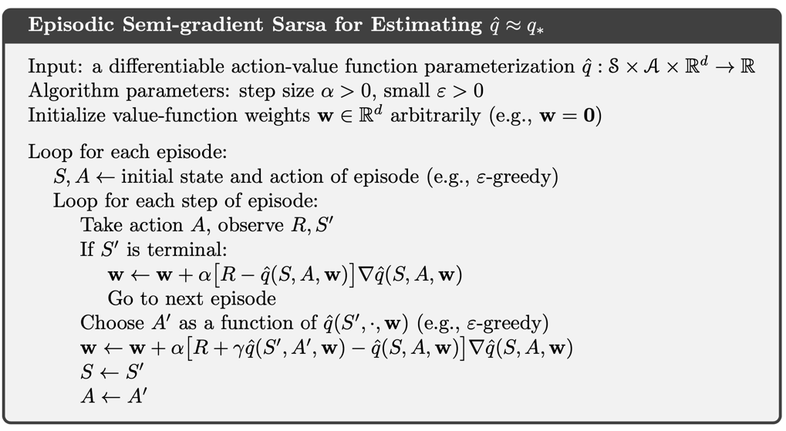
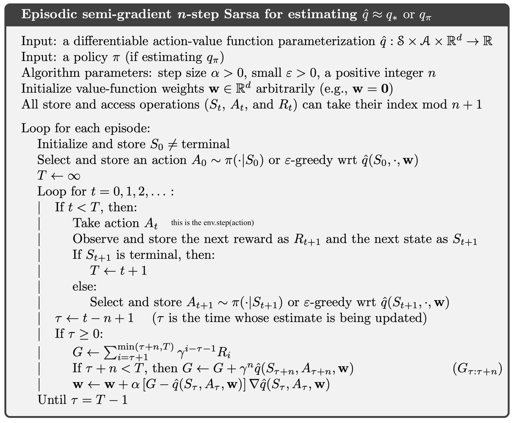

[Sutton & Barto RL Book]: http://incompleteideas.net/book/RLbook2020.pdf


# On-policy Control with Approximation

## Table of Contents
- [Introduction](#introduction)
- [Implemented Algorithms](#implemented-algorithms)

## Introduction
This section contains methods from Chapter 10 in [Sutton & Barto RL Book].

#### Linear Methods
Approximate functions $\hat{v}(\cdot, \mathbf{w})$ or $\hat{q}(\cdot, \mathbf{w})$, 
are a linear function of the weight vector $\mathbf{w}$. 
Linear methods approximate the value functions by the inner product 
between $\mathbf{w}$ and $\mathbf{x}(s)$ - for the state-value 
function $\hat{v}(\cdot, \mathbf{w})$; or 
$\mathbf{x}(s, a)$ for $\hat{q}(\cdot, \mathbf{w})$ for the state-action value function, where $\mathbf{x}(s)$ or $\mathbf{x}(s, a)$ are feature vectors, encoding the state
or state-action pairs into a feature space.

The value functions are defined as:
* $\hat{v}(s, \mathbf{w}) \overset{\cdot}{=} \mathbf{w}^\top \mathbf{x}(s) \overset{\cdot}{=} \sum_{i=1}^{d} w_i x_i(s)$
* $\hat{q}(s, a, \mathbf{w}) \overset{\cdot}{=} \mathbf{w}^\top \mathbf{x}(s, a) \overset{\cdot}{=} \sum_{i=1}^{d} w_i x_i(s, a)$

The gradient of the approximate value functions with respect to $\mathbf{w}$
in this case are:
* $\nabla \hat{v}(s, \mathbf{w}) = \mathbf{x}(s)$
* $\nabla \hat{q}(s, a, \mathbf{w}) = \mathbf{x}(s, a)$


## Implemented Algorithms
- [x]  Semi-gradient Sarsa (Section: 10.1): `agents.py/SemiGradientSarsa`
- [x]  n-Step Semi-gradient Sarsa (Section: 10.2): `agents.py/nStepSemiGradientSarsa`


## Algorithms

### Semi-Gradient Sarsa



#### Experiments
Here the [MountainCar](https://gymnasium.farama.org/environments/classic_control/mountain_car_continuous/) environment from OpenAI's Gymnasium is used.
This is a continuous control environment where the agent is a car that must reach the flag at the top of the hill.

The continuous state-space is discretized into feature vectors using tile-coding from [`tiles3.py`](http://incompleteideas.net/tiles/tiles3.py-remove) - where, as in footnote (1) in the book - it is used as:
- `iht=IHT(4096)` 
- `tiles(iht,8,[8*x/(0.5+1.2),8*xdot/(0.07+0.07)],[A])`

where the number of tiles & tilings are set to 8.

###### Parameters
The following parameters are used:
* Num episodes = 200
* Evaluation frequency = 5
* Max steps = 999
* &epsilon; = 0.01
* learning rate (&alpha;) was decayed from 
  * start  = 1 / (2 * num_tilings) = 1 / (2 * 8)
  * end = 1 / (10 * num_tilings) = 1 / (10 * 8)

  
| Train                                                                                       | Evaluation                                                                                 | 
|---------------------------------------------------------------------------------------------|--------------------------------------------------------------------------------------------|
|  |  | 


### n-Step Semi-Gradient Sarsa
An n-step version of episodic semi-gradient Sarsa by using an n-step return as the update target in the semi-gradient Sarsa update equation.
The n-step return immediately generalizes from its tabular form to a function approximation form.

$G_{t:t+n} \overset{\cdot}{=} R_{t+1} + \gamma R_{t+2} + \cdots + \gamma^{n-1} R_{t+n} + \gamma^n \hat{q}(S_{t+n}, A_{t+n}, \mathbf{w}_{t+n-1}), \ t + n < T$

The integrated algorithm is shown below:



#### Experiments
The same MountainCar environment is used for this experiment, with the same parameters as the Semi-Gradient Sarsa experiment (above)

  
| Train                                                                                            | Evaluation                                                                                      | 
|--------------------------------------------------------------------------------------------------|-------------------------------------------------------------------------------------------------|
|  |  | 


### Reward Shaping
Three reward shaping functions were also tried to encourage the car to reach the flag.
The results for these methods are located under `images/results` folder.

```python
# 1.Encourage the car to reach the flag by giving a reward proportional to the position of the car
def reward_shaper_position(reward: float, state:np.ndarray, done: bool, t: int):
    k = 0.1
    return reward + k * (state[0] - 0.45)

# 2. Encourage the car to reach the flag by giving a reward proportional to the 
# position of the car and discourage small velocities - which would default 
# to the car oscillating at the trough between the two hills
def reward_shaper_position_velocity(reward: float, state:np.ndarray, done: bool, t: int):
    k = 0.1
    return reward + k * (state[0] - 0.45)  * (0.07/(abs(state[1]) + 0.001))

# 3. Focus only on the velocity of the car
def reward_shaper_velocity(
        reward: float, state: np.ndarray, done: bool, t: int):
    k = 0.1
    return reward + k * np.sign((state[0] - 0.45)) * (0.07 / (abs(state[1]) + 0.001))
```
