[Sutton & Barto RL Book]: http://incompleteideas.net/book/RLbook2020.pdf

# Multi-armed Bandits
The most important feature distinguishing reinforcement learning from other 
types of learning is that it uses training information that _evaluates_ the 
actions taken rather than _instructs_ by giving correct actions.This is 
what creates the need for active exploration, for an explicit search for 
good behavior. Purely _evaluative_ feedback indicates how good the action 
taken was, but not whether it was the best or the worst action possible. 
Purely _instructive_ feedback, on the other hand, indicates the correct 
action to take, independently of the action actually taken. This kind of 
feedback is the basis of supervised learning. In their pure forms, these 
two kinds of feedback are quite distinct: evaluative feedback depends 
entirely on the action taken, whereas instructive feedback is independent of 
the action taken.

## Experiments:
* [Ex 1 - stationary environment, sample average action value estimation, $\varepsilon$-greedy](#experiment-1-stationary-testbed-sample-average-action-value-varepsilon-greedy-selection)
* [Ex 2 - stationary environment, exponential average (const step size) action value estimation, $\varepsilon$-greedy](#experiment-2-stationary-testbed-constant-step-size-for-action-value-varepsilon-greedy-selection)
* [Ex 3 - stationary environment, exponential average (const step size) action value estimation, $\varepsilon$-greedy](#experiment-3-non-stationary-testbed-constant-step-size-for-action-value-varepsilon-greedy-selection)
* [Ex 4 - stationary environment, sample average action value estimation, $\varepsilon$-greedy](#experiment-4-non-stationary-testbed-sample-average-action-value-estimation-varepsilon-greedy-selection)
* [Ex 5 - stationary environment, comparing initial action values, sample average action value estimation, $\varepsilon$-greedy](#experiment-5-stationary-testbed-initial-values-comparison-sample-average-action-value-estimation-varepsilon-greedy-selection)
* [Ex 6 - stationary environment, $\varepsilon$-greedy vs. UCB1](#experiment-6-stationary-testbed-varepsilon-greedy-vs-ucb1)
* [Ex 7 - Stationary environment, gradient method - naiive preference, baseline evaluation](#experiment-7-stationary-testbed-gradient-method---naiive-preference-baseline-evaluation)
* [Ex 8 - Non-Stationary environment, Softmax Exploration](#experiment-8-non-stationary-testbed-softmax-exploration)
* [Ex 9 - Stationary environment, Bernoulli-Greedy](#experiment-9-stationary-environment-bernoulli-greedy)
* [Ex 10 - Stationary environment, Bernoulli Thompson Sampling](#experiment-10-stationary-environment-bernoulli-thompson-sampling)
* [Ex 11 - Non-Stationary Environment, Bernoulli Thompson Sampling](#experiment-11-non-stationary-environment-bernoulli-thompson-sampling)

## Non-Associative Bandits
The non-associative setting, which does not involve learning to act in 
more than one situation, is the one in which most prior work involving 
evaluative feedback has been done, and it avoids much of the complexity 
of the full reinforcement learning problem. Studying this case enables us to 
see most clearly how evaluative feedback differs from, and yet can be 
combined with, instructive feedback.

## The k-armed Bandit Problem
Consider the following learning problem. You are faced repeatedly with a 
choice among $k$ different options, or _actions_. After each choice you 
receive a numerical _reward_ chosen from a __stationary probability 
distribution__ that depends on the action you selected. The objective is to 
maximize the expected total reward over some time period. This is the original 
form of the _$k$-armed bandit_ problem, so named by analogy to a slot
machine, or “_one_-armed bandit,” except that it has $k$ levers instead of one. 
Each action selection is like a play of one of the slot machine’s levers, 
and the rewards are the payoffs for hitting the jackpot. Through repeated 
action selections you are to maximize your winnings by concentrating your 
actions on the best levers. Today the term “bandit problem” is sometimes 
used for a generalization of the problem described above.

### Action Values
In our $k$-armed bandit problem, each of the $k$ actions has an expected or 
mean reward given that that action is selected; let us call this the 
_value_ of that action. We denote the action selected on time step $t$ as 
$A_t$, and the corresponding reward as $R_t$.

The (true) _value_, then, of an arbitrary action $a$, denoted $q_{*}(a)$, is the 
expected reward given that $a$ is selected:

$$
q_{*}(a) \overset \cdot{=} \mathbb{E}[R_t | A_t = a]
$$

If you knew the (true) value of each action, then it would be trivial to 
solve the $k$ -armed bandit problem: you would always select the action with 
the highest value. We assume that you _do not know_ the action values with 
certainty, although you may have _estimates_. We denote the estimated value 
of action $a$ at time step $t$ as $Q_{t}(a)$. We would like 
$Q_{t}(a)$ to be close to $q_{*}(a)$.

### Exploration vs. Exploitation
If you maintain estimates of the action values, then at any time step there is 
at least one action whose estimated value is greatest. We call these the 
_greedy_ actions. When you select one of these actions, we say that you are 
__exploiting__ your current knowledge of the values of the actions. If instead 
you select one of the nongreedy actions, then we say you are __exploring__, 
because this enables you to improve your estimate of the nongreedy action’s
value. Exploitation is the right thing to do to maximize the expected reward on the one
step, but exploration may produce the greater total reward in the long run.
Because it is not possible both to explore and to exploit with any single 
action selection, one often refers to the “conflict” between exploration 
and exploitation.

### Action - Value Methods
These are methods for estimating the values of actions and
for using the estimates to make action selection decisions, which are 
collectively call _action-value methods_. The __true__ value of an action is 
the _mean reward_ when that action is selected. One natural way to _estimate_ 
this is by averaging the rewards actually received:

$$
Q_{t}(a) \overset \cdot{=} \frac{\text{sum of rewards when $a$ taken prior to $t$}}{\text{number of times $a$ taken prior to $t$}} = \frac{\sum_{i=1}^{t-1}R_i \cdot \mathbb{1}_{A_i = a}}{\sum_{i=1}^{t-1} \mathbb{1}_{A_i = a}} 
$$

If the denominator is zero, we define $Q_t(a)$ as some default value, 
such as $0$. As the denominator goes to infinity, by the law of large 
numbers, $Q_t(a)$ converges to $q_{*}(a)$. This is called the 
_sample-average_ method for estimating action values because each estimate 
is an average of the sample of relevant rewards. 

### Action Selection 
The simplest action selection rule is to select one of the actions with the 
highest estimated value, that is, one of the _greedy_ actions.
If there is more than one greedy action, then a selection is made among 
them in some arbitrary way, perhaps randomly. Greedy action selection method is
writen as:

$$
A_t \overset \cdot{=} \text{arg max}_a Q_t(a)
$$

with ties broken arbitrarily. Greedy action selection always exploits current 
knowledge to maximize immediate reward; it spends no time at all sampling 
apparently inferior actions to see if they might really be better. 
A simple alternative is to behave greedily most of the time, but every once 
in a while, say with small probability $\varepsilon$, instead select randomly from among 
all the actions with equal probability, independently of the action-value 
estimates. These near-greedy action selection rules are called
_$\varepsilon$-greedy_ methods. In the limit as the number of steps increases,
every action will be sampled an infinite number of times, 
thus ensuring that all the $Q_t(a)$ converge to their respective $q_{*}(a)$.
This implies that the probability of selecting the optimal action 
converges to greater than $1 - \varepsilon$, that is, to near certainty. 
These are just asymptotic guarantees, however, and say little about the 
practical effectiveness of the methods. $\varepsilon$-greedy algorithm can be formulated as:

$$
A_t \leftarrow 
\begin{cases}
\text{arg max}_a Q_t(a) &\quad \text{with $p = 1 - \varepsilon$} \\
a \sim \mathcal{U} (\{a_0, a_1, ...,a_{|\mathcal{A}| - 1}\}) &\quad \text{with $p = \varepsilon$}
\end{cases}
$$

### Action Value
The naiive estimation of the action value $Q(a)$, is to take the sample 
average of the observed rewards. But instead of keep track of all the samples
and computing the average for each selection step - in our decision - we can 
approach it in an incremental fashion.

For a reward $R_i$ observed after taking action $A_{i} = a$, and $Q_n$ be $a$'s
value estimate after it has been selected $n-1$ times, we have:

$$
Q_n \overset \cdot{=} \frac{R_1 + R_2 + ... + R_{n-1}}{n - 1}
$$

This formulation requires that we keep a record of all the times $a$ has been 
selected, and at each step, we estimate $Q_n$. 

###### Incremental Approach
The incremental approach for computing $Q_n$ can be done as follows:

$$
\begin{align*}
Q_{n + 1} &= \frac{1}{n}\sum_{i = 1}^{n} R_i \\
&= \frac{1}{n}\Bigl(R_n + (n-1) \frac{1}{n-1} \sum_{i=1}^{n-1} R_i \Bigr) \\
&=\frac{1}{n}\Bigl(R_n + (n-1)Q_n  \Bigr) \\
&=\frac{1}{n}\Bigl(R_n + nQ_n - Q_n  \Bigr) \\
&= Q_n + \frac{1}{n}\Bigl[R_n - Q_n \Bigr]
\end{align*}
$$

The update rule:

$$
Q_{n+1} = Q_n + \frac{1}{n}\Bigl[R_n - Q_n \Bigr]
$$

is a specific form of a more general update rule:

$$
Q_{n+1} = Q_n + \alpha \Bigl[R_n - Q_n \Bigr]
$$

Where $Q$ can be any sample estimate (not just action value). This update 
form is used extensively in RL. $R_n - Q_n$ is the error in estimate, and it is
reduced by taking a step towards the target. $\alpha$ is called the _step size_.

In the step size in the incremental implementation above $\alpha = \frac{1}{n}$
changes with every action selection (even though in the naiive approach above
it's not action dependent). But we can generalize step size more broadly as 
$\alpha_t(a)$

### Bandit Algorithm
Pseudocode for a complete bandit algorithm using incrementally computed sample
averages and $\varepsilon$-greedy action selection is shown in the box below. 

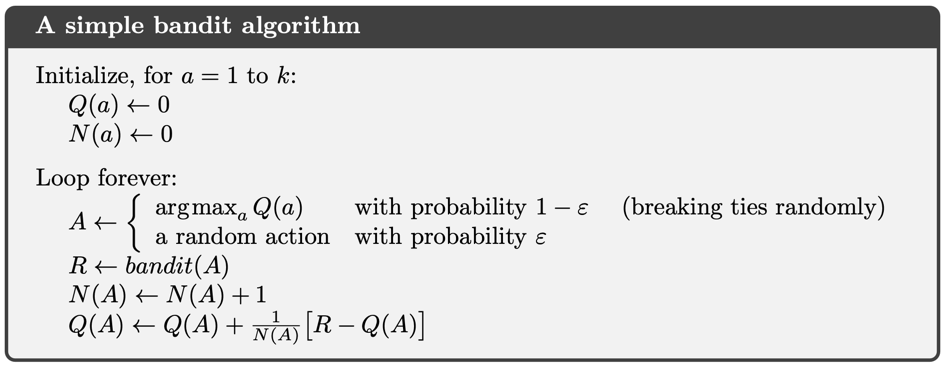

## Regret
When measuring the performance of the algorithms, besides the sum of rewards
we've obtained, we are also interested in measuring how efficient the approach
is. One way to do this is via the _regret_ metric. This metric measures
the "true" rewards "left on the table", i.e. if we were to know the true value
of the action (in practice we can't, but in simulations we can), how much we 
gave up. Ideally as the selection strategy learns, the rewards we leave on the 
table approaches zero.

The random variable of regret $Z_t$ is defined  as the difference between the 
optimal reward $q^{*}(A_i = a^*)$ minus  the true value of the selected 
action random variable $A_i = a$, defined as 
$q^*(A_i = a) = \mathbb{E}[R_i | A_i = a]$:

$$
\begin{align*}
Z_t &= \sum_{i = 1}^{t}\mathbb{}(q^{*}(A_i = a^{*}) - q^*(A_i = a))
\end{align*}
$$

To get an estimate of the regret $\mathbb{E}[Z_t]$ for a given strategy, 
we compute the sample average $\bar{Z}_t$ induced by this strategy over $N$ trials:

$$
\begin{align*}
\bar{Z}_t &= \frac{1}{N}\sum_{k=1}^{N}Z_t^{(k)} \\
&= \frac{1}{N}\sum_{k=1}^{N} \sum_{i=1}^{t} \Bigr( q^*(a^{*(k)}) - q^*(A_i = a^{(k)})\Bigl)
\end{align*}
$$

Under this notation, for these experiments the optimal action is changing
for each trial, hence the definition of the optimal action for trial
$k$ is $a^{*(k)}$. 

In (non-stationary) cases, where the optimal action changes over time, 
we would have:

$$
\begin{align*}
\bar{Z}_t &= \frac{1}{N}\sum_{k=1}^{N}Z_t^{(k)} \\
&= \frac{1}{N}\sum_{k=1}^{N} \sum_{i=1}^{t} \Bigr( q^*(a_{i}^{*(k)}) - q^*(A_i = a^{(k)})\Bigl)
\end{align*}
$$

where $a_{i}^{*(k)}$ is the optimal action for trial $k$ at step $i$.
Of course, we have access to the true reward values for any 
arbitrary action via the known environment. 

In the experiments, I'm tracking the _per-step_ or _average regret_, defined
as $\frac{\mathbb{E}[Z_t]}{t}$, as an efficiency metric. 
Ideally, this metric should tend towards $0$ in the limit.

## 10-armed Testbed
To roughly assess the relative effectiveness of the greedy and 
$\varepsilon$-greedy action-value methods, we compare them numerically on a 
suite of test problems. This is a set of $2000$ randomly generated $k$-armed 
bandit problems with $k = 10$. For each bandit problem, the action values, 
$q_{*}(a)$, where $a = 1, . . ., 10$, are selected according to a 
normal (Gaussian) distribution with mean $0$ and variance $1$. 

This means that for a bandit $j$ we have set its mean $\mu_j$ as 
$\mu_j = \mathbb{E}[R_t | A_t = a_j] \sim \mathcal{N}(0, 1)$. 

Then, during the simulation, when $a_j$ is selected, the observed reward is 
sampled as: $R_t \sim\mathcal{N}(\mu_j, 1)$.
 

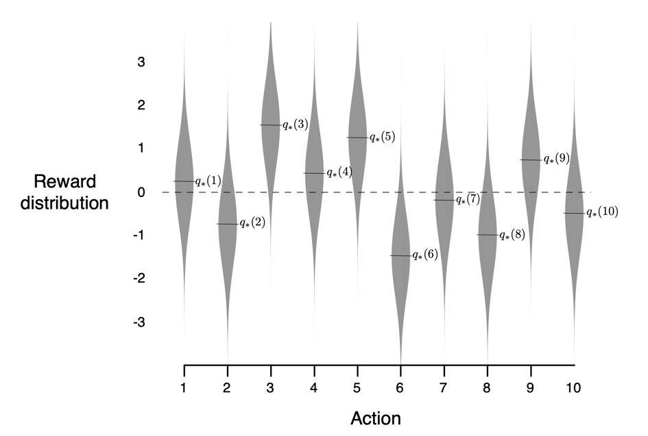

When the selection method selects action $A_t$ at time step $t$, the actual 
reward, $R_t$, is selected from a normal distribution with 
mean $q_{*}(A_t)$ and variance 1. This suite of test tasks is called
the _10-armed testbed_. For any learning method, we measure its performance
and behavior as it improves with experience over $1000$ time steps when applied 
to one of the bandit problems. This makes up one run. Repeating this for 
$2000$ independent runs, each with a different bandit problem, we obtained 
measures of the learning algorithm’s average behavior.

###### Task Extension
To extend and allow the testing of other learning algorithms, the test bed 
implemented supports two variants:

* _Stationary_: each bandit has fixed mean / std dev.
* _Non-stationary_: each bandit's mean follows a (normal) random walk

#### Experiment 1: Stationary Testbed, sample average action value,  $\varepsilon$-greedy selection.
The following implemented experiments relate to Figure 2.2 in the book. Here
action value is estimated using the following update rule:

$$
Q_{n+1} = Q_n + \frac{1}{n}\Bigl[R_n - Q_n \Bigr]
$$

which I have called this the monte-carlo estimate, 
$Q_{MC}(a)$, since it's an unbiased sample estimate of the action value. 
Action selection follows $\varepsilon$-greedy algorithm. Initial action value 
$Q_0 = 0$

Value function is implemented in `nonassociative_value_functions.py/QMonteCarlo`, 
while the incremental averaging method is implemented in 
`tools/moving_averages.py/CummulativeMovingAverage`.

| Average Rewards                                                     | Average Regret                                                      |
|---------------------------------------------------------------------|---------------------------------------------------------------------|
| 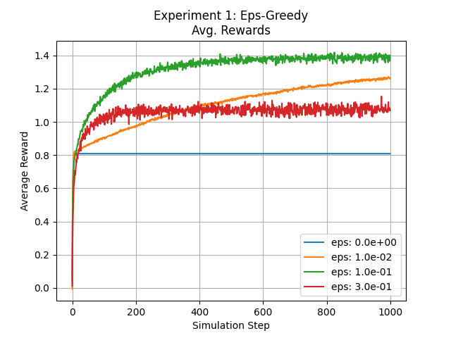 | 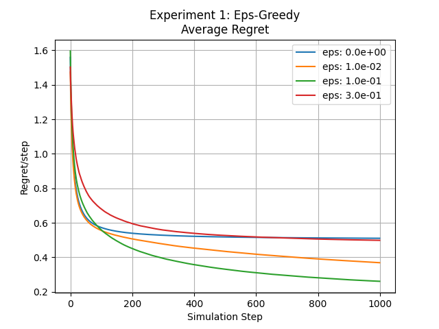 |

In this experiment, the sampled rewards from each bandit had a variance of 1. 
When we compare these graphs with those presented in the book we notice that 
the variance of the rewards is higher than those presented in the book. However, 
if we were to set the variance of the bandit to $0$, we obtain exactly the 
graphs of the book.

#### Experiment 2: Stationary Testbed, constant step size for action value, $\varepsilon$-greedy selection.
This experiment is set up the same as Experiment 1, with the exception that the 
update of the action value $Q$ is done using a fixed step $\alpha = 0.1$, with 
the following update value:

$$
Q_{n+1} = Q_n + \alpha\Bigl[R_n - Q_n \Bigr]
$$

Action selection follows $\varepsilon$-greedy algorithm. Initial action value 
$Q_0 = 0$

| Average Rewards                                                     | Average Regret                                                      |
|---------------------------------------------------------------------|---------------------------------------------------------------------|
| 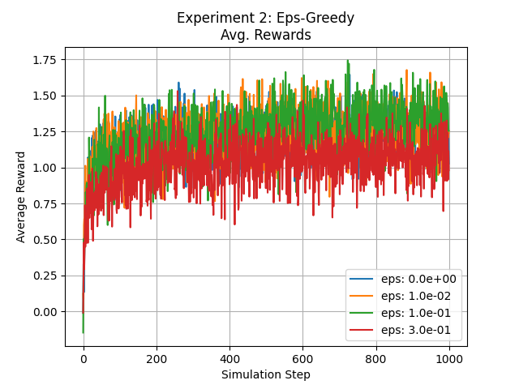 | 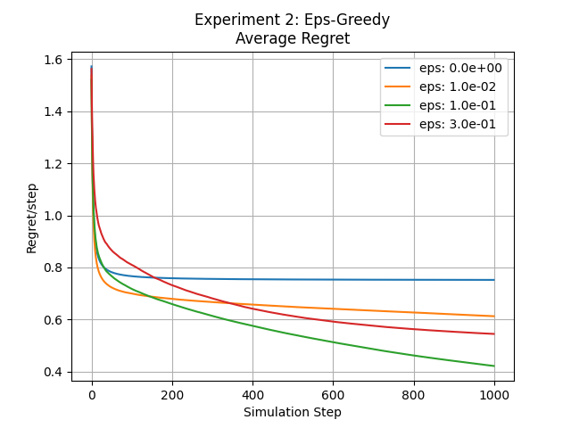 |

Value function is implemented in `nonassociative_value_functions.py/QCoefficientMovingAverage`, 
while the incremental averaging method is implemented in 
`tools/moving_averages.py/ExponentialMovingAverage`, which uses
a fixed coefficient in this experiment.

Here we notice that purely greedy and slightly greedy perform almost equally, 
and all perform better than the more agressive exploratory strategy 
$\varepsilon = 0.3$

### Non-Stationary Tasks
We often encounter reinforcement learning problems that are effectively
nonstationary. In such cases it makes sense to give more weight to recent rewards than
to long-past rewards. One of the most popular ways of doing this is to use a constant
step-size parameter.

I introduced the constant step size above, but let's dive into a bit more 
detail here. 

The update rule presented earlier is:

$$
Q_{n+1} \overset \cdot{=} Q_n + \alpha[R_n - Q_n] 
$$

for $\alpha \in (0, 1]$

$$
\begin{align*}
Q_{n+1} &\overset \cdot{=} Q_n + \alpha[R_n - Q_n] \\
&= \alpha R_n + (1 - \alpha)Q_n \\
&= \alpha R_n + (1 - \alpha)[\alpha R_{n-1} + (1 - \alpha)Q_{n - 1}] \\
&= \alpha R_n + (1 - \alpha)\alpha R_{n-1} + (1 - \alpha)^{2}Q_{n-1} \\
&= \alpha R_n + (1 - \alpha)\alpha R_{n-1} +  (1 - \alpha)^2\alpha R_{n-2} + ... + (1 - \alpha)^{n-1}\alpha R_{1} + (1 - \alpha)^{n}Q_{1} \\
&= (1 - \alpha)^n Q_1 + \sum_{i = 1}^{n}\alpha(1 - \alpha)^{n-i}R_{i}
\end{align*}
$$

This is called the _weighted average_ because the sum of the weights
$(1 - a)^n + \sum_{i = 1}^{n}\alpha (1 - \alpha)^{n - 1} = 1$. 

The weight $\alpha(1 - \alpha)^{n-i}$ given to $R_i$ depends on how many steps 
ago this reward was observed. Since $(1 - \alpha) < 1$, the weight given to 
the past rewards decreases - decays exponentially - over the steps. That is why
this average is also called _exponential recency-weighted average_. As we can
see, using a fixed step size recent rewards are weighted more, allowing for 
quicker adaptation to the non-stationary environment parameters.

Sometimes it is convenient to vary the step-size parameter from step to step. 
Let $\alpha_n(a)$ denote the step-size parameter used to process the reward 
received after the $n$th selection of action $a$. 
Convergence is not guaranteed for all choices of the sequence 
$\{\alpha_n(a)\}$. Stochastic approximation theory gives us the conditions required to
assure convergence with probability 1:

$$
\begin{align*}
\sum_{n = 1}^{\infty} \alpha_n(a) = \infty \quad \text{and} \quad \sum_{n = 1}^{\infty} \alpha_n^2(a) < \infty
\end{align*}
$$

The first condition is required to guarantee that the steps are large enough 
to eventually overcome any initial conditions or random fluctuations. 
The second condition guarantees that eventually the steps become small enough 
to assure convergence.

#### Experiment 3: Non-stationary Testbed, constant step size for action value, $\varepsilon$-greedy selection.
In this experiment the test bed is non-stationary. For each trial and each 
bandit, they are instantiated as normal random walk objects 
(`tools/random_walks.py/NormalRandomWalk`), each initialized with a random 
reward (mean) and randomness variance (random walk variance) of $0.1$, more
agressive than that mentioned in the book - refer 
to Exercise 2.5 - to make the non-stationarity and the results more obvious. 
Initial action values $Q_0(a) = 0$ for all actions,  and step size $\alpha = 0.1$

| Average Rewards                                                     | Average Regret                                                      |
|---------------------------------------------------------------------|---------------------------------------------------------------------|
| 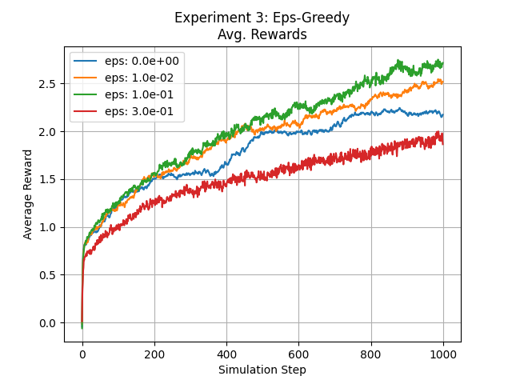 | 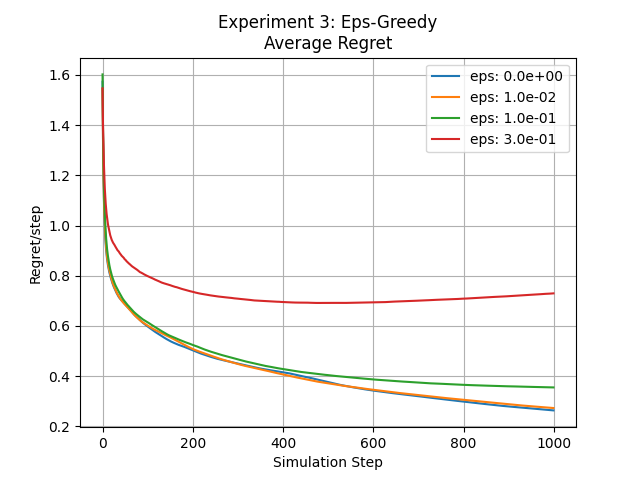 |

#### Experiment 4: Non-stationary Testbed, sample-average action value estimation, $\varepsilon$-greedy selection.
Here I'm showing the difficulties of using sample-averages for estimating 
action values. As was shown below, under this approach, remote samples have as
much weight as more recent ones. Using the same test bed paramters as Excercise 
3, here are the plots.

| Average Rewards                                                     | Average Regret                                                      |
|---------------------------------------------------------------------|---------------------------------------------------------------------|
| 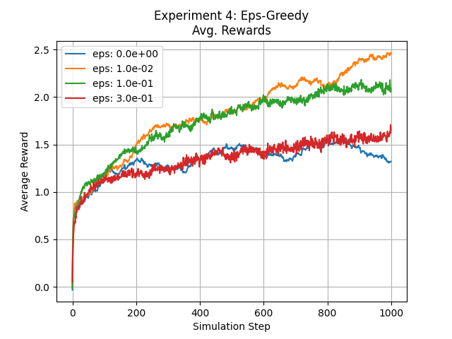 | 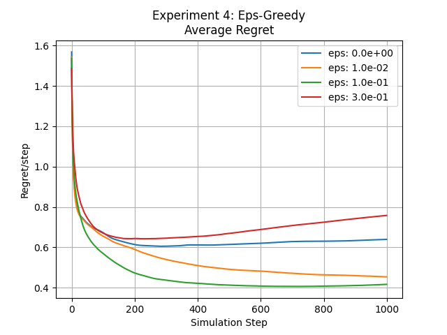 |

We can see that recency-weighted exponential averaging for action value 
estimation (exercise 3) is more efficient than sample-averaging (exercise 4).

## Optimistic Initial Values
In the current presentation and experiments so far, the initial action values 
$Q_0(a)$ were set to $0$ for all $a \in \mathcal{A}$. The results obtained were
also dependent on this value, i.e. they are biased by the initial estimation.

For the sample-average methods, the bias disappears once all
actions have been selected at least once, but for methods with constant
$\alpha$, the bias is permanent, though decreasing over time. This then becomes
a user set parameter.

Initial action values can also be used as a simple way to encourage exploration.
Since actions are selected greedily - with $1 - \varepsilon$ probability - setting
the initial value to something positive, will prompt the selection of these
actions. As these action values converge to their true values, any optimistic 
values will continuously be selected, thus resulting in initial exploration, as 
the values for all the actions converge to their final estimates. This pattern
holds even for $\varepsilon = 0$, as a purely greedy approach, will always 
chase the optimistic value while these values converge to their final values, 
and it becomes less exploratory. This way, purely greedy strategy behaves like
an $\varepsilon$-greedy strategy with a decaying $\varepsilon > 0$.

While this approach is effective in stationary problems, it is not very 
effective for the non-stationary setting, as the optimism driven exploration 
decreases over time, while in non-stationary environments action values need
to track the dynamic/moving/non-stationary expectations of the bandits.
Any method that focuses on the initial conditions in any special way
is unlikely to help with the general nonstationary case.

#### Experiment 5: Stationary Testbed, initial values comparison, sample-average action value estimation, $\varepsilon$-greedy selection.

Here we're comparing the effects of optimism in the initial action value estimations.

| Average Rewards                                                     | Average Regret                                                      |
|---------------------------------------------------------------------|---------------------------------------------------------------------|
| 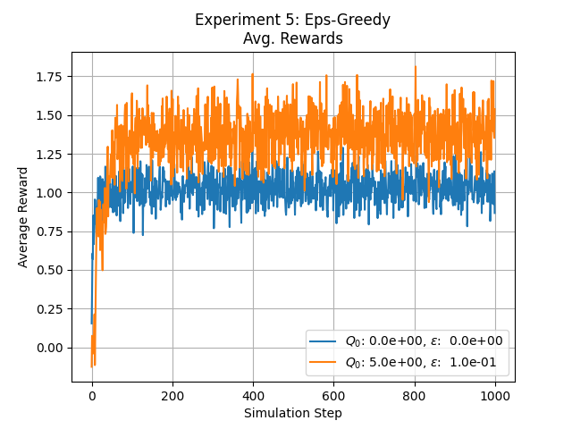 | 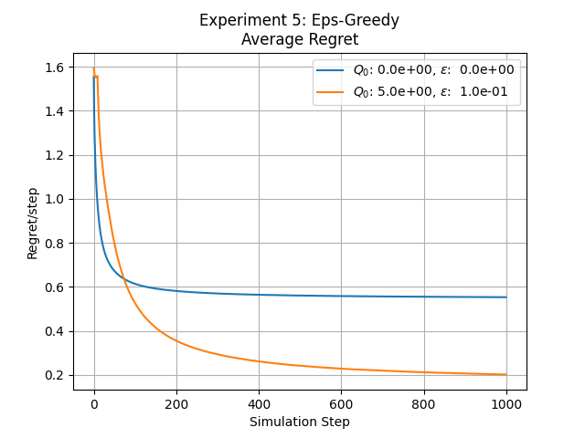 |

As we can see, optimistic initial estimations prompt for more exploration even 
when compared to $\varepsilon > 0$.

## Upper-Confidence-Bound Action Selection

$\varepsilon$-greedy action selection forces the non-greedy
actions to be tried, but _indiscriminately_, with no preference for those that 
are nearly greedy or particularly uncertain.

It would be better to select among the non-greedy actions according to their 
potential for actually being optimal, taking into account both how close their 
estimates are to being maximal and the uncertainties in those estimates. One 
way to do this is according to:

$$
\begin{align*}
A_t \overset \cdot{=} \arg \max_a \Bigl[Q_t(a) + c \sqrt{\frac{\ln t}{N_t(a)}} \Bigr]
\end{align*}
$$

where $N_t(a)$ denotes the number of times $a$ has been taken up to step $t$, 
and $c$ denotes the degree of exploration.

The square root, in the upper confidence bound (UCB) action selection,
is viewed as a measure of the uncertainty or variance in the estimate of $a$’s 
value. The quantity being max’ed over is thus a sort of upper bound 
on the possible true value of action $a$, with $c$ determining the 
confidence level. Every time $a$ is selected the uncertainty is reduced:
$N_t(a)$ increases, thus decreasing the uncertainty about its value. While, with
each step that $a$ is not selected, our uncertainty increases, prompting more 
exploration. The use of the natural log causes a smaller increase in uncertainty
over time, but ubounded nonetheless. This results in all actions being selected
over time, but those with more frequent visitations or lower action values
will be selected less frequently.

#### Experiment 6: Stationary Testbed, $\varepsilon$-greedy vs. UCB1.

| Average Rewards                                                     | Average Regret                                                      |
|---------------------------------------------------------------------|---------------------------------------------------------------------|
| 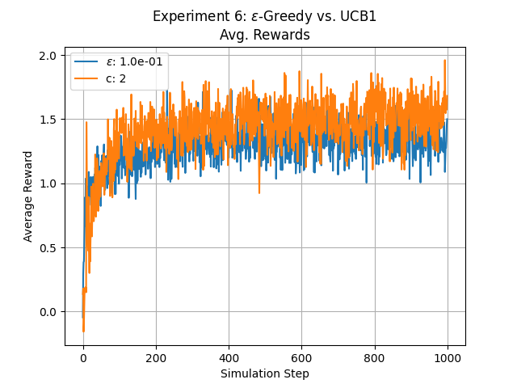 | 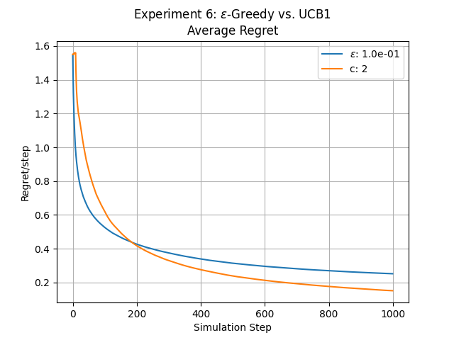 |

## Gradient Bandit Algorithms: Naiive Preference
Using action-value functions to select actions is not the only way.
Numerical _preferences_, denoted as $H_t(a) \in \mathbb{R}$ for each action 
$a \in \mathcal{A}$, are an alternative way to perform selection.
The larger the preference, the more often that action is
taken, but the preference has no interpretation in terms of reward. Only the 
_relative preference_ of one action over another matters. Action selection 
probabilities are determined according to the _softmax-distribution_:

$$
\begin{align*}
\text{Pr}\{A_t = a_i\} &\overset \cdot{=} \frac{e^{H_t(a_i)}}{\sum_{j = 1} ^ {|\mathcal{A}|}e^{H_t(a_j)}} \overset \cdot{=} \pi_t(a_i, \mathbf{z}_t)
\end{align*}
$$

where: $\mathbf{z}_t = H_t(\mathbf{a})$. Therefore, in the naiive preference 
method, actions are selected according to:

$$
a \sim \text{softmax}(H_t(\mathbf{z}_t))
$$

Initially all preferences $H_0$ are the same, so all the actions have equal 
probability of being selected. 

There is a natural learning algorithm for soft-max action preferences based on the idea
of stochastic gradient _ascent_. 

##### Gradient Ascent
Let's define: $\sigma(\mathbf{z}_t)_i = \pi(a_i, \mathbf{z}_t)$ 
and $\text{Pr}\{R_t | A_t \} = p_b(r | a_i)$. 

Also, the output of the softmax $\pi(\mathbf{a}, \mathbf{z}_t)$ is $[p_0, ..., p_{|\mathcal{A}| - 1}]$ be the 
probability distribution over rewards for bandit $i$, where its gradient is:

$$
\begin{align*}
\frac{\delta \pi(\mathbf{a}, \mathbf{z})_i}{\delta z_j} = 
\begin{cases}
p_i(1 - p_i) \quad \text{ $i = j$} \\
-p_i p_j \quad \quad \text{otherwise}
\end{cases}
\end{align*}
$$

The goal is to maximize the expectation of the reward 
$J(\mathbf{z}_t) = \mathbb{E}[R_t | \mathbf{z}_t]$ via
gradient ascent. In order to do this we need to obtain the gradient of the 
expectation. Since this is not analytically possible, we obtain expectation of 
a gradient which is estimated over samples. 

$$
\begin{align*}
\nabla_{\mathbf{z}_t} \mathbb{E}[R_t | \mathbf{z}_t] &= \nabla_{\mathbf{z}_t}[\sum_{r, a} r p_b(r | a) \pi(a, \mathbf{z}_t)] \\[1.0em]
&= \sum_{r, a} r p_b(r | a)\nabla_{\mathbf{z}_t}\pi(a, \mathbf{z}_t) \\[1.0em]
&= \sum_{r, a} r p_b(r | a) \pi(a, \mathbf{z}_t) \frac{\nabla_{\mathbf{z}_t}\pi(a, \mathbf{z}_t)}{\pi(a, \mathbf{z}_t)} \\[1.0em]
&= \sum_{r, a} r p(r , a) \frac{\nabla_{\mathbf{z}_t}\pi(a, \mathbf{z}_t)}{\pi(a, \mathbf{z}_t)} \\[1.0em]
&= \mathbb{E}[R_t \nabla_{\mathbf{z}_t}\log \pi(A_t, \mathbf{z}_t)] \\[1.0em]
&= \mathbb{E}[(R_t - \bar{R}_t) \nabla_{\mathbf{z}_t}\log \pi(A_t, \mathbf{z}_t)] \quad \text{with baseline}
\end{align*}
$$

Here $p_b(r | a)$ is the probability of obtaining reward $r$ from the selected 
bandit with action $a$. Note that introducing a baseline does not change
the proof: $\nabla \sum_{r, a} \bar{r}p_b(r | a)\pi(a) = \nabla\bar{r}\sum_{r, a}p(r, a) = \nabla \bar{r} = 0$

For the gradient of the log term we have: 

_Derivation form 1_:

$$
\begin{align*}
\nabla_{\mathbf{z}_t} \log \pi(A_t = a_i, \mathbf{z}_t) &= \nabla_{\mathbf{z}_t}(z_{i, t} - \log \sum_j e^{z_{j, t}}) \\
&= \nabla_{\mathbf{z}_t}z_{t, i} - \nabla_{\mathbf{z}_t} \log \sum_j e^{z_{j, t}} \\
&= \mathbf{e}_i - \pi(\mathbf{a}, \mathbf{z}_t) \\
&= [0, .., 1, ..., 0] - [p_0, p_1, ..., p_{|\mathcal{A}| - 1}] \\
& = [-p_0, -p_1, ..., (1 - p_i), ..., -p_{|\mathcal{A}| - 1}]
\end{align*}
$$

where:
* $\nabla_{\mathbf{z}_t}z_{t, i} = \frac{\delta z_{i, t}}{\delta_{z_{j, t}}} = \delta_{i, j} \implies \mathbf{e}_i = [0, ..., 1, ..., 0]$
* $\nabla_{\mathbf{z}_t} \log \sum_j e^{z_{j, t}} = \frac{1}{ \sum_j e^{z_{j, t}}} (\nabla_{\mathbf{z}_t}\sum_j e^{z_{j, t}}) = \frac{1}{ \sum_j e^{z_{j, t}}}([ e^{z_{0, t}}, e^{z_{1, t}}, ... ]) = \pi(\mathbf{a}, \mathbf{z}_t)$

Note that:
* $\nabla_{\mathbf{z}} e^{z_i} = [\frac{\partial e^{z_i}}{\partial z_0}, ..., \frac{\partial e^{z_i}}{\partial z_i}, ...]$
* $\frac{\partial e^{z_i}}{\partial z_j} = e^{z_i} \frac{\partial_{z_i}}{\partial_{z_j}} = 0$

_Derivation form 2_:

$$
\begin{align*}
\frac{\nabla_{\mathbf{z}_t}\pi(\mathbf{a}, \mathbf{z}_t)_i}{\pi(\mathbf{a}, \mathbf{z}_t)_i} &= [-\frac{p_0p_i}{p_i}, -\frac{p_1p_i}{p_i}, ..., \frac{p_i(1 - p_i)}{p_i}, ..., -\frac{p_{|\mathcal{A}| - 1}p_i}{p_i}] \\[1.0em]
&= [-p_0, -p_1, ..., (1 - p_i), ..., -p_{|\mathcal{A}| - 1}]
\end{align*}
$$

Thus in order to perform gradient ascent on the preference function, the update rule is:

$$
\mathbf{z}_{t+1} = \mathbf{z}_t + \alpha \nabla_{\mathbf{z}_t}J(\mathbf{z}_t)
$$

Since $\mathbf{z}_t = H_t(\mathbf{a})$, on each step, after selecting action $A_t$ 
and receiving the reward $R_t$, the action preferences are updated as:

$$
\begin{align*}
H_{t+1}(A_t) &\overset \cdot{=} H_t(A_t) + \alpha(R_t - \bar{R}_t)(1 - \pi_t(A_t)) \quad \text{and} \\
H_t(a) &= H_t(a) - \alpha(R_t - \bar{R}_t) \pi_t(a) \quad \text{ for $a \ne A_t$}
\end{align*}
$$

where $\bar{R}_t$ serves as the baseline. If the reward is higher than the baseline,
then the probability of taking $A_t$ in the future is increased, and if the reward is below
baseline, then the probability is decreased. The non-selected actions move in the opposite
direction.

#### Experiment 7: Stationary Testbed, Gradient Method - Naiive Preference, Baseline Evaluation
In this experiment we're evaluating the gradient method over different learning 
steps and the use of baseline. Here the means of the bandits $q_*(a)$ were 
sampled around +4 (refer to Figure 2.5 in the book). 

| Average Rewards                                                     | Average Regret                                                      |
|---------------------------------------------------------------------|---------------------------------------------------------------------|
| 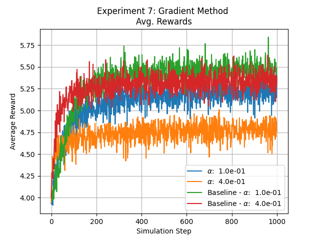 | 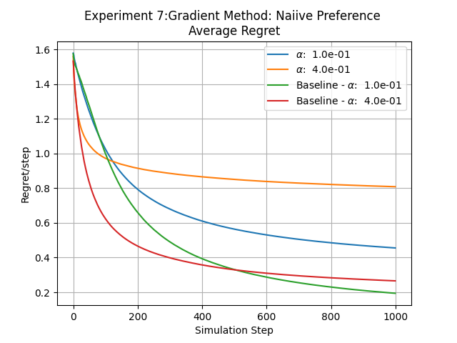 |

As we can see, using the baseline yields more efficient learning.

## Extending Beyond the Book
The following presented algorithms are not presented in any detail in the book.
They are included here as they are often encountered in the literature. The 
run script for these approaches is `additional_algorithms_main.py`.

## Softmax (Boltzmann) Exploration
Softmax methods are based on Luce’s axiom of choice (1959) and pick each 
arm with a probability that is proportional to its _average reward_. 
Arms with greater empirical means $Q_n(a_i)$ are therefore picked with 
higher probability, where softmax function is used to generate the 
probabilities. Alternative name, Boltzman exploration. Probability of 
selecting a bandit $i$ is:

$$
p_i(n + 1) = \frac{e^{\frac{Q_n(a_i)}{\tau}}}{\sum_{j = 1} ^{k} e^{\frac{Q_n(a_j)}{\tau}}}
$$

where $\tau$ is a temperature parameter, controlling the randomness of the
choice. When $\tau = 0$, Boltzmann Exploration acts like pure greedy. 
As $\tau$ tends to infinity, the algorithms picks  arms uniformly at random. 
The selection method here is similar to that of the naiive preference (above), 
where we can also incorporate the temperature method. However, the difference 
here primarily lies in the way the logits are obtained. In the preference approach
we used gradient ascent to optimize the logit function $H_t$. Whereas here, 
we're using the sample averages $Q_n$, just like in the action-value methods.

Experiments with stationary test bed yield very similar results
for different temperature values. It is more interesting to explore 
the non-stationary test bed setting.

Implementation of the strategy: 
`nonassocative_policies.py/SoftmaxExplorationPolicy`

#### Experiment 8: Non-Stationary Testbed, Softmax Exploration
The estimated average used in the softmax function can be estimated
as a simple average (unbiased), or as a recency-weighted exponential average 
(refer to the action value section above). 

| Average Rewards                                                     | Average Regret                                                      |
|---------------------------------------------------------------------|---------------------------------------------------------------------|
| 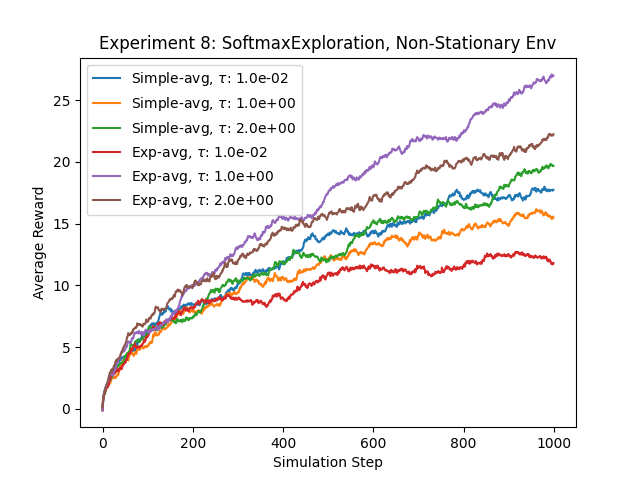 | 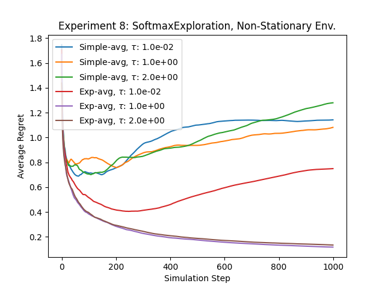 |

As we saw in the action-value strategy for the non-stationary test bed, 
recency weighted averages deal with non-stationarity much better. Also, greedy 
strategy fairs worse than the exploratory strategy.

## Thompson Sampling

The following material relies on this [tutorial](https://web.stanford.edu/~bvr/pubs/TS_Tutorial.pdf).

#### Bernoulli Bandit
Suppose there are K actions, and when played, any action yields either a 
success or a failure. Action $k \in \{1, ..., K\}$ produces a success ($r = 1$)
with probability $\theta_k \in [0, 1]$, hence $r = 0$ with probability 
$1 - \theta_k$. The success probabilities $(\theta_1, ..., \theta_K)$ are
unknown to the agent, but are fixed over time, and therefore can be learned 
by experimentation.

#### Dithering
_Dithering_ is a common approach to exploration that operates through
randomly perturbing actions that would be selected by a greedy algorithm. 
One version of dithering, called $\varepsilon$-greedy exploration, 
applies the greedy action with probability $1 - \varepsilon$ and otherwise 
selects an action uniformly at random. Though this form of exploration 
can improve behavior relative to a purely greedy approach, it wastes 
resources by failing to “write off” actions regardless of how unlikely 
they are to be optimal. This issue becomes increasingly problematic as the
number of actions increases.
Thompson sampling (1933), provides an alternative to dithering that more
intelligently allocates exploration effort.

#### Beta-Bernoulli Bandit
In the Bernoulli setting, the success rate $\theta_k$ can also be interpreted
as the mean reward. Let $\mathbf{\theta} = \{\theta_1, ..., \theta_K \}$.
In the first period an action $a_1$ applied and a reward 
$r_1$ is generated with probability 
$\text{Pr}\{r_1 = 1 | a_1, \theta \} = \theta_{a_1}$. Afterwards, the agent
applies action $a_2$ and observes $r_2$, and so on.

Let the agent begin with an independent prior belief over each $\theta_k$.
Take these prior beliefst to be beta-distributed with parameters 
$\mathbf{\alpha} = \{\alpha_1, ..., \alpha_K \}$ and 
$\mathbf{\beta} = \{\beta_1, ..., \beta_K \}$. Then, for an action $k$, the 
prior density function $\theta_k$ is:

$$
p(\theta_k) = \frac{\Gamma(\alpha_k + \beta_k)}{\Gamma(\alpha_k)\Gamma(\beta_k)} \theta_k^{\alpha_k - 1}(1 - \theta_k)^{\beta_k - 1}
$$

where $\Gamma$ is the [gamma function](https://en.wikipedia.org/wiki/Gamma_function).

#### Bernoulli-Greedy
As observations are gathered, the distribution is updated according to 
Bayes’ rule. It is particularly convenient to work with beta distributions 
because of their conjugacy properties. In particular, each action’s posterior 
distribution is also beta with parameters that can be updated according 
to the following rule:

$$
(\alpha_k, \beta_k) = 
\begin{cases}
(\alpha_k, \beta_k) \quad a_t \ne k \\
(\alpha_k, \beta_k) + (r_t, 1 - r_t) \quad a_t = k
\end{cases}
$$

Only the parameters of a selected action are updated. For the case of 
$\alpha_k = \beta_k = 1$, the prior $p(\theta_k)$ is uniform over $[0, 1]$.
A beta distribution's mean is $\frac{\alpha_k}{\alpha_k + \beta_k}$ and the 
distribution becomes more concentrated as $\alpha_k + \beta_k$ grows.
The following is the greedy algorithm for the beta-Bernoulli bandit.

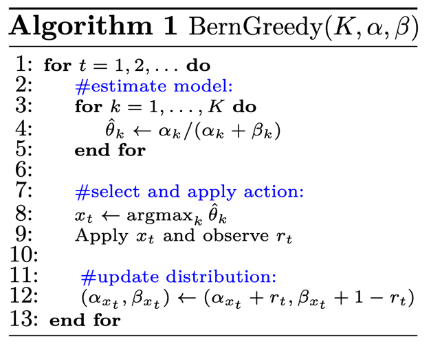

where for each bandit the means of the Beta distributions are used to select 
the action.

#### Experiment 9: Stationary Environment, Bernoulli-Greedy
In the following experiment the testbed is composed of $k=10$ bernoulli 
(density) bandits. Their success rate $\mu_{k}$ is sampled randomly from 
$\mu_k \sim \mathcal{U}[0.1, 0.9]$. The success rate remains stationary through
the simulation (i.e. non-stationary). Several combinations of initial 
$\alpha$s and $\beta$s were tried. 1000 steps and 2000 trials were run.

| Average Rewards                                                     | Average Regret                                                      |
|---------------------------------------------------------------------|---------------------------------------------------------------------|
| 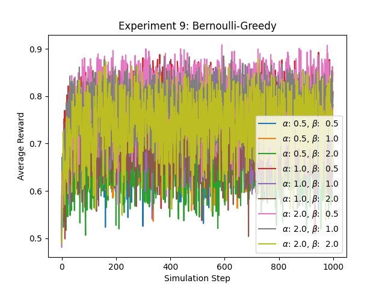 | 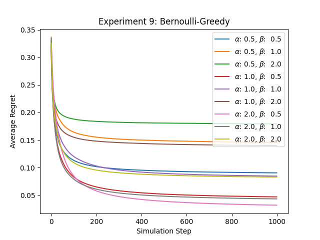 |

#### Thompson Sampling
Thompson Sampling is a specialized case of a Beta-Bernoulli bandit, 
and it is similar to _Algorithm 1_. 
The only difference is that the success probability estimate 
$\theta_k$ is _randomly_ sampled from the posterior distribution, 
which is a beta distribution with parameters $(\alpha_k, \beta_k)$, 
rather than taken to be the expectation $\frac{\alpha_k}{\alpha_k + \beta_k}$.
The algorithm below shows how this is achieved:

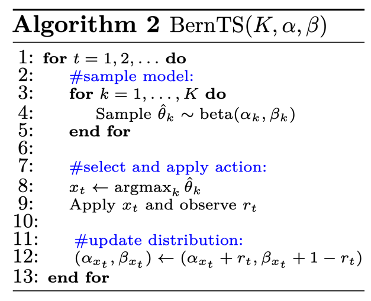

#### Experiment 10: Stationary Environment, Bernoulli Thompson Sampling
Same setting as in experiment 9 for BernoulliTS algo.

| Average Rewards                                                      | Average Regret                                                       |
|----------------------------------------------------------------------|----------------------------------------------------------------------|
| 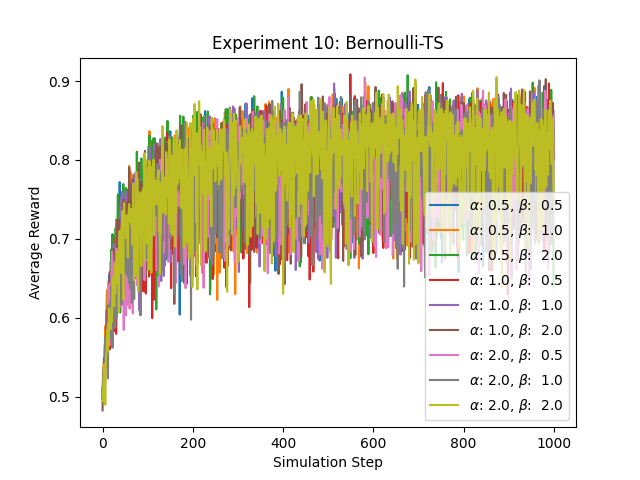 | 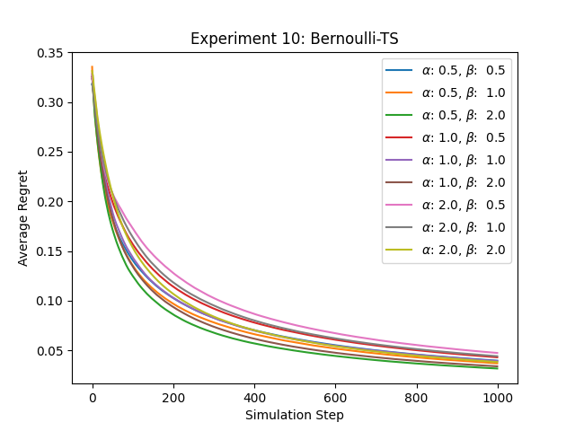 |

#### Experiment 11: Non-Stationary Environment, Bernoulli Thompson Sampling
In this experiment the true success rates of a bandit change over time 
(random walk with normal distribution) with a variance of 0.02. The rest of the
setup is the same as in experiment 9 

| Average Rewards                                                      | Average Regret                                                       |
|----------------------------------------------------------------------|----------------------------------------------------------------------|
| 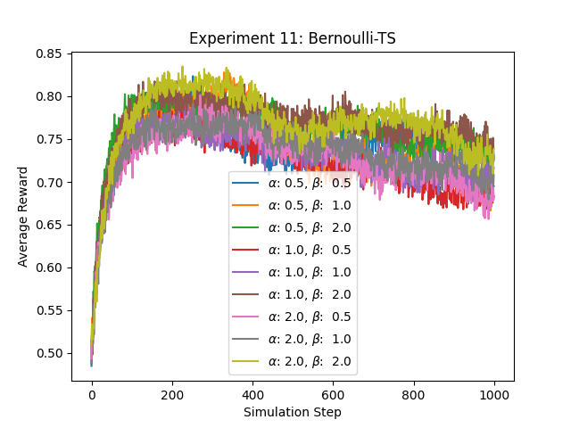 | 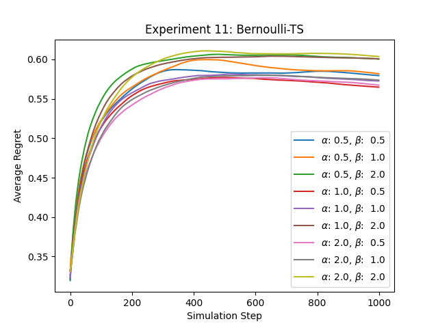 |

As we can see here, Algorithm 2 doesn't deal too well with non-stationary environment
