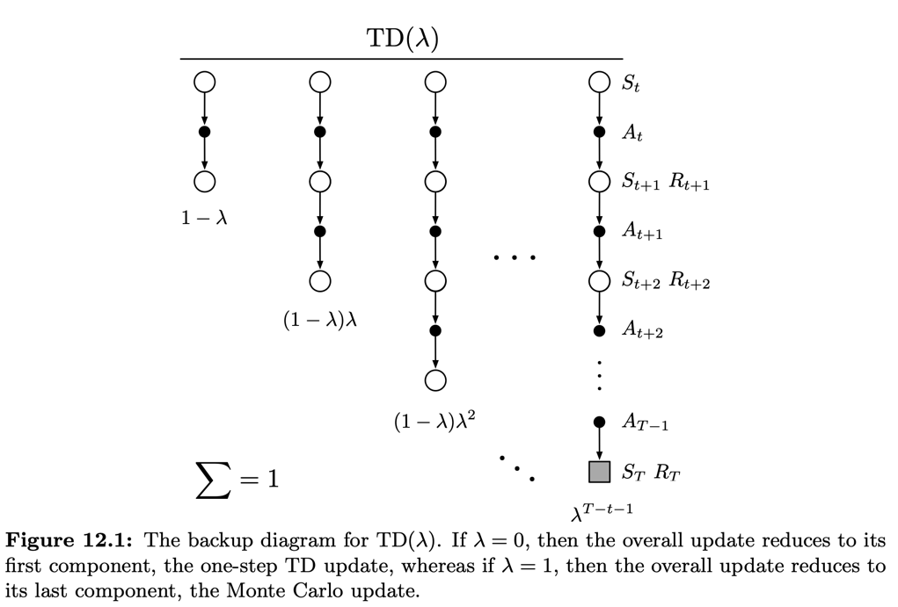
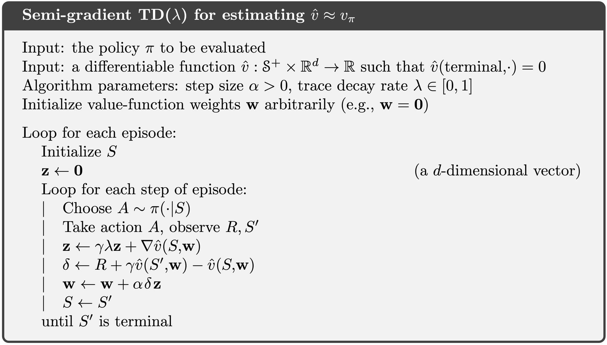
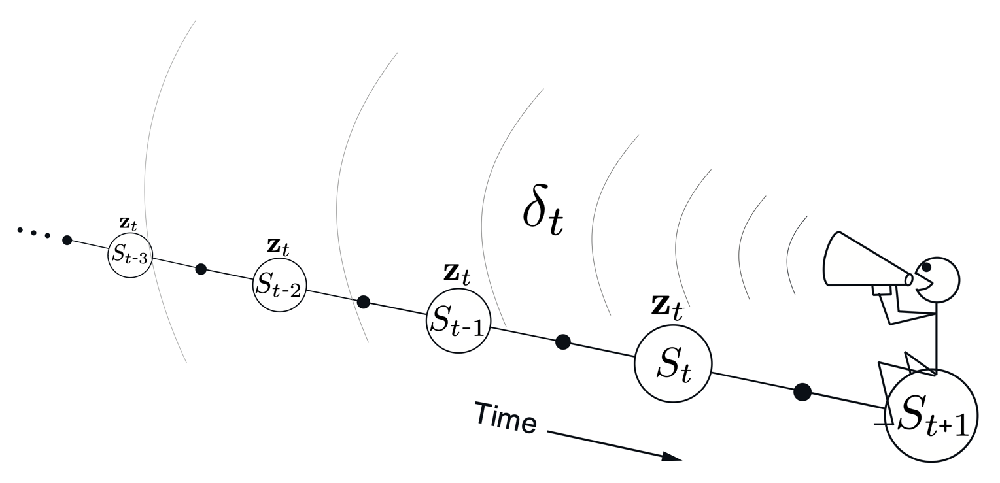
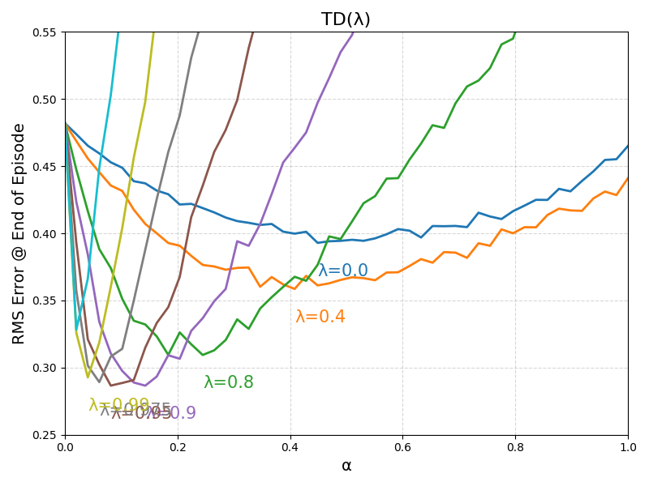

[Sutton & Barto RL Book]: http://incompleteideas.net/book/RLbook2020.pdf

# Eligibility Traces

Eligibility traces (ET)s unify and generalize TD and Monte Carlo methods. When TD
methods are augmented with ETs, they produce a family of methods spanning
a spectrum that has Monte Carlo methods at one end ($ \lambda = 1$) and one-step TD methods
at the other ($\lambda = 0$). In between are intermediate methods that are often better than
either extreme method. ETs also provide a way of implementing Monte Carlo
methods online and on continuing problems without episodes. 
What ETs offer is a short-term memory vector mechanism, 
a memory vector, the _eligibility trace_ $\mathbf{z}_t \in \mathbb{R}^d$, 
that parallels the $n$-step TD method's long-term weight vector 
$\mathbf{w}_t \in \mathbb{R}^d$.

Some of the advantages of ETs are:
* Only a single trace vector is required rather than a store of the last $n$ feature vectors
* Learning also occurs continually and uniformly in time rather than being delayed and
then catching up at the end of the episode.
* Learning can occur and affect behavior immediately after a state is 
encountered rather than being delayed $n$ steps.

Monte-Carlo and TD methods evaluate a state's value on events that occur
following the state over multiple stepts. This is the _forward view_. With 
ETs it is possible to leverage the TD error and looking backward
to evaluate a state's value. This approach is called the _backward view_.

---

## The $\lambda$-return
The $n$-step __return__ is defined as:
$$
\begin{align*}
G_{t:t+n} &\overset{\cdot}{=} \sum_{i=t + 1}^{t+n}\gamma^{i-t - 1}R_{i} + \gamma^{n}\hat{v}(S_{t+n}, \mathbf{w}_{t+n-1}), \quad 0 \le t \le T - n 
\end{align*}
$$

where for $t \gt T$ the $n$-step return is just the sum of discounted rewards up
to the end of the episode at $t = T$. Here $\hat{v}(s, \mathbf{w})$ is the
approximate value of $s$ evaluated by function (approximator) $\hat{v}$ 
parametrized by $\mathbf{w}$.

Another valid target return for the update can be the average over 
returns from different $n$s. For example a target update can be
defined as the sum $\frac{1}{2} G_{t:t+2} + \frac{1}{2}G_{t:t+4}$. 
Any set of $n$-step returns - even infinite - can be averaged this way as 
long as their weights (coefficients) sum to $1$.

An update that averages simpler component updates is called 
a _compound update_. A compound update can only be done
when the longest of its component updates is complete. The TD($\lambda$) is
one particular way of combining all $n$-step updates, where each 
component is weighted proportionally to 
$\lambda^{n - 1}, \space \lambda \in [0, 1)$ and normalized 
by $1 - \lambda$ to ensure the sum of the weights add up to $1$.

The resulting target return $G^{\lambda}$ is called the _$\lambda$-return_:

$$
\begin{align*}
G^{\lambda}_{t} \overset{\cdot}{=} (1 - \lambda)\sum_{n=1}^{\infty}\lambda^{n-1}G_{t:t+n}
\end{align*}
$$

In this formulation, the $1$-step is given the largest weight $1 - \lambda$, 
next the $2$-step with weight $(1 - \lambda)\lambda$, and so forth - the weight
decays with $\lambda$. 

For any $n$ s.t. $ t + n \ge T$, all $n$-step return is the conventional $G_t = \sum_{i=t+1}^{T} \gamma^{i - t - 1} R_{i}$. 
So for the remaining traces of same return, their cummulative weight 
is $\lambda^{T - t - 1}$. An alternative view of weight distribution 
is given below:

So we can separate the terms after terminal state from the main summation 
of the $\lambda$-return as follows:

$$
\begin{align*}
G^{\lambda}_{t} = (1 - \lambda)\sum_{n=1}^{T - t - 1}\lambda^{n-1}G_{t:t+n} + \lambda^{T - t - 1} G_t
\end{align*}
$$

Here we note that when $\lambda = 1$, we get the conventional MC return 
$G_t^{\lambda=1} = G_t$, while for $\lambda = 0$ we get 
$G_t^{\lambda=0} = G_{t:t+1}$, the one-step TD($0$) return. The $\lambda$ 
parameter affects how far into the future the $\lambda$-return is determined by. 
The $\lambda$-return gives us an alternative way of moving smoothly between MC
and one-step TD methods, comparable with the $n$-step bootstrapping methods, 
where we vary the steps.

##### Exercise 12.1
Note the recursive relationship of the $n$-step return:
$$
\begin{align*}
G_{t:t+n} &\overset{\cdot}{=} \sum_{i=t+1}^{t+n}\gamma^{i-t - 1}R_{i} + \gamma^{n}\hat{v}(S_{t+n}, \mathbf{w}_{t+n-1}) = R_{t+1} + \gamma G_{t+1:t+n},  \quad 0 \le t \le T - n
\end{align*}
$$

Replacing it into the $\lambda$-return we also get the recursive relationship as follows:

$$
\begin{align*}
G^{\lambda}_{t} &\overset{\cdot}{=} (1 - \lambda)\sum_{n=1}^{\infty}\lambda^{n-1}G_{t:t+n} \\
&= (1 - \lambda)\sum_{n=1}^{\infty}\lambda^{n-1}\bigl(R_{t+1} + \gamma G_{t+1:t+n}\bigr) \\
&= (1 - \lambda)\sum_{n=1}^{\infty}\bigl[\lambda^{n-1} R_{t+1} + \lambda^{n-1}\gamma G_{t+1:t+n}\bigr] \\
&=(1 - \lambda)\Bigl[\sum_{n=1}^{\infty}\lambda^{n-1} R_{t+1} + \gamma \sum_{n=1}^{\infty}\lambda^{n-1}  G_{t+1:t+n} \Bigr] \\
&=(1 - \lambda)\sum_{n=1}^{\infty}\lambda^{n-1} R_{t+1} + \gamma \Bigl[(1 - \lambda) \sum_{n=1}^{\infty}\lambda^{n-1}  G_{t+1:t+n} \Bigr] \\
&= R_{t+1} + \gamma\Bigl[(1 - \lambda)\sum_{n=1}^{\infty}\lambda^{n-1}  G_{t+1:t+n} \Bigr] \tag*{(sum of infinite geometric series cancels out coefficient)} \\
&= R_{t+1} + \gamma G^{\lambda}_{t+1}
\end{align*}
$$

### Offline $\lambda$-return Algorithm

The _offline_ algorithms makes no changes to the weight vector during the 
episode. At the end of the episode, a sequence of offline updates are applied
according to the semi-gradient update rule, using the $\lambda$-return as 
the target

$$
\begin{align*}
\mathbf{w}_{t+1} = \mathbf{w}_{t} + \alpha\bigl[G^{\lambda}_t - \hat{v}(S_t, \mathbf{w}_t) \bigr]\nabla_{\mathbf{w}}\hat{v}(S_t, \mathbf{w}_t), \;\; t = 0, ..., T-1 
\end{align*}
$$

In this approach, for each state visited, we look forward in time to
all the future rewards and decide how best to combine them. This is the 
(theoretical) _forward_ view of the learning algorithm. 
After looking forward from and updating one particular state, 
we move on to the next state and do not
bother with the already "updated" states. Future states however, are 
repeatedly affected from the point of view of the previous states 
(recall that for approximate methods, an update to a state affects others, 
unlike the independence we get in the tabular methods where the update
of a state does not affect the values others).

---

## TD($\lambda$)
Ties the theoretical forward view with the backward view using ETs. 
It improves over the offline (forward) view in the following ways:

* updates the weight vector $\mathbf{w}$ in every step, rather at the end of the episode
* computations are distributed equally in time, as opposed to at the end
* can be applied to continuing rather than just episodic problems

#### Semigradient TD($\lambda$) with function approximation
In this setting, ET is a vector $\mathbf{z} \in \mathbb{R}^{d}$
with the same number of components as the weight vector $\mathbf{w}$. 
The weight vector is a long-term memory accumulating accross the episode,
whereas ETs are short-term memory lasting less than the episode, and assist
in the learning process. They affect the weight vector, which in turn affects
the state value.

In TD($\lambda$) ETs are initialized to zero at the beggining of the episode,
it is incremented by the gradient at each step, and it is decayed by
a $\gamma \lambda$ factor over time.

$$
\begin{align*}
\mathbf{z}_{-1} &\overset{\cdot}{=} \mathbf{0} \\
\mathbf{z}_{t} &= \gamma \lambda \mathbf{z}_{t-1} + \nabla_{\mathbf{w}} \hat{v}(S_t, \mathbf{w}_t), \;\; 0 \le t \le T   
\end{align*}
$$

$\lambda$ is the same parameters as in the $\lambda$-return and is also referred
to as _trace-decay_ parameter. The ET keeps track of which components of 
$\mathbf{w}$ have contributed positively or negatively to _recent_ state 
valuations. Recency in this context is defined in terms of $\gamma \lambda$.
In linear function approximation, the gradient of the value 
function $\hat{v}(S_t, \mathbf{w}_t)$ is simply the feature vector 
$\mathbf{x}_t$ - so the ET is the accumulation of past (decaying) features.

_Eligibility of the trace $\mathbf{z}$ denotes the eligibility of each component of $\mathbf{w}$
for undergoing (learning) changes if a reinforcing event happens._ The reinforcing
event under consideration are the momentary 1-step TD errors 
$\delta_t \overset{\cdot}{=} R_{t + 1} + \gamma \hat{v}(S_{t+1}, \mathbf{w}_t) - \hat{v}(S_t, \mathbf{w}_t)$.
The update rule is defined as: 
$$
\begin{align*}
\mathbf{w}_{t+1} \overset{\cdot}{=} \mathbf{w}_{t} + \alpha \delta_{t} \mathbf{z}_t
\end{align*}
$$

So here we have the update depending on the value of the current TD erro and
the accumulation of features of past events, i.e. _backward_ view. The 
prediction algorithm is given as:

###### Intuition behind the backward view of TD($\lambda$)
At each moment we look at the current TD error $\delta_t$ and assign it backward to 
each prior state $[..., S_{t - i}, ..., S_t+1]$ according to how much that 
state contributed to the current eligibility trace $\mathbf{z}_t$ at $t$.

At the update of the weights $\mathbf{w}_{t+1}$ the values of those states
are changed, for when they're encountered again in the future.Consider what 
happens under TD($\lambda$) for different $\lambda$ values.

* $\lambda = 0$: $\;\; \mathbf{z}_t = \nabla\hat{v}(S_t, \mathbf{w}_t)$. The update
reduces to the one-step semi-gradient TD update, which is why the algorithm
is called TD($0$). Only the one state preceding the current one is updated 
by the TD error. Other states may have their value estimates changed by 
generalization due to function approximation.
* $0 \lt \lambda \lt 1$: More of the preceding states are  updated, but each 
more temporally distant state is updated less because the corresponding  
eligibility trace is smaller (due to the decay $\gamma \lambda$). Earlier 
states are given less credit for the TD error.
* $\lambda = 1$: Credit given to earlier states falls by $\gamma$. We achieve
MC behavior. Note that the reward is passed back by the trace discounted by 
$\gamma^k$, which is what we get under MC (but what about the term due to $\hat{v}$'s ?) 
This is also called as TD($1$). One benefit of using TD($1$) is that
it allows us to use MC for continuing tasks; and which can be implemented 
incrementally and online (unlike the vanilla MC which waits for the end of 
episode). Unlike in MC, if something unusually good or bad happens
during an episode, control methods based on TD(1) can learn immediately 
and alter their behavior on that same episode.

###### Exercise 12.3
From Exercise 12.1 we know:
$$
\begin{align*}
G^{\lambda}_{t} &= R_{t+1} + \gamma G^{\lambda}_{t+1}
\end{align*}
$$

The error term in the offline algorithm can be expanded as:

$$
\begin{align*}
G^{\lambda}_t - \hat{v}(S_t, \mathbf{w}_t) &= R_{t+1} + \gamma G^{\lambda}_{t+1} - \hat{v}(S_t, \mathbf{w}_t) + \gamma \hat{v}(S_{t + 1}, \mathbf{w}_t) - \gamma \hat{v}(S_{t + 1}, \mathbf{w}_t) \\
&= \delta_t + \gamma(G^{\lambda}_{t+1} - \hat{v}(S_{t + 1}, \mathbf{w}_t)) \\
&= \delta_t + \gamma(R_{t+2} + \gamma G^{\lambda}_{t+2} - \hat{v}(S_{t + 1}, \mathbf{w}_t) + \gamma\hat{v}(S_{t+2}, \mathbf{w}_t) - \gamma\hat{v}(S_{t+2}, \mathbf{w}_t)) \\
&= \delta_{t} + \gamma\delta_{t+1} + \gamma^{2}(G^{\lambda}_{t+2} - \hat{v}(S_{t+2}, \mathbf{w}_t)) \\
&= \delta_{t} + \gamma\delta_{t+1} + \gamma^{2}\delta_{t+2} + ...  \\
&= \sum_{i=t}^{\infty}\gamma^{i - t}\delta_i \tag*{continuing case}\\
&= \sum_{i=t}^{T-1}\gamma^{i - t}\delta_i \tag*{where $\delta_t = 0$ for $t \ge T$, episodic case}
\end{align*}
$$

Note that TD error here is conditioned on fixed $\mathbf{w}_t$

##### Fig 12.6: compare TD($\lambda$) vs Offline $\lambda$-return Algorithm

Here the "environment" is the 19-state random walk from example 7.1.
In the description of this example, the authors note that the reward
from the first state (A) to the terminal state on the left is -1. However,
while they expand on the 5-state example, it is not clear whether the terminal
state on the right of the last example has a reward of 0 or +1. Since this 
is not clear, I am using the 5-state random walk setup where
on transition from the last state onto the right, a reward of +1 is emitted.

Moreover, the true value of each state is defined as the undiscounted expected
sum of rewards starting from each respective state. I compute this numerically
over 300 runs for each initial state for all states. The results are shown 
in the table below:

| TD($\lambda$)                                                               | Offline $\lambda$-return Algorithm                                                      |
|-----------------------------------------------------------------------------|-----------------------------------------------------------------------------------------|
|  |  |

One discrepancy between the graph above and the book is that in the case of
TD($\lambda$) at $\alpha$ = 0, the error is approximately 0.47 while 
the authors are at 0.55. As of this writing, it is unclear to me why this is 
the case. At $\alpha$ = 0, the weights are not updated (i.e. there is no 
learning). Moreover, per Example 7.1., value function is initialized as 
$V(s) = 0$. The only other difference are the true values used. This could 
stem from a disrepancy between the random walk transition probabilities or 
the insufficient samples used for the state value estimation. I invite
the curious reader to further investigate this discrepancy. For the moment, I 
am proceeding with the findings as I generate them.