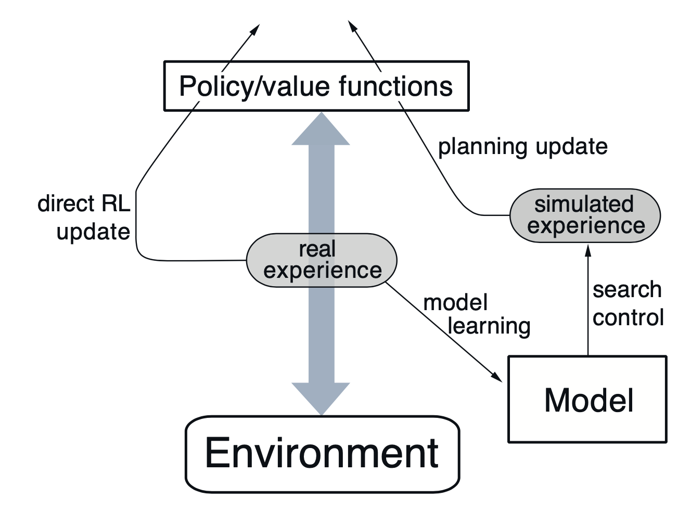
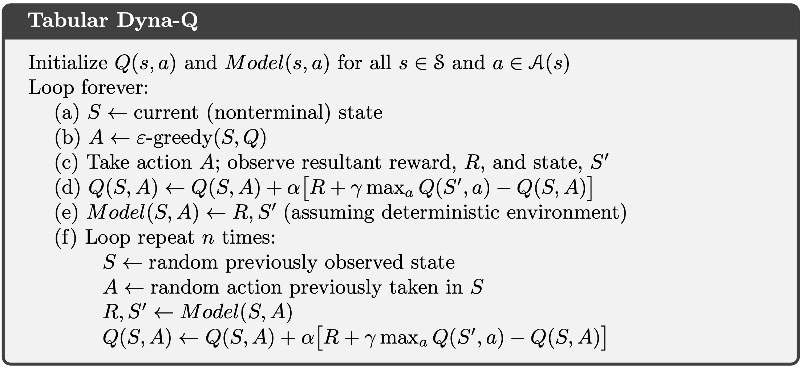
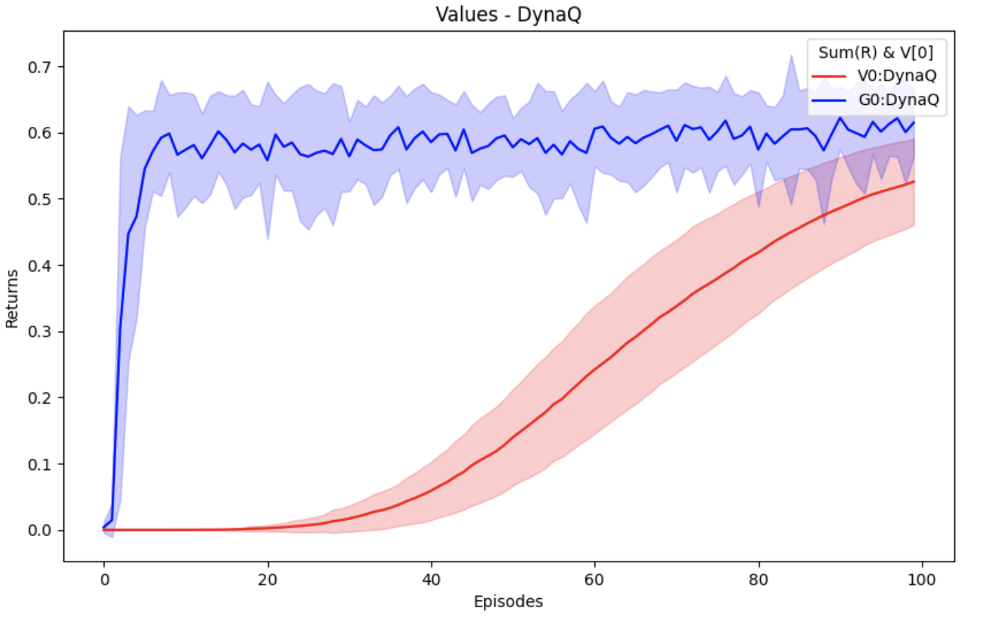
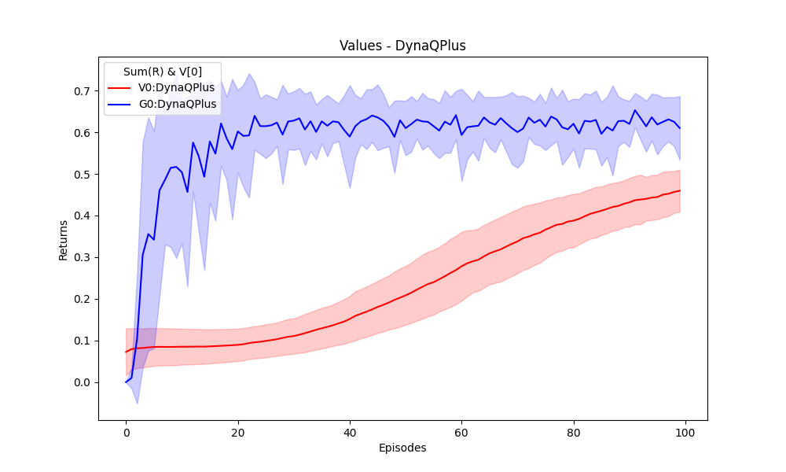
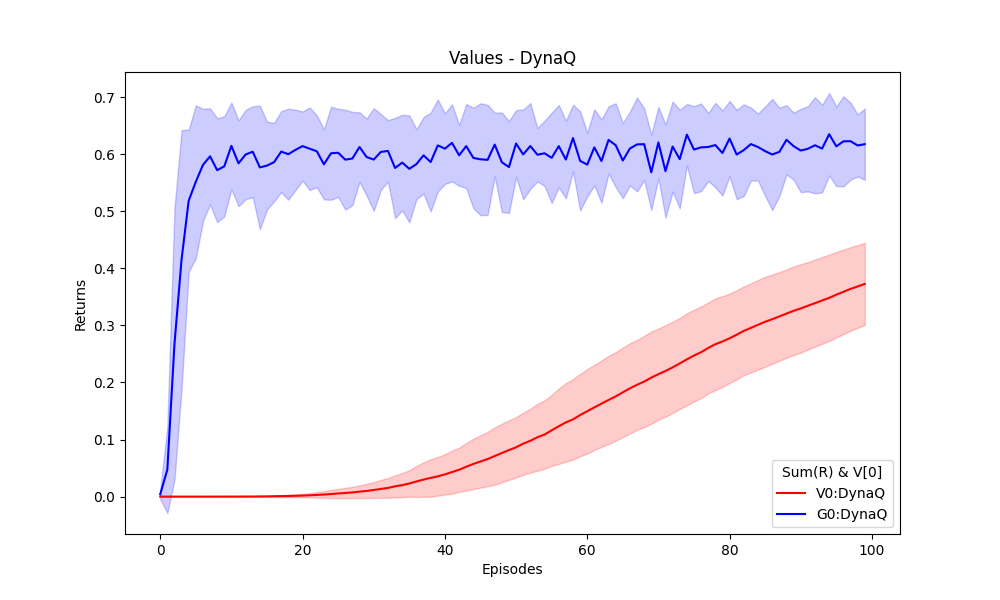
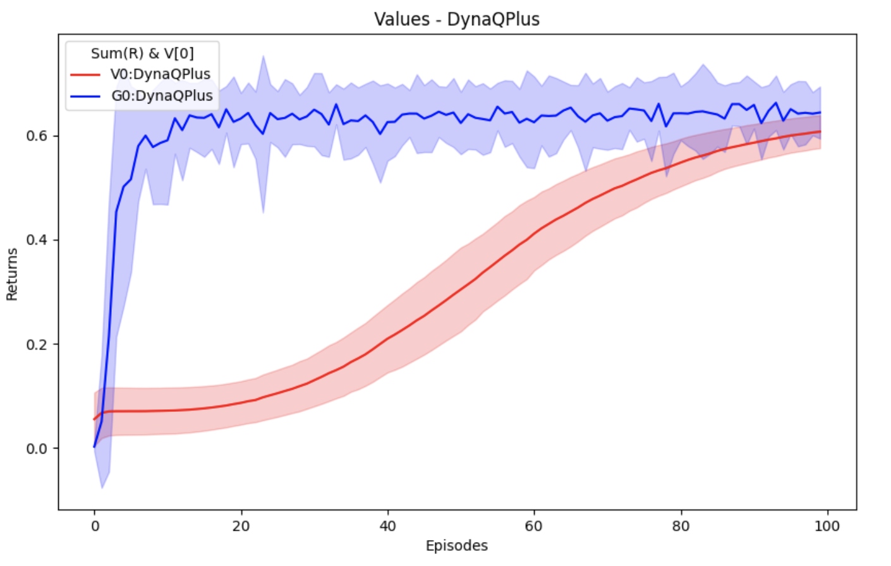
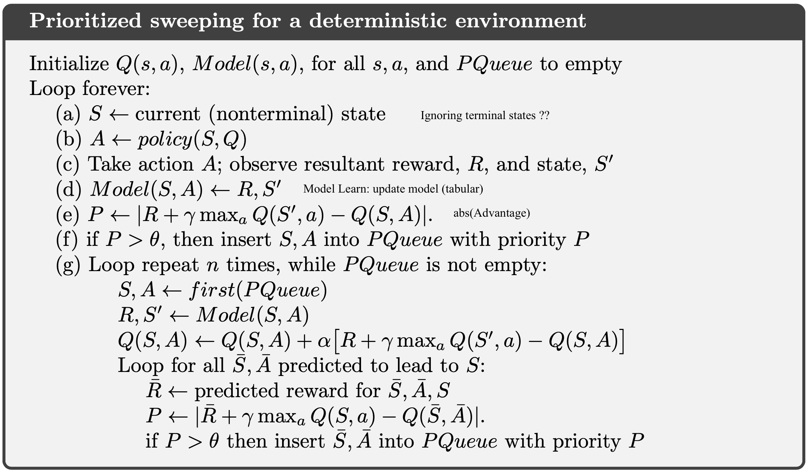
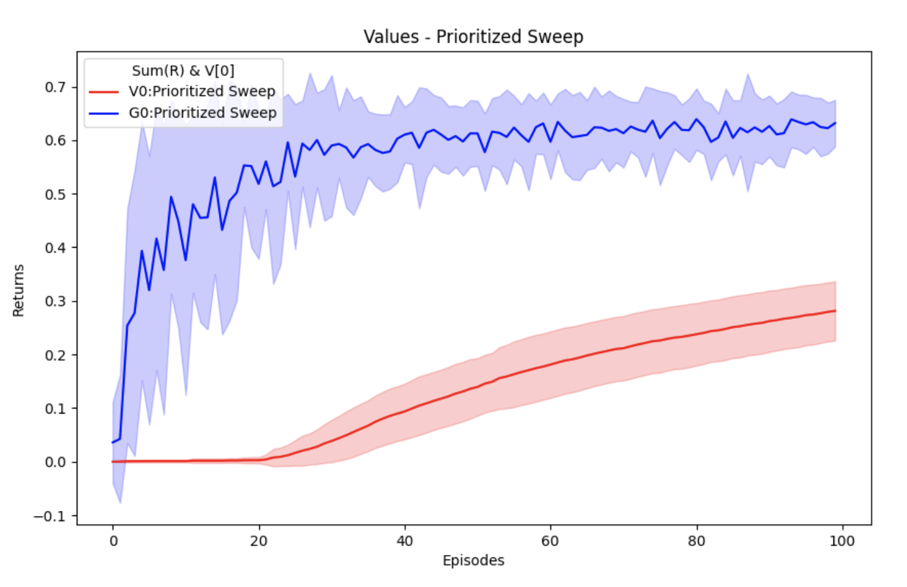
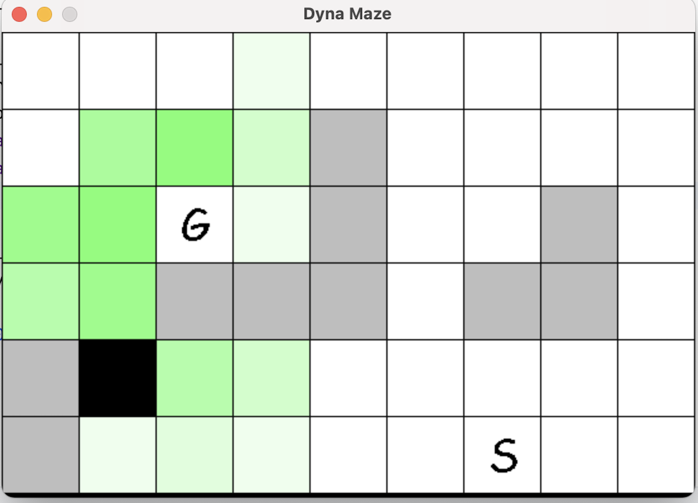
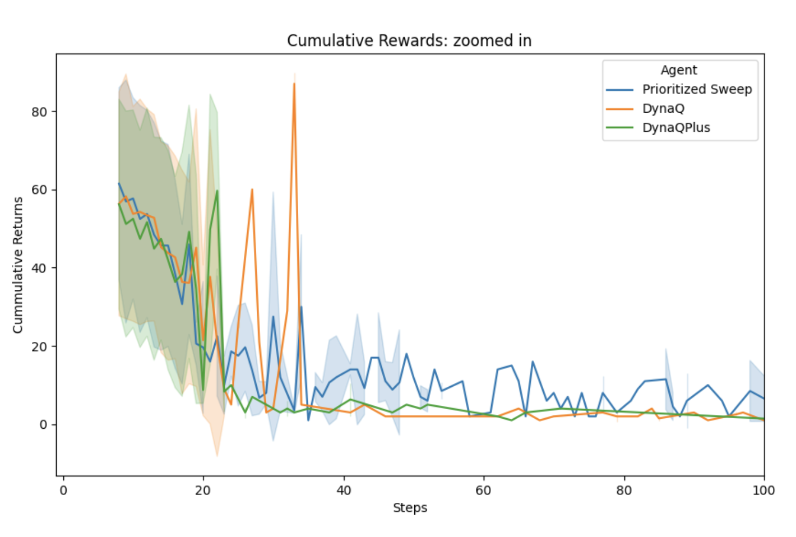

[Sutton & Barto RL Book]: http://incompleteideas.net/book/RLbook2020.pdf
[Dyna Maze Game]: https://github.com/konantian/Dyna-Maze-Game/tree/master

# Planning Methods
A unified view of reinforcement learning methods that require a model of the environment.
A _model_ of the environment we mean anything that an agent can use to predict how the environment will respond to its actions.
_Planning_ refers to any computational process that takes a model as input and produces or improves a policy for interacting with the modeled environment.
State-space _planning_ is the search through the state space for an optimal policy or an optimal path to a goal.

### State-space _planning_
* All state-space planning methods involve computing value functions as a key intermediate step toward improving the policy 
* They compute value functions by updates or backup operations applied to simulated experience.

## Table of Contents
- [Introduction](#introduction)
- [Implemented Algorithms](#implemented-algorithms)
- [Execution](#execution)
- [Environments](#environments)

## Introduction
This section contains implemented methods from Chapter 8, in [Sutton & Barto RL Book].
These are methods in which the agent uses _state-space planning_ to improve their policies.
The various state-space planning methods vary in the kinds of updates they do.

## Implemented Algorithms
- [x] Tabular Dyna-Q/Dyna-Q+ (Section 8.2, 8.3): `agents/TabularDynaQAgent`
- [x] Prioritized Sweeping (Section 8.4): `agents/TabularPrioritizedSweepingAgent`

### Dyna Agents
Conceptually, planning, acting, model-learning, and direct RL occur 
simultaneously and in parallel in Dyna agents.

### Dyna-Q (8.2)

_Online planning_ agent which uses a _sample_ model (a sample model produces a possible transition). 
Under the assumption of a deterministic environment, this model _learns_ 
(stores) the next-state & reward for each state-action pair.
During the _planning_ phase, the agent simulates the experience from the model.
The simulation consists in the random sampling of the already visited (state, actions)
and generating the (next-state, reward) simulated experiences, for a number 
of planning steps. The agent uses these simulated experiences to improve its policy, using these. 

###### Algorithm

The Direct-RL path, to perform TD(0) policy improvement, for Dyna-Q agent 
supports:
- [x] Q-Learning (SarsaMax); same as in the book
- [x] Sarsa (added from TD chapter)
- [x] Expected Sarsa (added from TD chapter)

###### Estimated Value vs Sum of Discounted Rewards at initial state

| DynaQ Update Method   | Train Value                                                               |
|-----------------------|---------------------------------------------------------------------------|
| Q-Learning (SarsaMax) |                 |
| Sarsa                 |           |
| Expected Sarsa        |  |

##### Dyna-Q+ (8.3)
When the environment is (slightly?) stochastic, our model will most likely be wrong.
In order to promote updating of the model, Dyna-Q+ uses a model-exploration heuristic, 
where during planning update, the simulated  reward is increased by visitation
staleness of a state by a _bonus factor_ of `𝜅*sqrt(𝜏)` where `𝜏` is the 
time since last visit. Note that this bonus  factor will affect the 
state-action values (Q(s, a)) - which is how this modification
in planning, promotes adaptation to a changing environment.

To improve model exploration, the algorithm allows for actions that have 
not been taken before for an already visited state. Refer to section 8.3 
(page 168) footnote in [Sutton & Barto RL Book].

###### Estimated Value vs Sum of Discounted Rewards at initial state 

##### Prioritized Sweeping (8.4)
In the Dyna agents presented in the preceding sections, simulated transitions 
are started in state–action pairs selected uniformly at random from all 
previously experienced pairs. But a uniform selection is usually not the best.
In prioritized sweeping we want to work back from any state whose
value has "significantly" changed. Typically, this implies that the 
values of many other states should also be changed, but the only useful 
one-step updates are those of actions that lead directly into the one state 
whose value has been changed. If the values of these actions are updated,
then the values of the predecessor states may change in turn. If so, 
then actions leading into them need to be updated, and then their 
predecessor states may have changed. This way one can work backward from 
arbitrary states that have changed in value. 

The _predecessor_ state-action pairs of those state-actions whose value 
estimation has changed a lot are more likely  to also change a lot. 
In a stochastic environment, variations in estimated transition probabilities
also contribute to variations in the sizes of changes and in the urgency 
with which pairs need to be updated. It is natural to prioritize the 
updates according to a measure of their urgency, and perform them in 
order of priority. This is the idea behind _prioritized sweeping_.

A _queue_ is maintained of every state–action pair whose estimated value 
would change nontrivially if updated, prioritized by the size of the 
change. When the top pair in the queue is updated, the effect on each of its 
predecessor pairs is computed. If the effect is greater than some small 
threshold, then the pair is inserted in the queue with the new priority.

###### Algorithm

###### Estimated Value vs Sum of Discounted Rewards at initial state

## Execution
Run code in `main.py`. Each algorithm has its own `experiments` task.

### Running DynaMaze
When running Dyna-Q/Q+, the DynaMaze environment can be configured. 
A grid window pops up with the starting (S) and goal (G) state.
The user can configure the blocks by clicking/unclicking on the grid. 
Press "Spacebar" to confirm obstacle configuration. 
A `maze_config.pkl` is generated saving the environment config.
When running the script again, the grid loads from this config file. 
The user can modify the grid, or simply confirm the loaded environment by pressing the spacebar.

As the simulation runs, state (grid cell) values _V(s) = Ea[Q(s, a)]_ are displayed as green colors.

### Simulations
In the sections above, the algorithms are described along with their simulation 
performance. An episode ended when the goal was reached. The number of
steps for each episode could vary significantly. The environment was the same 
for all episodes. The shortest path (optimal) was 8 steps. Simulations were run
over 20 random seeds for each agent. For each seed, there were 100 episodes. 
Moreover, for each new seed, the agent was unlearned.

* __Values__ graph  
  * _G[0]_ defined as the sum of actual discounted rewards from the start of the start of the simulations
  * _V[0]_ is the value function for S[0], i.e. the first state of the environment.

* __Cumulative Rewards__ graph depicts the cummulative reward accumulated over the terminal steps, across the episodes, over different seeds.

## Environment
- Extension of [Dyna Maze Game], which implements the environment in _Example 8.1_: Dyna Maze in the book.
