[Sutton & Barto RL Book]: http://incompleteideas.net/book/RLbook2020.pdf

# Policy Gradient Methods


## Table of Contents
- [Introduction](#Introduction)
- [Implemented Algorithms](#implemented-algorithms)
- [Detailed Development](#explanations-development-and-experimental-details)
- [REINFORCE - MC Policy Gradient](#reinforce-the-monte-carlo-policy-gradient-)
- [REINFORCE with Baseline](#reinforce-with-baseline)
- [Actor Critic Methods](#actor---critic-methods---introduction)
- [One-Step Actor Critic](#one-step-actorcritic)
- [n-Step with Eligibility Traces Actor–Critic](#n-step-with-eligibility-traces-actorcritic)
- [Policy Gradient for Continuing Problems](#policy-gradient-for-continuing-problems)
- [Policy Parameterization for _Continuous Actions_](#policy-parameterization-for-_continuous-actions_)


## Introduction
In policy gradient (PG) methods, the policy does not consult 
the action values in its decision of action. Here, a parametrized policy is 
learned which selects the action without consulting the estimated action value.
The value function may still be learned, with the aim of learning the policy
(parameters), but it is not specifically consulted in order to take the 
action.

In PG methods, learning the policy parameter is based on the  gradient of the 
scalar performance measure wherein these methods aim to
_maximize_ its value, via gradient _ascent_.

All PG methods follow this general schema - independent of whether they learn 
a state/action value function or not. Methods which do learn value functions
are usually called _actor-critic_, where actor refers to the policy and the 
critic the state or (most often) action value function.


## Implemented Algorithms
- [x] REINFORCE: `agents/Reinforce`
- [x] REINFORCE with Baseline: `agents/ReinforceBaseline`
- [x] One-Step Actor Critic: `agents/OneStepAC`
- [x] n-Step Actor Critic with Eligibility Traces: `agents/ACWithEligibilityTraces`
- [x] Actor Critic with Eligibility Traces, Continuing Task: `agents/ACWithEligibilityTracesContinuing`
- [x] REINFORCE for Continuous Action: `agents/ReinforceContinuousAction`
- [x] REINFORCE with Baseline for Continuous Action: `agents/ReinforceBaselineContinuousAction`
- [x] Actor Critic with Eligibility Traces for Continuous Action: `agents/ACWithEligibilityTracesContinuousAction`
- [x] Actor Critic with Eligibility Traces for Continuous Action, Continuous Task: `agents/ACWithEligibilityTracesContinuousActionContinuingTask`


## Explanations, Development, and Experimental Details
Full development and discussion visit the notebook [here](summary.ipynb)


## REINFORCE: The Monte Carlo Policy Gradient 

REINFORCE uses the complete return from time $t$, which includes all
future rewards up until the end of the episode. In this sense REINFORCE is a Monte
Carlo algorithm and is well defined only for the episodic case with all updates made in
retrospect after the episode is completed.

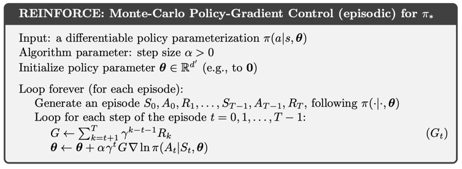

###### Experiments
The algorithm above didn't perform well on `MountainCar`. Had success 
with `CartPole`, the results of which are shown below. The model is located
in `agents/Reinforce` and it is an PyTorch MLP implementation of the policy 
model. Both normalized and unnormalized gradients were tried. In this experiment
100 trials were tried over a few learning steps (learning rates), all of which
were decayed over the steps. The metric displayed is the undiscounted sum or 
rewards, even though a discount of 0.99 was used in the run.

|                       | Train                                                                      | Eval                                                                      |
|-----------------------|----------------------------------------------------------------------------|---------------------------------------------------------------------------|
| Normalized Gradient   | 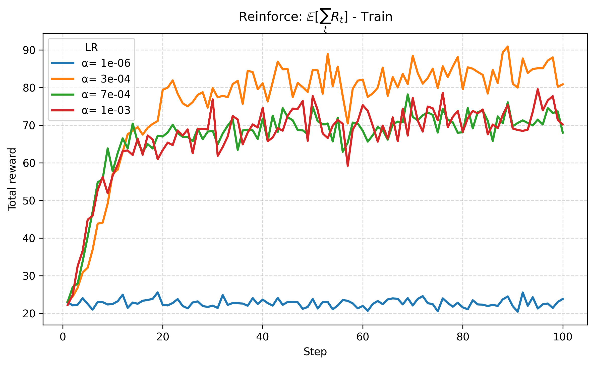 | 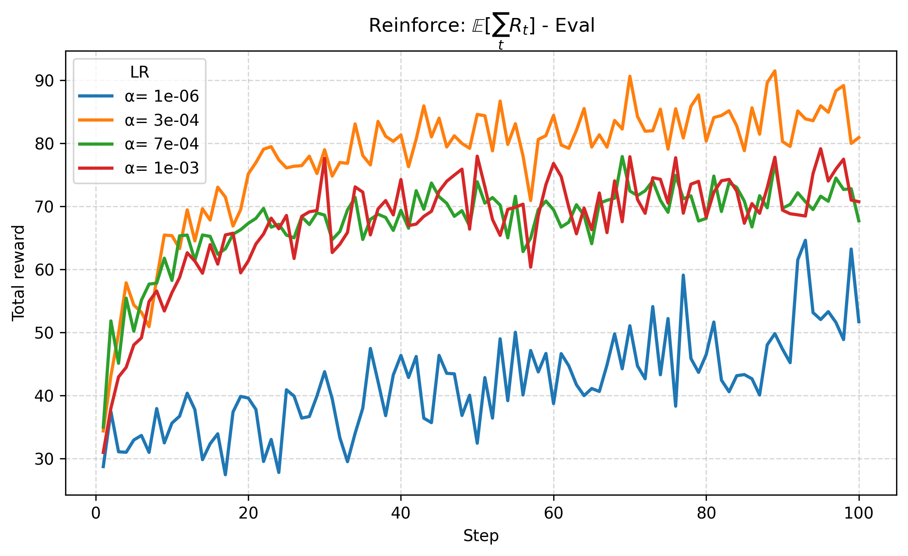 |
| Unnormalized Gradient | 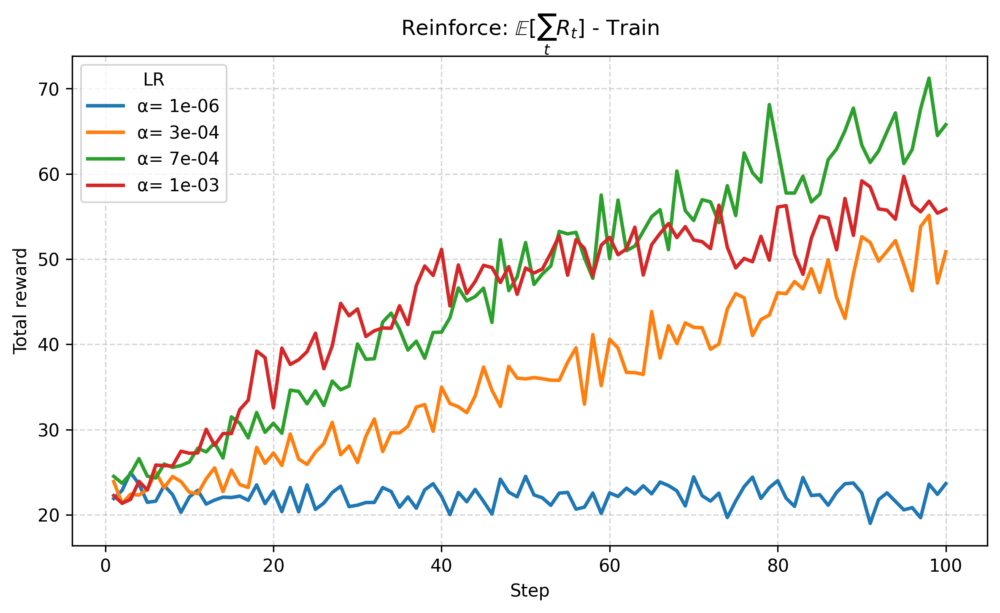          | 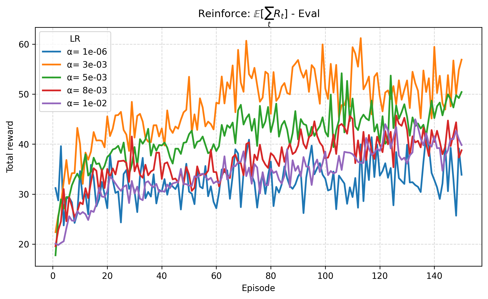          |

Note that _eval_ experiments denote the episodes where the action 
was strictly greedy. Normalizing the gradients speeds up learning.


## REINFORCE with Baseline

The PG theorem can be generalized to include a baseline $b(s)$:

$$
\nabla J(\mathbf{\theta}) \propto \sum_s \mu(s) \sum_a \Bigl(q_{\pi}(s, a) - b(s) \Bigr) \nabla \pi(a | s, \mathbf{\theta}) 
$$

The new update rule for REINFORCE with baseline is:

$$
\mathbf{\theta}_{t+1} = \mathbf{\theta}_t + \alpha \Bigl(G_t - b(S_t) \Bigr) \nabla \log \pi(A_t | S_t, \mathbf{\theta})
$$

A common choice for the baseline is the state value function 
$\hat{v}(S_t, \mathbf{w}_t)$ where the parameter $\mathbf{w} \in \mathbb{R}^d$ 
iss learned and updated like in the linear approximation methods (refer to 
those methods). So in this case we would have 2 sets of parameters 
we're learning, $\mathbf{\theta}$ and $\mathbf{w}$.  Because REINFORCE is a Monte-Carlo method, i.e. we use complete 
returns generated _at the end of the episode_, to learn the policy parameters
$\mathbf{\theta}$, we can also use the same method for learning the parameters
of the state value function $\mathbf{w}$.

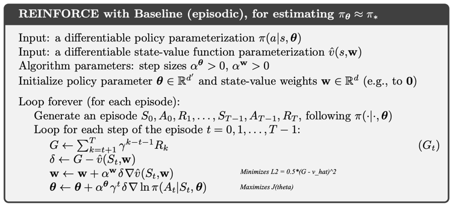

###### Experiments
REINFORCE with baseline is implemented in `agents/ReinforceBaseline`

|                       | Train                                                                              | Eval                                                                              |
|-----------------------|------------------------------------------------------------------------------------|-----------------------------------------------------------------------------------|
| Normalized Gradient   | 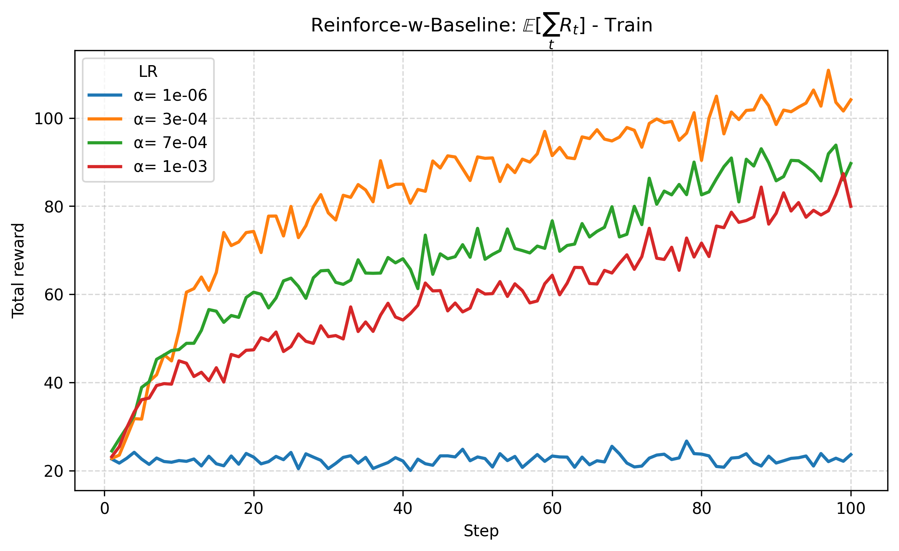 | 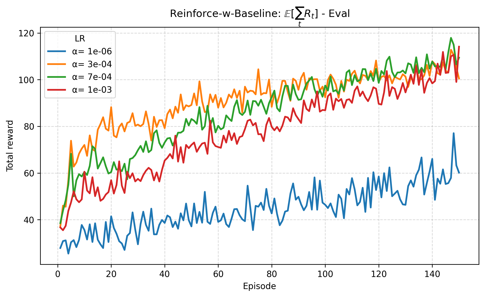 |
| Unnormalized Gradient | 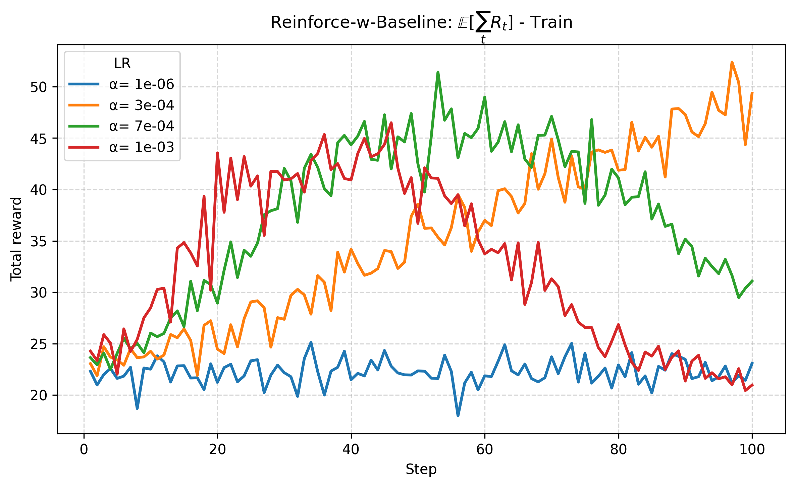          | 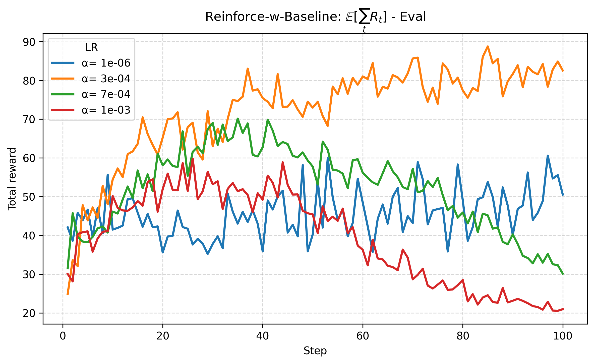          |


## Actor - Critic Methods - Introduction
In REINFORCE with baseline, we use a state value function (estimate) of the 
state _before_ the action is taken, i.e. $S_t$. This estimate sets a baseline 
for the ensuing return $R_{t+1}$, but it cannot be used to evaluate 
the action $A_t$. In Actor-Critic (AC) methods we evaluate the following 
state ($S_{t+1}$) as well. The estimated value of the second state, when
discounted and added to the reward, constitutes the one-step return $G_{t:t+1}$ 
which is a useful estimate of the actual return and thus is a way of 
assessing the action. With this formulation, we can modulate the bias furthermore
by using $n$-step returns and eligibility traces. When the
state-value function is used to assess actions in this way it is called a 
_critic_, and the overall policy-gradient method is termed an _actor–critic_
method.

## One-Step Actor–Critic
They are the analog of the TD methods, such as TD(0), Sarsa(0), and Q-learning.
They are fully online and incremental, yet avoid the complexities of  
eligibility traces. One-step actor–critic methods replace the full return of REINFORCE with the 
one-step estimate of the return, and use a learned state value function as
the baseline.

The pseudo-code for the episododict algorithm is shown below. 
It is fully online, incremental algorithm, with states, 
actions, and rewards processed as they occur and then never 
revisited.

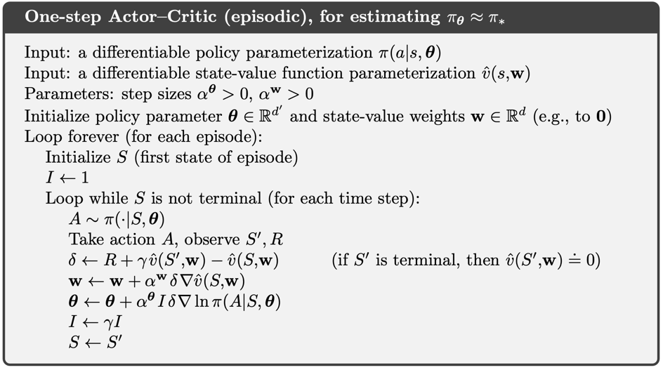

The implementation is in `agents/OneStepAC`

###### Experiment Results

The following are the results
for one-step AC agent on `CartPole` environment. The update value
used for the critic $\alpha^{\mathbf{w}} = 25 \alpha^{\mathbf{\theta}}$.


| Gradient t            | Train                                                                      | Eval                                                                      |
|-----------------------|----------------------------------------------------------------------------|---------------------------------------------------------------------------|
| Normalized Gradient   | 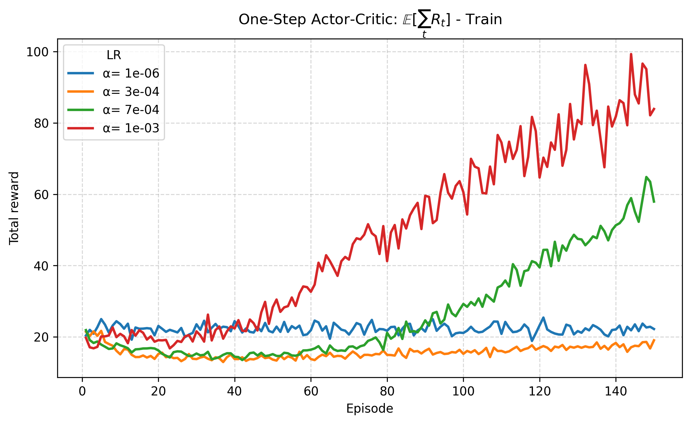 | 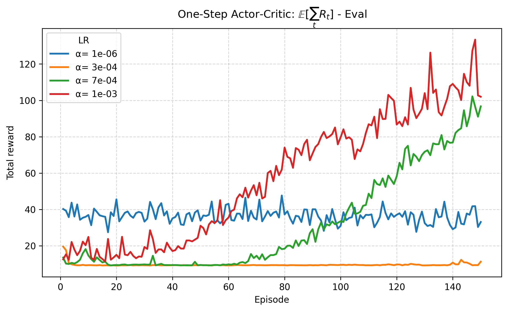 |
| Unnormalized Gradient | 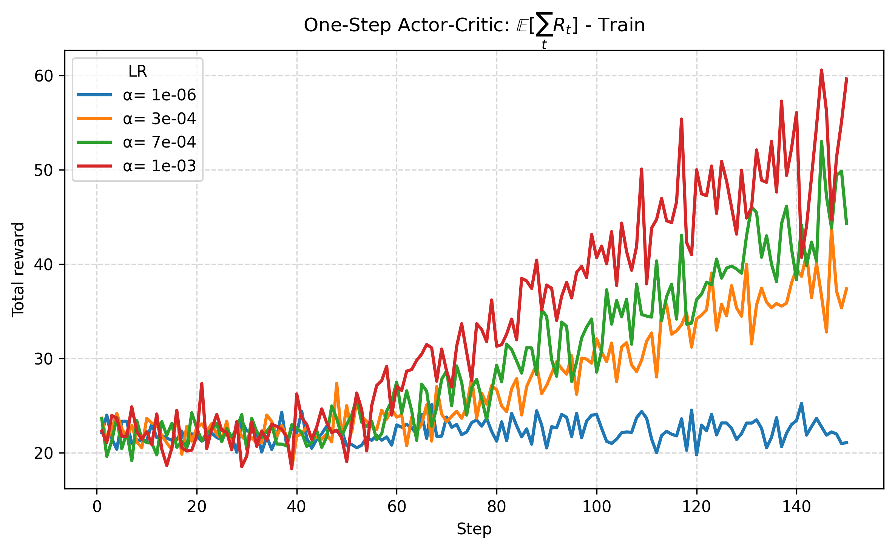          | 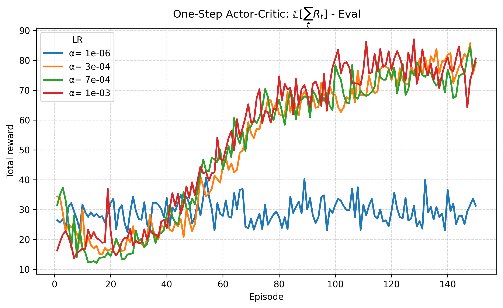          |


## n-Step with Eligibility Traces Actor–Critic
We can replace the one-step target $G_t$ with $G_{t:t+n}$ or the lambda return
$G_t^{\lambda}$. Then using the eligibility traces we can incorportate these 
methods into the algorithm below. 

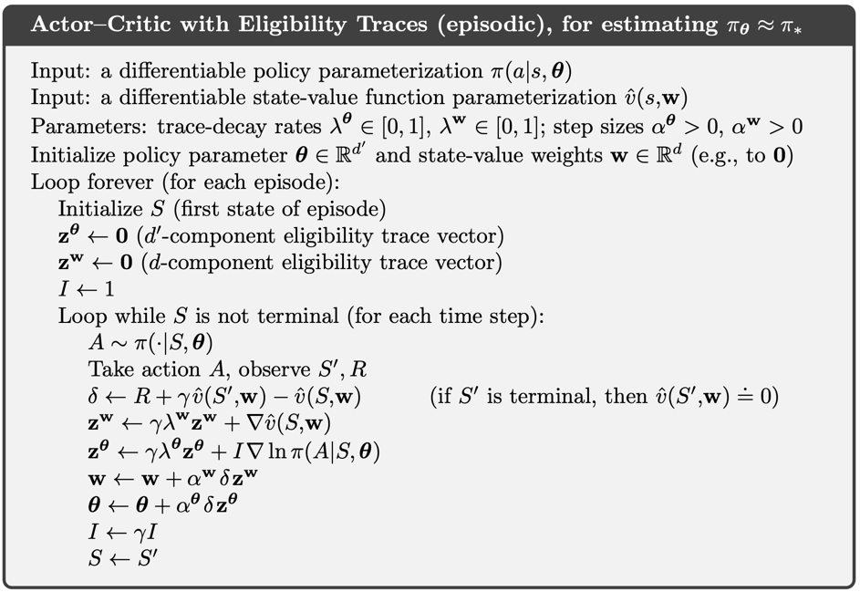

###### Experiment Results
Like above, these results pertain to the `CartPole` environment, with 
the same learning rates $\alpha$. The $\lambda$'s used here for both actor 
and critic were set to 0.5.


|                       | Train                                                                                    | Eval                                                                                    |
|-----------------------|------------------------------------------------------------------------------------------|-----------------------------------------------------------------------------------------|
| Normalized Gradient   | 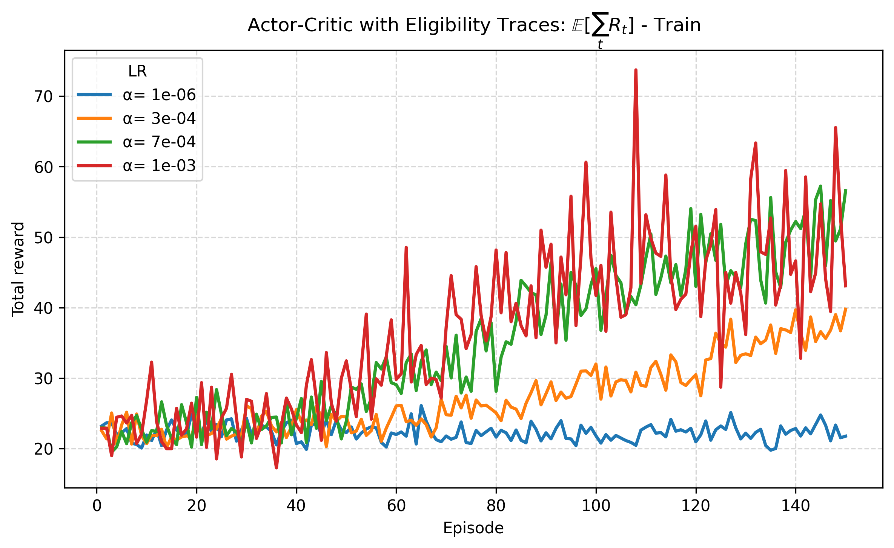 | 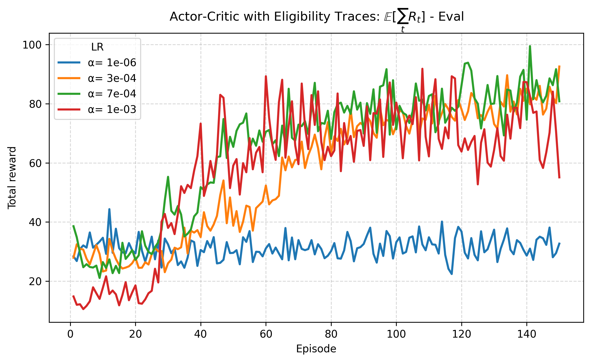 |
| Unnormalized Gradient | 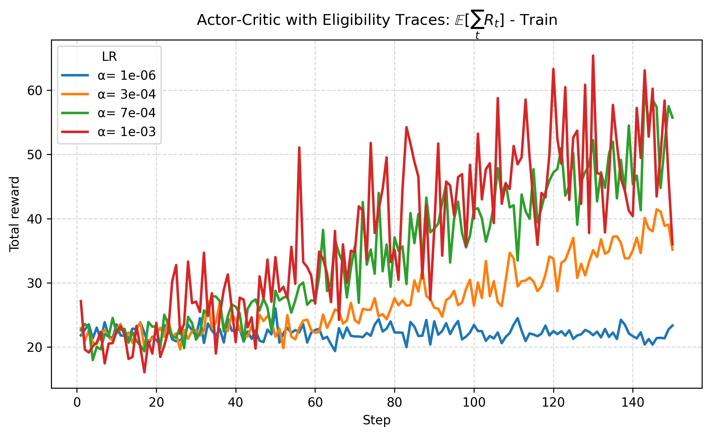          | 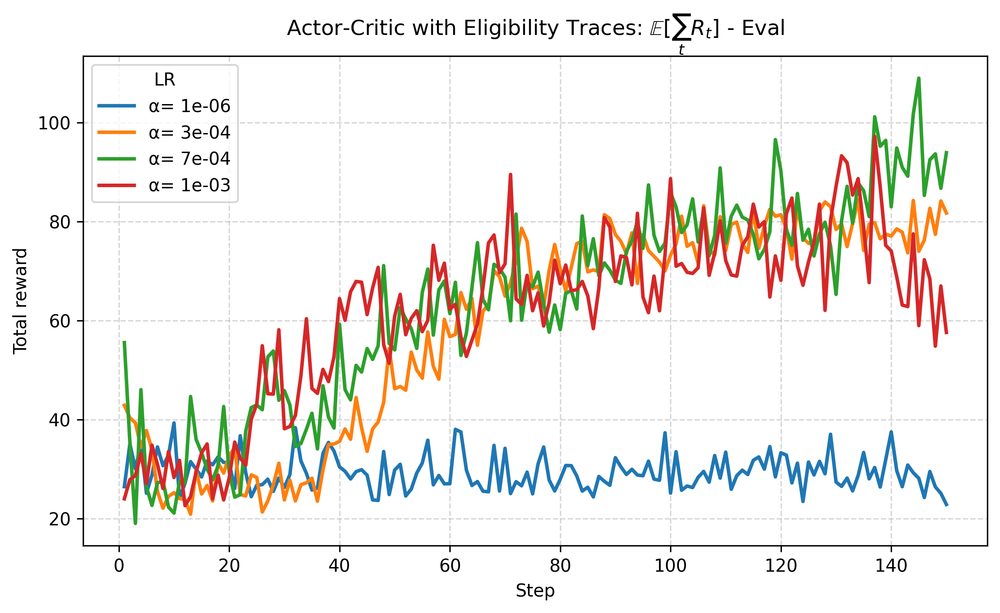          |

We can see that the $\lambda$-return with eligibility traces approach yields 
better results than the one-step AC method.


## Policy Gradient for Continuing Problems
For the continuing setting we need to redefine the objective function (
performance function) in terms of the average rate of reward per step. 
The pseudo-code of which is shown below:


###### Experiments
For this experiment I repurposed the MountainCar environment
such that a distance from the flag bonus was added to the time negative 
step (-1). 

The modified reward used is as follows:

``` python
bonus = (1 - abs(pos - 0.5) / 1.8)
if bonus > 0.9:
    bonus *= 10
return reward + bonus
```

where `pos` is the position of the vehicle along the x-axis.
12 experiments for each alpha were run. The plot is the expected average reward
per step (i.e. reward per step averaged over 12 experiments).

|                       | Train                                                                                                 | 
|-----------------------|-------------------------------------------------------------------------------------------------------|
| Normalized Gradient   | 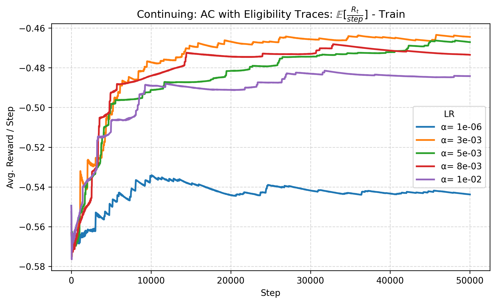 |
| Unnormalized Gradient | 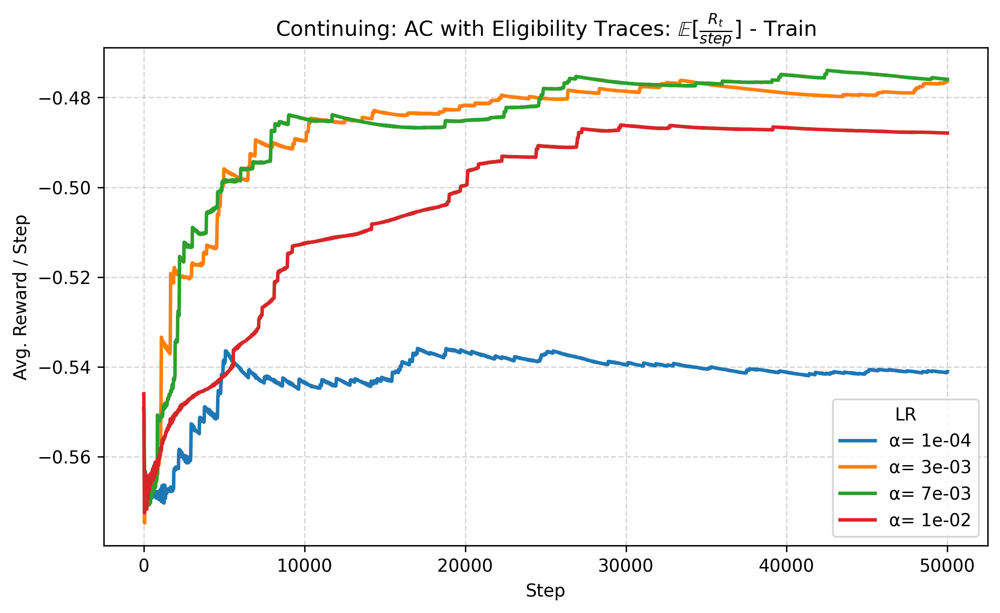          |


## Policy Parameterization for _Continuous Actions_

For continuous actions (i.e. infinite actions) we learn the statistics of the
distribution of said action. For example, the action set might be the real numbers, with actions chosen
from a normal (Gaussian) distribution. To produce a policy parameterization, 
the policy can be defined as the normal probability density over a 
real-valued scalar action, with mean and standard deviation given by 
parametric function approximators that depend on the state.

$$
\pi(a | s, \mathbf{\theta}) \overset \cdot{=} \frac{1}{\sigma(s, \mathbf{\theta})} \exp \Bigl(- \frac{\bigl(a - \mu(s, \mathbf{\theta}) \bigr)^2}{2\sigma(s, \mathbf{\theta})^2} \Bigr)
$$


where: $\pi: \mathcal{S} \times\mathbb{R} ^{d'} \rightarrow \mathbb{R}$ 
and $\sigma: \mathcal{S} \times\mathbb{R} ^{d'} \rightarrow \mathbb{R}^{+}$
are two _parametrized function approximators_. With these definitions, 
all the algorithms from discrete action, can be used to 
learn continuous action selection.

###### Experiments

The following algorithms were adopted for continuous action policies. The 
environment used here was the continuous action [MountainCar](https://gymnasium.farama.org/environments/classic_control/mountain_car_continuous/)

Note that the continuous action environment has a different reward from
the discrete action environment. From the website:

"A negative reward of $-0.1 * action^2$ is received at each timestep to 
penalise for taking actions of large magnitude. If the mountain car reaches 
the goal then a positive reward of +100 is added to the negative 
reward for that timestep."

| Algorithms                             | Train                                                                                                            | 
|----------------------------------------|------------------------------------------------------------------------------------------------------------------|
| Episodic: REINFORCE                    |                                 |
| Episodic: REINFORCE with Baseline      |                         |
| Episodic: AC with Eligibility Traces   |                   |
| Continuing: AC with Eligibility Traces |  |

For the REINFORCE algorithms, the return was mean-centered, as it significantly
improved learning.