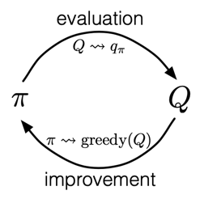
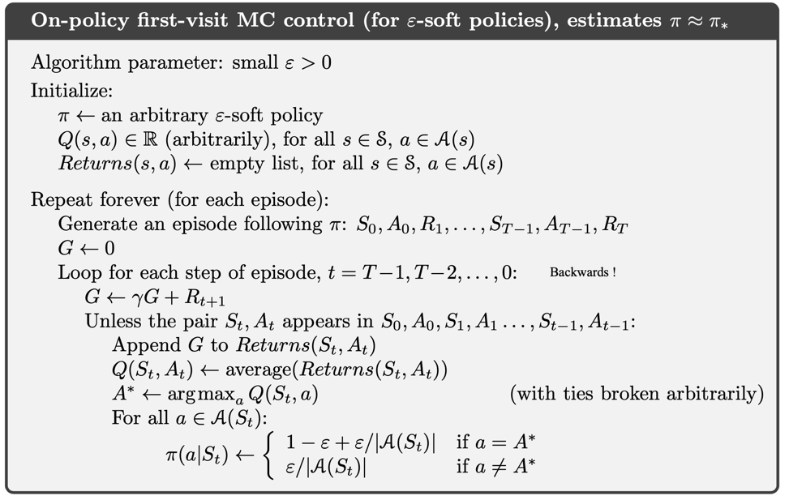
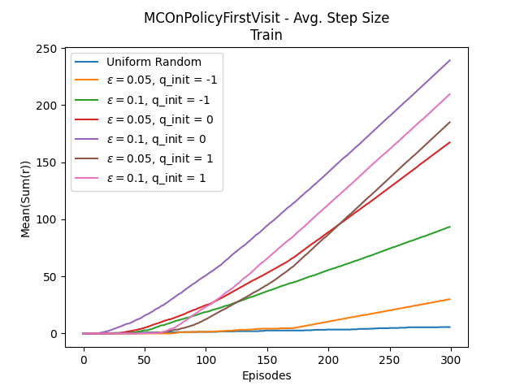
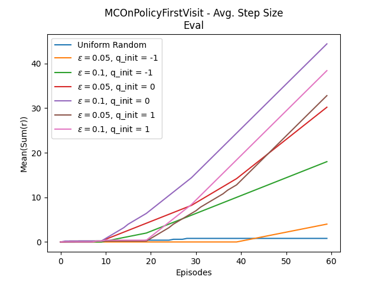
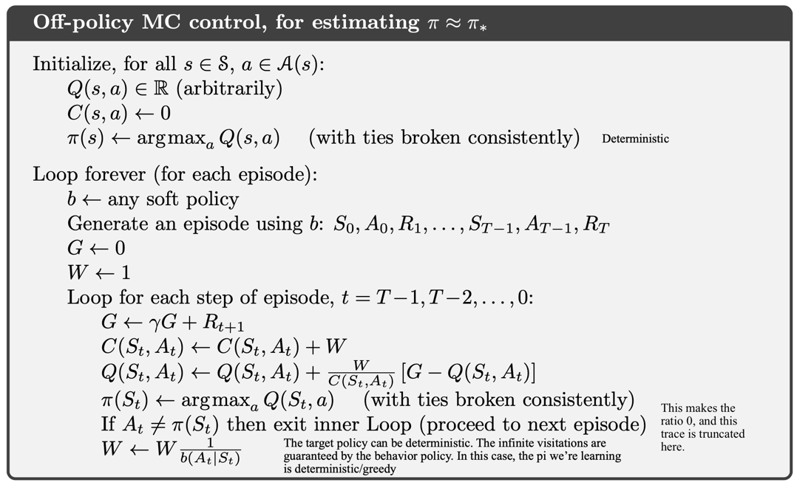
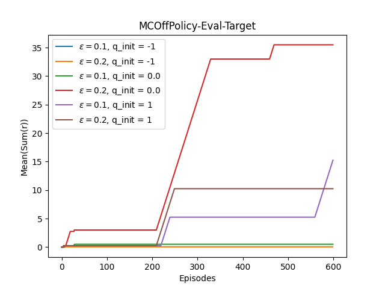

[Sutton & Barto RL Book]: http://incompleteideas.net/book/RLbook2020.pdf

# Monte Carlo Methods
Monte Carlo methods require only experience—sample sequences of states, actions, and rewards from actual or simulated interaction with an environment. Here we learn value functions from _sample_ returns. The estimates for each state are independent. The estimate for one state does not build upon the estimate of any other state, as is the case in DP. In other words, Monte Carlo methods do not bootstrap.

## Table of Contents
- [Implemented Algorithms](#Implemented-Algorithms)
- [Monte Carlo Control](#Introduction-Monte-Carlo-Control)
- [On-Policy, First Visit](#On-Policy-First-Visit)
- [Off-Policy Prediction Via Importance Sampling](#Off-policy-Prediction-via-Importance-Sampling)
- [Off-Policy MC Control](#Off-Policy-MC-Control)
- [Execution](#Execution)
- [Environment](#Environment)

## Implemented Algorithms
- [x] On-policy first-visit MC control (5.4): `agents/MCOnPolicyFirstVisitGLIE`
- [x] Off-Policy MC control for estimating optimal $\pi_*$ (5.7): `agents/MCOffPolicy`

## Introduction Monte Carlo Control
This section contains methods from Chapter 5, in [Sutton & Barto RL Book].

In generalized policy iteration (GPI), we have both an approximate policy and
an approximate value function. The value function is repeatedly altered to more 
closely approximate the (estimated) value function for the current policy, 
and the policy is repeatedly improved with respect to the current value 
function.

These two kinds of changes work against each other to some extent, as 
each creates a moving target for the other, but together they cause both 
policy and value function to approach optimality.

For Monte Carlo, we perform alternating complete steps of policy evaluation 
and policy  improvement, beginning with an arbitrary policy $\pi_{0}$ 
and ending with the optimal policy and optimal action-value function.

$\pi_0 \xrightarrow{\mathrm{E}} q_{\pi_0} \xrightarrow{\mathrm{I}} \pi_1 \xrightarrow{\mathrm{E}} q_{\pi_1} \xrightarrow{\mathrm{I}} \pi_2 \xrightarrow{\mathrm{E}} \dots \xrightarrow{\mathrm{I}} \pi_* \xrightarrow{\mathrm{E}} q_*$

where $\xrightarrow{\mathrm{E}}$ denotes the complete policy evaluation, and 
$\xrightarrow{\mathrm{I}}$ denotes a complete policy improvement. 
_Infinitely_ many episodes (an assumption) are experienced, 
with the approximate action-value function  approaching the true 
function asymptotically. Policy improvement is done by 
making the policy greedy with respect to the current value function. 

Monte Carlo methods can be used to find optimal policies given only 
_sample episodes_ and no other knowledge of the environment’s dynamics. 
Here we alternate between evaluation and improvement on an _episode-by-episode_ 
basis. After each episode, the observed returns are used for 
policy _evaluation_ ($\xrightarrow{\mathrm{E}}$), and then the policy is 
improved ($\xrightarrow{\mathrm{I}}$) at all the states  visited in the episode.

Above we made the assumption that infinitely many episodes are experienced 
for true evaluation of the action value - but this is not realistic. 
The only general way to ensure that all actions are selected infinitely 
often is for the agent to continue to select them. 
There are two approaches to ensuring this, resulting in what we call 
__on-policy__ methods and __off-policy__ methods.

### On-Policy First Visit
On-policy methods attempt to evaluate or improve the policy that is used to 
make decisions. In on-policy control methods the policy is generally 
_soft_, meaning that $\pi(s|a) > 0$ for all states and actions, but gradually 
shifted closer and closer to a _deterministic_ optimal policy. 
The on-policy method here uses "$\epsilon$-greedy policies, meaning
that most of the time they choose an action that has maximal estimated 
action value, but with probability $\epsilon$ they instead select an 
action at random (_note_: including the optimal action). $\epsilon$-_greedy_ 
policies are examples of $\epsilon$-_soft_ policies

#### Experiments
###### Parameters
  * "FrozenLake-v1" environment (see below)
  * Number of episodes: 300
  * 5 seeds

###### Results

| Train                                                                                          | Evaluation                                                                                    | 
|------------------------------------------------------------------------------------------------|-----------------------------------------------------------------------------------------------|
|  |  |

These graphs show the mean - across seeds - of the cummulative rewards for 
train and evaluation of the on-policy first visit MC agent. 
These results can be baselined against a policy which randomly selects with 
equal probability (unform distribution).

### Off-policy Prediction via Importance Sampling
All learning control methods face a dilemma: They seek to learn action 
values conditional on subsequent optimal behavior, but they need to 
behave non-optimally in order to explore all actions (to find the 
optimal actions). How can they learn about the optimal policy while 
behaving according to an exploratory policy?

One approach is to use _two_ policies, one that is learned 
about and that becomes the optimal policy, and one that is more 
exploratory and is used to generate behavior. The policy being 
learned about is called the _target policy_, and the policy used to 
generate behavior is called the _behavior policy_. In this case we say 
that learning is from data “__off__” the target policy, and the overall 
process is termed _off-policy_ learning.

Off-policy methods require additional concepts and notation, and because 
the data is due to a different policy, off-policy methods are often of 
greater variance and are slower to converge.

Suppose we wish to estimate $v_\pi$ or $q_\pi$, but all we have are episodes 
following another policy $b$, where $b\neq\pi$. In this case, $\pi$ is the 
target policy, $b$ is the behavior policy, and both policies are 
considered fixed and given (for now). In order to use episodes from 
$b$ to estimate values for $\pi$, we require  that every action taken under 
$\pi$ is also taken, at least occasionally,  under $b$. That is, we require 
that $\pi(a|s) > 0$ implies $b(a|s) > 0$.  This is called the assumption 
of _coverage_.

It follows from coverage that $b$ must be stochastic in states where it is 
not identical to $\pi$. The target policy $\pi$, on the other hand, may be 
deterministic, and, in fact, this is a case of particular interest in 
control applications. In control, the target policy is typically the 
deterministic greedy policy with respect to the current estimate of the 
action-value function. This policy becomes a deterministic optimal 
policy while the behavior policy remains stochastic and more exploratory, 
for example, an $\epsilon$-greedy policy.

Almost all off-policy methods utilize _importance sampling_, is applied to
off-policy learning by weighting returns according to the relative
probability of their trajectories occurring under the target and 
behavior policies, called the _importance-sampling ratio_.

$\Pr\{ A_t, S_{t+1}, A_{t+1}, \dots, S_T \mid S_t, A_{t:T-1} \sim \pi \} \\$

$= \pi(A_t \mid S_t) p(S_{t+1} \mid S_t, A_t) \pi(A_{t+1} \mid S_{t+1}) \cdots p(S_T \mid S_{T-1}, A_{T-1}) \\$

$= \prod_{k=t}^{T-1} \pi(A_k \mid S_k) p(S_{k+1} \mid S_k, A_k)$

The relative probability of the trajectory under the target and behavior 
policies (the importance-sampling ratio) $\rho$ is:

$\rho_{t:T-1} \overset{\cdot}{=} \frac{\prod_{k=t}^{T-1} \pi(A_k \mid S_k) p(S_{k+1} \mid S_k, A_k)}{\prod_{k=t}^{T-1} b(A_k \mid S_k) p(S_{k+1} \mid S_k, A_k)} = \prod_{k=t}^{T-1} \frac{\pi(A_k \mid S_k)}{b(A_k \mid S_k)}$

The importance sampling ratio ends up depending only on the two policies and 
the sequence, not on the MDP.

We wish to estimate the expected returns (values) under the target policy, 
but all we have are returns $G_t$ from to the behavior policy. These returns 
have the wrong expectation $\mathbb{E}[G_t|S_t=s] = v_b(s)$ and so cannot be 
averaged to obtain $v_\pi$. The ratio $\rho_{t:T-1}$ transforms 
the returns to have the right expected value:

$\mathbb{E}[\rho_{t:T-1}G_t|S_t = s] = v_{\pi}(s)$

Let:
* $\mathcal{T}(s)$ be the set of all time steps in which state $s$ is visited - for either every-visit method or first-visit method.
* $T(t)$ first time of termination following $t$
* $G_t$ return after $t$ up to $T(t)$
* $\{G_t\}_{t \in \mathcal{T}(s)}$ returns relating to $s$
* $\{\rho_{t:T(t)-1}\}_{t \in \mathcal{T}(s)}$ $s$ related importance sampling ratio

To estimate $v_\pi(s)$ we scale the returns by the ratio and average the 
result:

$V(s) = \frac{\sum_{t \in \mathcal{T}(s)} \rho_{t:T(t)-1} G_t}{|\mathcal{T}(s)|}\hspace{2cm} (1)$

also known as _ordinary importance sampling_. The alternative is 
_weighted importance sampling_, which uses a _weighted average_ defined as:

$V(s) = \frac{\sum_{t \in \mathcal{T}(s)} \rho_{t:T(t)-1} G_t}{\sum_{t \in \mathcal{T}(s)} \rho_{t:T(t)-1}}\hspace{2cm} (2)$

or zero, if the denominator is 0. 

For the _first-visit_ method, ordinary  importance sampling is unbiased 
whereas weighted importance sampling is  biased (where the bias converges 
asymptotically to zero). However, the variance of ordinary importance 
sampling is in general unbounded because the variance of the ratios can be 
unbounded, whereas in the weighted estimator the largest weight on any 
single return is one. On the other hand, the _every-visit_ methods for 
ordinary and weighed importance sampling are both biased, though the bias 
falls asymptotically to zero as the number of samples increases.

###### Incremental Implementation
For the incremental implementation of the IS'ed off-policy MC methods, we need to 
separately consider those that use ordinary importance sampling and those 
that use weighted importance sampling. 

In ordinary importance sampling, the _returns_ ($G_t$) are scaled by the importance
sampling ratio $\rho_{t:T(t) - 1}$. Here we can again use the incremental 
methods from Chapter 2 of [Sutton & Barto RL Book], but using the scaled 
returns in place of the rewards of that chapter - i.e. using the format:

$NewEstimate = OldEstimate + StepSize[Target - OldEstimate]$

the incremental ordinary estimate then becomes:

$V^\pi(s)_{n+1} = V^\pi(s)_n + \alpha[\rho_{t:T(t) - 1}G_t - V^\pi(s)_n]$

For the weighted average case, we have to form a weighted average of
the returns. For a given sequence of returns, $G_1, G_2, ..., G_{n-1}$, all
starting at the same state (say, $s_m)$, each with a corresponding random weight 
$W_i = \rho_{t_i:T(t_i) - 1}$, we aim to form the estimate $V_n$ 
(or $V^\pi(s_m)_n$ more accurately, but keeping the formulas shorter 
for simplicity):

$V_n = \frac{\sum_{k=1}^{n-1}W_kG_k}{\sum_{k=1}^{n-1}W_k}\hspace{0.5cm} k\geq2$

and keep it up-to-date as we obtain a single additional return $G_n$.
In addition to $V_n$, must also maintain for each state the cumulative 
sum $C_n$ of the weights given to the first $n$ returns. The update rule is:

$V_{n+1} = V_n + \frac{W_n}{C_n}[G_n - V_n],\hspace{0.5cm} n\geq1 $

where: 

$C_{n+1} = C_n + W_{n+1}\hspace{0.5cm}$ and $C_0 = 0$

### Off-Policy MC Control
In off-policy methods, policy evaluation and control are kept separate, unlike
the on-policy case. The policy used to generate behavior, 
called the _behavior policy_, may be unrelated to the policy
that is evaluated and improved, called the _target policy_. An advantage of 
this separation is that the target policy may be deterministic (e.g., greedy),
while the behavior policy can continue to sample all possible actions 
(exploration). As mentioned above, this method requires that the 
behavior policy has a nonzero probability of selecting all actions that 
might be selected by the target policy (coverage). To explore all 
possibilities, we require that the behavior policy be soft (i.e., 
that it selects all actions in all states with nonzero probability).

The target policy $\pi\approx\pi_*$ is the greedy policy with 
respect to $Q$, which is an estimate of $q_\pi$. The behavior 
policy $b$ can be anything, but in order to assure 
convergence of $\pi$ to the optimal policy, an infinite number of 
returns must be obtained for each pair of state and action. 
This can be assured by choosing $b$ to be $\epsilon$-soft.

#### Experiments
###### Parameters
  * "FrozenLake-v1" environment (see below)
  * Number of episodes: 3000
  * 5 seeds

In the results above, evaluation is run intermittently while the target policy
is learning (in training). Hence, the flat sections indicate the performance
at that level of learning. Note that when compared to the on-policy results
above, the agent takes more episodes to reach the cummulative results of the
on-policy variant. Moreover, pessimistic initialization of the action value
function $Q$, yields lower returns than the neutral or optimistic initialization.

## Execution
Run code in `main.py`. Each algorithm has its own `experiments` task.

## Environment [`FrozenLake-v1`](https://gymnasium.farama.org/environments/toy_text/frozen_lake/)
The game starts with the player at location [0,0] of the frozen 
lake grid world with the goal located at far extent of the world e.g. [3,3] 
for the 4x4 environment. Holes in the ice are distributed in set locations
when using a pre-determined map or in random locations when a random map 
is generated. The player makes moves until they reach the goal or fall 
in a hole. The lake is slippery (unless disabled) so the player 
may move perpendicular to the intended direction sometimes. Randomly generated 
worlds will always have a path to the goal.

Reward schedule:
* Reach goal: +1 
* Reach hole: 0 
* Reach frozen: 0

The episode ends if tje player moves into a hole (termination), or the player
reaches the goal.