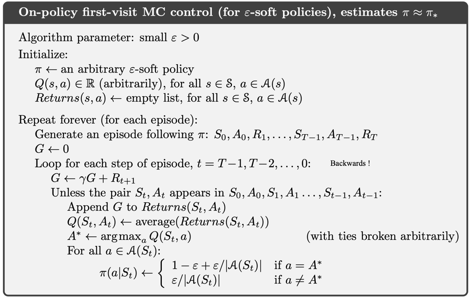
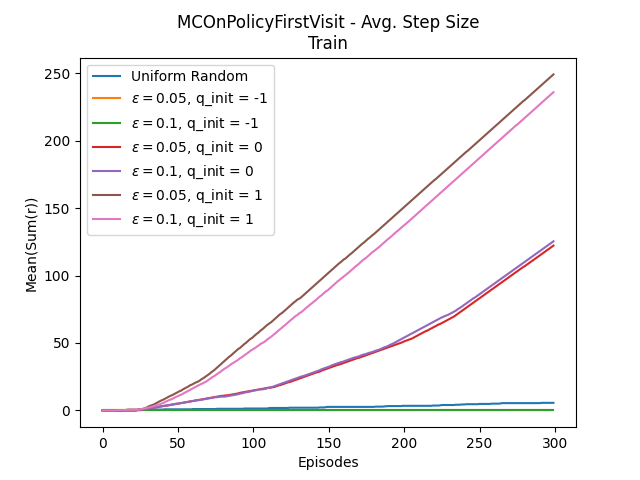
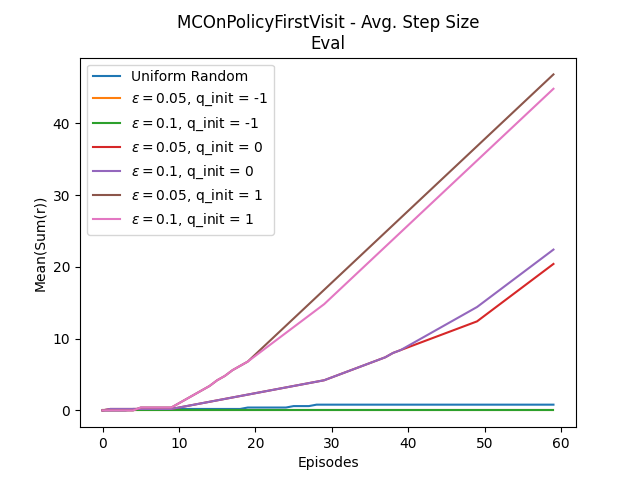
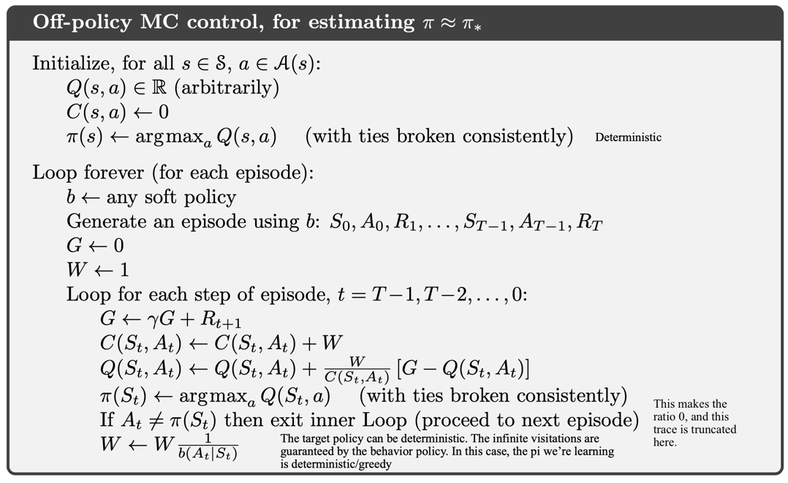
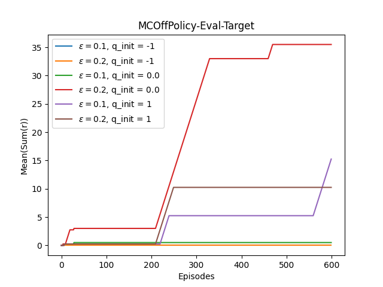

[Sutton & Barto RL Book]: http://incompleteideas.net/book/RLbook2020.pdf

# Monte Carlo Methods
Monte Carlo methods require only experience—sample sequences of states, actions, and rewards from actual or simulated interaction with an environment. Here we learn value functions from _sample_ returns. The estimates for each state are independent. The estimate for one state does not build upon the estimate of any other state, as is the case in DP. In other words, Monte Carlo methods do not bootstrap.

## Table of Contents
- [Background and Explanations](#Background and Explanations)
- [Implemented Algorithms](#Implemented-Algorithms)
- [On-Policy, First Visit](#On-Policy-First-Visit)
- [Off-Policy MC Control with Importance Sampling](#Off-Policy MC Control with Importance Sampling)
- [Execution](#Execution)
- [Environment](#Environment)

## Implemented Algorithms
- [x] On-policy first-visit MC control (5.4): `agents/MCOnPolicyFirstVisitGLIE`
- [x] Off-Policy MC control for estimating optimal $\pi_*$ (5.7): `agents/MCOffPolicy`

## Background and Explanations
See expanded discussion of the algorithms and concepts covered here: [summary.ipynb](summary.ipynb).

Topics covered in the notebook:

* __Introduction Monte Carlo Control__
* __On-Policy First Visit__
* __Off-policy Prediction via Importance Sampling__
* __Off-Policy MC Control__

## On-Policy First Visit

#### Experiments
##### Parameters
  * "FrozenLake-v1" environment (see below)
  * Number of episodes: 300
  * 5 seeds

##### Results

| Train                                                                                          | Evaluation                                                                                    | 
|------------------------------------------------------------------------------------------------|-----------------------------------------------------------------------------------------------|
|  |  |

These graphs show the mean - across seeds - of the cummulative rewards for 
train and evaluation of the on-policy first visit MC agent. 
These results can be baselined against a policy which randomly selects with 
equal probability (unform distribution).

## Off-Policy MC Control with Importance Sampling

#### Experiments
##### Parameters
  * "FrozenLake-v1" environment (see below)
  * Number of episodes: 3000
  * 5 seeds

In the results above, evaluation is run intermittently while the target policy
is learning (in training). Hence, the flat sections indicate the performance
at that level of learning. Note that when compared to the on-policy results
above, the agent takes more episodes to reach the cummulative results of the
on-policy variant. Moreover, pessimistic initialization of the action value
function $Q$, yields lower returns than the neutral or optimistic initialization.

## Execution
Run code in `main.py`. Each algorithm has its own `experiments` task.

## Environment [`FrozenLake-v1`](https://gymnasium.farama.org/environments/toy_text/frozen_lake/)
The game starts with the player at location [0,0] of the frozen 
lake grid world with the goal located at far extent of the world e.g. [3,3] 
for the 4x4 environment. Holes in the ice are distributed in set locations
when using a pre-determined map or in random locations when a random map 
is generated. The player makes moves until they reach the goal or fall 
in a hole. The lake is slippery (unless disabled) so the player 
may move perpendicular to the intended direction sometimes. Randomly generated 
worlds will always have a path to the goal.

Reward schedule:
* Reach goal: +1 
* Reach hole: 0 
* Reach frozen: 0

The episode ends if tje player moves into a hole (termination), or the player
reaches the goal.