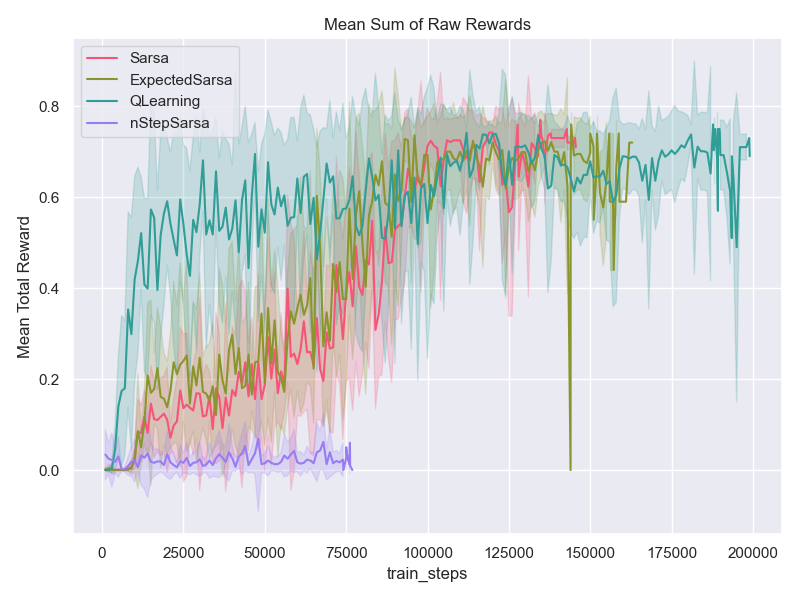
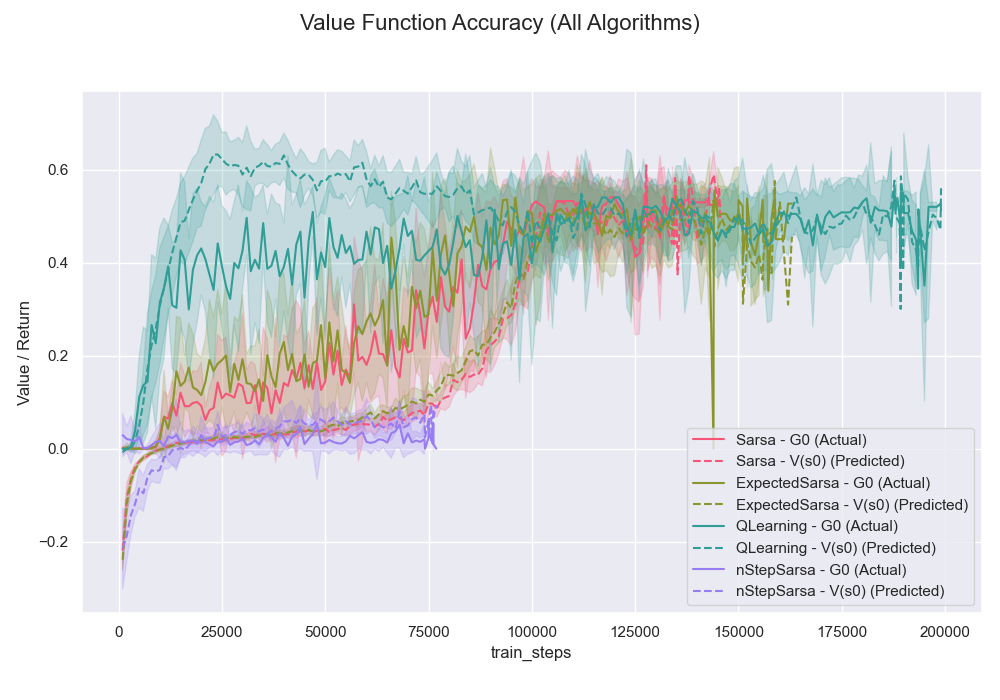
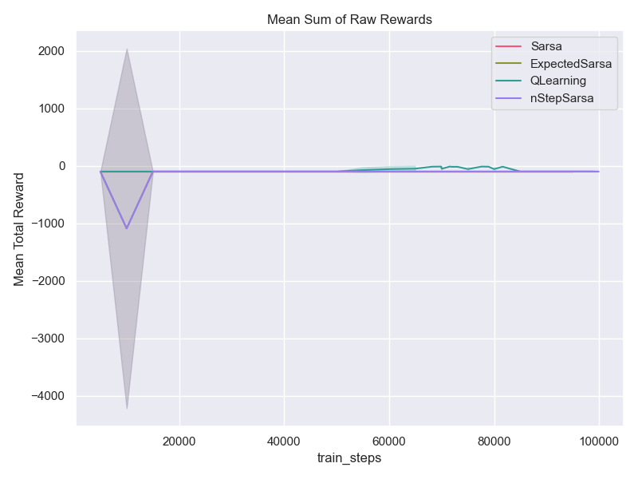
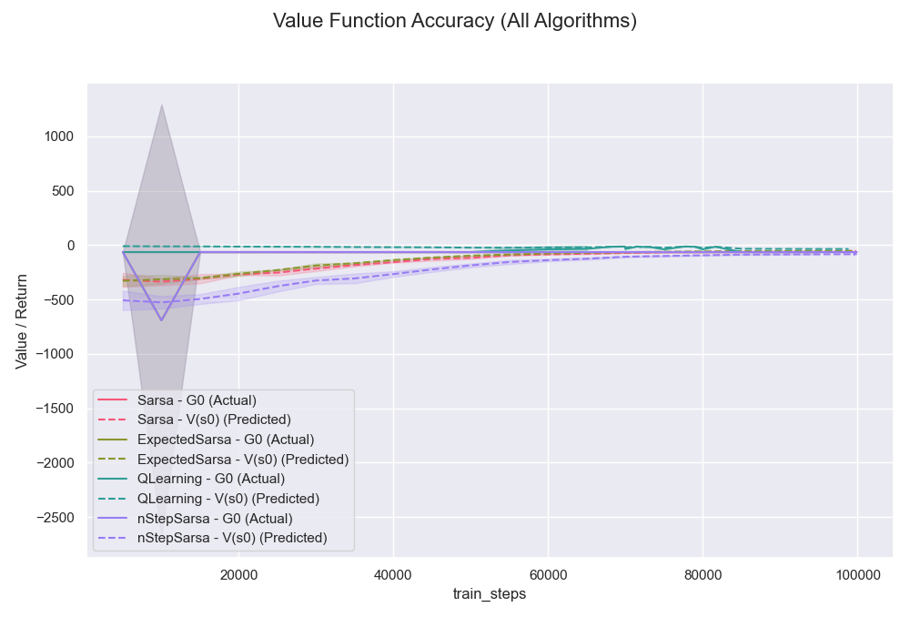
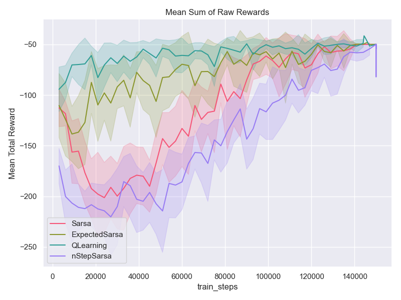
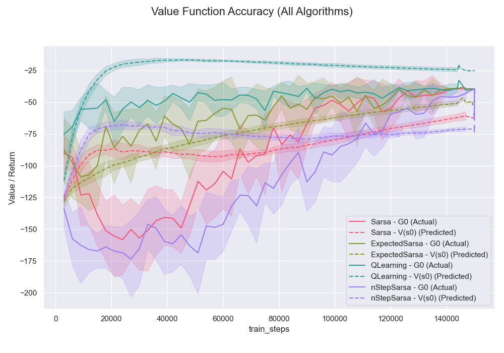

[Sutton & Barto RL Book]: http://incompleteideas.net/book/RLbook2020.pdf

# Temporal Difference and n-Step Bootstrapping

## Table of Contents
- [Introduction](#introduction)
- [Implemented Algorithms](#implemented-algorithms)
- [Execution](#execution)
- [Environments](#environments)

## Introduction
This section contains methods from Chapter 6 & 7 in [Sutton & Barto RL Book].
Expanded discussions are in [summary](summary.ipynb)

## Implemented Algorithms
- [x] Sarsa (Section: 6.4): `agents/Sarsa`
- [x] ExpectedSarsa (Section: 6.6): `agents/ExpectedSarsa`
- [x] QLearning / SarsaMax (Section: 6.5): `agents/QLearning`
- [x] nStepSarsa (Section: 7.2): `agents/nStepSarsa`
- [x] nStepsSarsaOffPolicy (Section: 7.3): `agents/nStepsSarsaOffPolicy`
- [x] QSigmaOffPolicy (Section 7.6): `agents/QSigmaOffPolicy`

## Algorithms
The following algorithms have been implemented

### Sarsa

### Expected Sarsa
Same as Sarsa, however for next state–action pairs it uses the _expected_ value, 
taking into account how likely each action is under the _current_ policy.

### Sarsa-Max (Q Learning)

### nStep Sarsa

### Offpolicy - nStepSarsa &  Q(&sigma;)
As of this writing, these implementations are not yielding good results. Further work is necessary. 

## Experiments

### Environments Setup
Different environments have been tested with the following parameters

* Num train seeds = $10$
* Num eval seeds = $100$

* _Frozen Lake_ - stochastic: 
  * Reward
    * Reach goal: $+1$
    * Reach hole: 0
    * Reach frozen: 0
    * Slippery: True (stochastic)
    * Map: $4 \times 4$
  * Initial state-action value $q_{init} = -1$
  * Number of episodes = $10000$ 
  * Episode horizon = $100$ 
  * $\varepsilon$ linearly annealed $[1, 0.01]$
  * $\alpha$ linearly annealed $[0.3, 0.1]$

* CliffWalking - is not stochastic
  * Reward
    * Each time step incurs $-1$ reward 
    * Player stepped into the cliff incurs $-100$ reward
  * Initial state-action value $q_{init} = -200$
  * Number of episodes = $1000$ 
  * Episode horizon = $100$ 
  * $\varepsilon$ linearly annealed $[1, 0.01]$
  * $\alpha$ linearly annealed $[0.5, 0.01]$

* Taxi - taxi is not stochastic.
  * Reward
    * $-1$ per step unless other reward is triggered
    * $+20$ delivering passenger
    * $-10$ executing “pickup” and “drop-off” actions illegally.
  * Initial state-action value $q_{init} = -150$
  * Number of episodes = $3000$ 
  * Episode horizon = $50$ 
  * $\varepsilon$ linearly annealed $[0.3, 0.001]$
  * $\alpha$ linearly annealed $[1, 0.2]$

##### Algorithm Parameters

All the algorithms shown share the same parameters per environment as shown.
nStepSarsa used $n=4$

#### Results

| Environment       | $\frac{1}{N}\sum_{n}^{N}\sum_{t=0} r^{n}_t$                                                              | $\hat{V}(s_0) = \frac{1}{N}\sum_n^{N}V(s^n_0)$ vs $\hat{G}_0 = \frac{1}{N}\sum_n^{N}\sum_{t=0} \gamma^t r^{n}_t$ |
|-------------------|----------------------------------------------------------------------------------------------------------|------------------------------------------------------------------------------------------------------------------|
| Frozen Lake (v1)  |    |                           |
| CliffWalking (v0) |  |                         |
| Taxi (v3)         |          |                                 |

## Execution
Run code in `main.py`. Each algorithm has its own `experiments` task.

## Environments
- [Gymnasium] - `FrozenLake-v1`, `CliffWalking-v0`, `Taxi-v3`