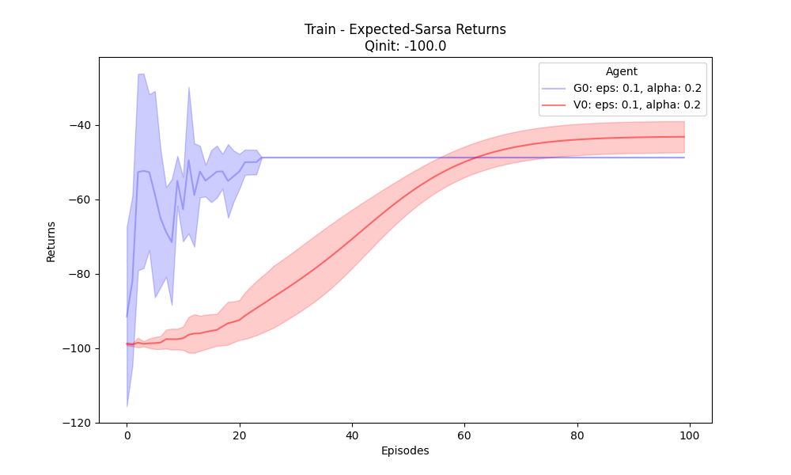

[Sutton & Barto RL Book]: http://incompleteideas.net/book/RLbook2020.pdf

# Temporal Difference and n-Step Bootstrapping

## Table of Contents
- [Introduction](#introduction)
- [Implemented Algorithms](#implemented-algorithms)
- [Execution](#execution)
- [Environments](#environments)

## Introduction
This section contains methods from Chapter 6 & 7 in [Sutton & Barto RL Book].

## Implemented Algorithms
- [x] Sarsa (Section: 6.4): `agents/Sarsa`
- [x] ExpectedSarsa (Section: 6.6): `agents/ExpectedSarsa`
- [x] QLearning / SarsaMax (Section: 6.5): `agents/QLearning`
- [x] nStepSarsa (Section: 7.2): `agents/nStepSarsa`
- [x] nStepsSarsaOffPolicy (Section: 7.3): `agents/nStepsSarsaOffPolicy`
- [x] QSigmaOffPolicy (Section 7.6): `agents/QSigmaOffPolicy`

## Algorithms

### Sarsa

#### Experiments

###### Algorithm Parameters
The following parameters used for the Sarsa algorithm
* &epsilon; = 0.1
* &alpha; = 0.2

###### Environment Setup
* FrozenLake - stochastic: 
  * Reward
    * Reach goal: +1
    * Reach hole: 0
    * Reach frozen: 0
    * Slippery: True (stochastic)
    * Map: 4x4
  * Initial _Q(*, *)_ = 0 
  * seeds = {1, 2, 3.., 7} 
  * num_episodes = 2000 
  * Max episode steps = 50 

* CliffWalking - is not stochastic
  * Reward
    * Each time step incurs -1 reward 
    * Player stepped into the cliff incurs -100 reward
  * Initial _Q(*, *)_ = -100, to show the effect of learning the Value function
  * seeds = {1, 2, 3.., 7} 
  * num_episodes = 50 
  * Max episode steps = 10 

* Taxi - taxi is not stochastic.
  * Reward
    * -1 per step unless other reward is triggered
    * +20 delivering passenger
    * -10 executing “pickup” and “drop-off” actions illegally.
  * Initial _Q(*, *)_ = -100, to show the effect of learning the Value function
  * seeds = {1, 2, 3.., 7} 
  * num_episodes = 100 
  * Max episode steps = 50  

| Environment       | Train Value                                                                 | Evaluation Value                                                           | Evaluation Cummulative Sum                                                         |
|-------------------|-----------------------------------------------------------------------------|----------------------------------------------------------------------------|------------------------------------------------------------------------------------|
| Frozen Lake (v1)  |    |    |    |
| CliffWalking (v0) |  |  |  |
| Taxi (v3)         |          |          |          |

### Expected Sarsa
Same as Sarsa, however for next state–action pairs it uses the _expected_ value, 
taking into account how likely each action is under the _current_ policy.

#### Experiments

###### Algorithm Parameters
The following parameters used for the Sarsa algorithm
* &epsilon; = 0.1
* &alpha; = 0.2

###### Environment Setup
* FrozenLake - stochastic: 
  * Reward
    * Reach goal: +1
    * Reach hole: 0
    * Reach frozen: 0
    * Slippery: True (stochastic)
    * Map: 4x4
  * Initial _Q(*, *)_ = 0 
  * seeds = {1, 2, 3.., 7} 
  * num_episodes = 2000 
  * Max episode steps = 50 

* CliffWalking - is not stochastic
  * Reward
    * Each time step incurs -1 reward 
    * Player stepped into the cliff incurs -100 reward
  * Initial _Q(*, *)_ = -100, to show the effect of learning the Value function
  * seeds = {1, 2, 3.., 7} 
  * num_episodes = 50 
  * Max episode steps = 10 

* Taxi - taxi is not stochastic.
  * Reward
    * -1 per step unless other reward is triggered
    * +20 delivering passenger
    * -10 executing “pickup” and “drop-off” actions illegally.
  * Initial _Q(*, *)_ = -100, to show the effect of learning the Value function
  * seeds = {1, 2, 3.., 7} 
  * num_episodes = 100 
  * Max episode steps = 50  

| Environment       | Train Value                                                                         | Evaluation Value                                                                   | Evaluation Cummulative Sum                                                                 |
|-------------------|-------------------------------------------------------------------------------------|------------------------------------------------------------------------------------|--------------------------------------------------------------------------------------------|
| Frozen Lake (v1)  |    |    |    |
| CliffWalking (v0) |  |  |  |
| Taxi (v3)         |          |          |                  |

### Sarsa-Max (Q Learning)

#### Experiments

###### Algorithm Parameters
The following parameters used for the Sarsa algorithm
* &epsilon; = 0.1
* &alpha; = 0.2

###### Environment Setup
* FrozenLake - stochastic: 
  * Reward
    * Reach goal: +1
    * Reach hole: 0
    * Reach frozen: 0
    * Slippery: True (stochastic)
    * Map: 4x4
  * Initial _Q(*, *)_ = 0 
  * seeds = {1, 2, 3.., 7} 
  * num_episodes = 2000 
  * Max episode steps = 50 

* CliffWalking - is not stochastic
  * Reward
    * Each time step incurs -1 reward 
    * Player stepped into the cliff incurs -100 reward
  * Initial _Q(*, *)_ = -100, to show the effect of learning the Value function
  * seeds = {1, 2, 3.., 7} 
  * num_episodes = 50 
  * Max episode steps = 10 

* Taxi - taxi is not stochastic.
  * Reward
    * -1 per step unless other reward is triggered
    * +20 delivering passenger
    * -10 executing “pickup” and “drop-off” actions illegally.
  * Initial _Q(*, *)_ = -100, to show the effect of learning the Value function
  * seeds = {1, 2, 3.., 7} 
  * num_episodes = 100 
  * Max episode steps = 50  

| Environment       | Train Value                                                                     | Evaluation Value                                                               | Evaluation Cummulative Sum                                                             |
|-------------------|---------------------------------------------------------------------------------|--------------------------------------------------------------------------------|----------------------------------------------------------------------------------------|
| Frozen Lake (v1)  |    |    |    |
| CliffWalking (v0) |  |  |  |
| Taxi (v3)         |          |          |          |

## Execution
Run code in `main.py`. Each algorithm has its own `experiments` task.

## Environments
- [Gymnasium] - `FrozenLake-v1`, `CliffWalking-v0`, `Taxi-v3`